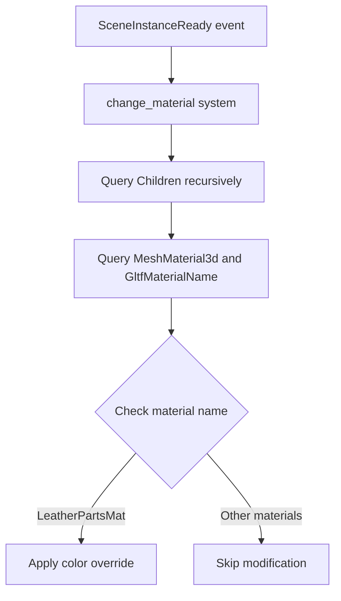

+++
title = "#20853 Change edit_gltf_material to use GltfMaterialName"
date = "2025-09-03T00:00:00"
draft = false
template = "pull_request_page.html"
in_search_index = true

[taxonomies]
list_display = ["show"]

[extra]
current_language = "en"
available_languages = {"en" = { name = "English", url = "/pull_request/bevy/2025-09/pr-20853-en-20250903" }, "zh-cn" = { name = "中文", url = "/pull_request/bevy/2025-09/pr-20853-zh-cn-20250903" }}
labels = ["C-Examples"]
+++

# Title
Change edit_gltf_material to use GltfMaterialName

## Basic Information
- **Title**: Change edit_gltf_material to use GltfMaterialName
- **PR Link**: https://github.com/bevyengine/bevy/pull/20853
- **Author**: ChristopherBiscardi
- **Status**: MERGED
- **Labels**: C-Examples, S-Ready-For-Final-Review
- **Created**: 2025-09-03T18:31:24Z
- **Merged**: 2025-09-03T21:26:07Z
- **Merged By**: alice-i-cecile

## Description Translation
# Objective

The intention is to make it more obvious how to replace and edit materials from glTF files in a way that is capable of targeting specific materials like a real application would.

Partial documentation for #12209 

## Solution

Use GltfMaterialName so that it is more obvious how to target specific materials.

## Testing

```
cargo run --example edit_material_on_gltf
```

## Showcase

The tinting is now only applied to the leather materials.


## Notes

- It could be useful to have an extended material that uses the base replacing one of the options, or other material modification examples. I tried to use the existing material extension shader example but it really didn't look like it fit (and appeared buggy visually, although I don't believe it was actually buggy).
- I used the prelude in the example instead of separating out every item like it had previously
- This is a small improvement, but there are multiple concepts in this example. "Scene-specific overrides" and "editing materials".
- This example *could* have material caches (`struct LeatherPartsMat(Handle<..>)`) but right now the example has three separate materials that are all used in the scene so it felt like overkill until the problem is actually present.

## The Story of This Pull Request

This PR addresses a practical issue in Bevy's material editing example. The original `edit_material_on_gltf` example demonstrated how to modify materials from glTF files, but it applied color overrides to all materials indiscriminately. This approach didn't reflect real-world use cases where developers typically need to target specific materials by name.

The solution introduces the `GltfMaterialName` component to enable targeted material editing. Instead of applying color overrides to every material in the scene, the updated example now specifically targets materials named "LeatherPartsMat". This makes the example more realistic and demonstrates how developers can selectively modify materials based on their original glTF material names.

The implementation involved several key changes:

1. **Import simplification**: The code now uses Bevy's prelude module instead of individual imports, making the code cleaner and more maintainable.

2. **Enhanced query system**: The material query now includes both `MeshMaterial3d<StandardMaterial>` and `GltfMaterialName`, allowing the system to access material names from the glTF file.

3. **Targeted material processing**: The system now uses a match statement to check material names and only applies color overrides to materials with the specific name "LeatherPartsMat".

4. **Improved logging**: Added informative log messages that show which materials are being processed and modified, making the example more educational for developers.

The changes demonstrate a more practical approach to material editing in Bevy, showing how to leverage the `GltfMaterialName` component that was introduced in previous work. This provides a better foundation for developers who need to implement material overrides in their applications, as it mirrors the real-world scenario of targeting specific materials by name rather than applying global changes.

## Visual Representation



## Key Files Changed

- `examples/3d/edit_material_on_gltf.rs` (+35/-33)

The main changes in this file:

1. **Import simplification**:
```rust
// Before:
use bevy::{
    app::{App, PluginGroup, Startup},
    asset::{AssetServer, Assets},
    audio::AudioPlugin,
    color::{palettes, Color},
    gltf::GltfAssetLabel,
    light::DirectionalLight,
    math::{Dir3, Vec3},
    pbr::{MeshMaterial3d, StandardMaterial},
    prelude::{Camera3d, Children, Commands, Component, On, Query, Res, ResMut, Transform},
    scene::{SceneInstanceReady, SceneRoot},
    DefaultPlugins,
};

// After:
use bevy::{
    audio::AudioPlugin, color::palettes, gltf::GltfMaterialName, prelude::*,
    scene::SceneInstanceReady,
};
```

2. **Enhanced material query and processing**:
```rust
// Before:
fn change_material(
    // ... parameters
    mesh_materials: Query<&MeshMaterial3d<StandardMaterial>>,
    // ...
) {
    // Process all materials indiscriminately
}

// After:
fn change_material(
    // ... parameters
    mesh_materials: Query<(&MeshMaterial3d<StandardMaterial>, &GltfMaterialName)>,
    // ...
) {
    // Target specific materials by name
    match material_name.0.as_str() {
        "LeatherPartsMat" => {
            // Apply color override only to leather materials
        }
        name => {
            info!("not replacing: {name}");
        }
    }
}
```

## Further Reading

- [Bevy GLTF Materials Documentation](https://docs.rs/bevy/latest/bevy/gltf/struct.GltfMaterialName.html)
- [Bevy ECS Query System](https://bevyengine.org/learn/book/ecs/query/)
- [GLTF Material Specification](https://github.com/KhronosGroup/glTF/tree/master/specification/2.0#materials)