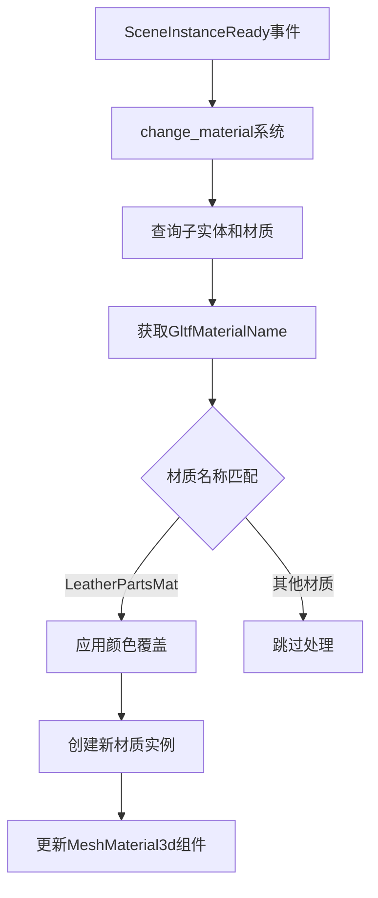

+++
title = "#20853 Change edit_gltf_material to use GltfMaterialName"
date = "2025-09-03T00:00:00"
draft = false
template = "pull_request_page.html"
in_search_index = false

[extra]
current_language = "zh-cn"
available_languages = {"en" = { name = "English", url = "/pull_request/bevy/2025-09/pr-20853-en-20250903" }, "zh-cn" = { name = "中文", url = "/pull_request/bevy/2025-09/pr-20853-zh-cn-20250903" }}
labels = ["C-Examples"]
+++

# Title

## Basic Information
- **Title**: Change edit_gltf_material to use GltfMaterialName
- **PR Link**: https://github.com/bevyengine/bevy/pull/20853
- **Author**: ChristopherBiscardi
- **Status**: MERGED
- **Labels**: C-Examples, S-Ready-For-Final-Review
- **Created**: 2025-09-03T18:31:24Z
- **Merged**: 2025-09-03T21:26:07Z
- **Merged By**: alice-i-cecile

## Description Translation
# 目标

目的是让开发者更清楚地了解如何替换和编辑glTF文件中的材质，使其能够像真实应用程序那样针对特定材质进行操作。

这是对#12209的部分文档说明。

## 解决方案

使用GltfMaterialName，以便更明确地如何定位特定材质。

## 测试

```
cargo run --example edit_material_on_gltf
```

## 展示

现在着色效果仅应用于皮革材质。


## 备注

- 拥有一个使用基础替换选项或其他材质修改示例的扩展材质可能会很有用。我尝试使用现有的材质扩展着色器示例，但它看起来不太合适（并且视觉上看起来有bug，尽管我不认为它实际上有bug）。
- 我在示例中使用了prelude，而不是像之前那样分开列出每个项目
- 这是一个小的改进，但这个示例中有多个概念。"场景特定的覆盖"和"编辑材质"。
- 这个示例*可以*有材质缓存（`struct LeatherPartsMat(Handle<..>)`），但目前示例中有三个独立的材质都在场景中使用，所以在问题实际出现之前感觉有些过度设计。

## The Story of This Pull Request

这个PR解决了一个实际开发中的常见需求：如何精确地定位和修改glTF模型中的特定材质。原来的示例代码对所有材质进行统一处理，这在真实应用场景中并不实用。

**问题背景**
在Bevy引擎中处理glTF模型时，开发者经常需要针对模型中的特定材质进行定制化修改。原来的`edit_material_on_gltf`示例虽然展示了如何修改材质，但使用的是通用的方法，无法精确定位到具体的材质类型。这导致开发者在实际项目中难以参考这个示例来实现精确的材质控制。

**解决方案**
PR作者选择使用`GltfMaterialName`组件来解决这个问题。这个组件包含了glTF文件中定义的材质名称信息，使得开发者能够基于材质名称进行精确匹配和修改。

**技术实现**
主要的修改集中在`change_material`函数中。原来的实现简单遍历所有子实体并修改所有找到的材质：

```rust
// 原来的实现（简化）
for descendants in children.iter_descendants(event.entity()) {
    if let Some(material) = mesh_materials.get(descendants).ok() {
        // 修改所有材质
        let mut new_material = material.clone();
        new_material.base_color = color_override.0;
        // ... 应用新材质
    }
}
```

新的实现增加了材质名称的查询和匹配：

```rust
// 新的实现
for descendant in children.iter_descendants(event.entity()) {
    let Ok((id, material_name)) = mesh_materials.get(descendant) else {
        continue;
    };
    
    match material_name.0.as_str() {
        "LeatherPartsMat" => {
            // 只对特定材质应用颜色覆盖
            let Ok(color_override) = color_override.get(event.entity()) else {
                continue;
            };
            let mut new_material = material.clone();
            new_material.base_color = color_override.0;
            commands.entity(descendant)
                .insert(MeshMaterial3d(asset_materials.add(new_material)));
        }
        name => {
            info!("not replacing: {name}");
        }
    }
}
```

这个修改使得示例更加实用，开发者可以清楚地看到如何基于材质名称进行条件处理。

**工程考量**
PR作者还做了一些代码质量改进：
1. 简化了import语句，使用`prelude::*`代替冗长的逐个导入
2. 增加了详细的日志输出，帮助开发者理解处理过程
3. 保持了向后兼容性，没有破坏现有的API

**影响和价值**
这个修改虽然看起来简单，但对于学习Bevy材质系统的开发者来说很有价值。它展示了：
- 如何使用`GltfMaterialName`组件获取材质名称信息
- 如何基于名称进行条件材质处理
- 如何在真实场景中实现精确的材质控制

示例现在更接近真实项目的需求，开发者可以更容易地将其应用到自己的项目中。

## Visual Representation



## Key Files Changed

### `examples/3d/edit_material_on_gltf.rs` (+35/-33)

这个文件是PR的主要修改对象，展示了如何使用`GltfMaterialName`来精确定位和修改glTF模型中的特定材质。

**主要修改：**

1. **导入语句简化**
```rust
// 之前:
use bevy::{
    app::{App, PluginGroup, Startup},
    asset::{AssetServer, Assets},
    audio::AudioPlugin,
    color::{palettes, Color},
    gltf::GltfAssetLabel,
    light::DirectionalLight,
    math::{Dir3, Vec3},
    pbr::{MeshMaterial3d, StandardMaterial},
    prelude::{Camera3d, Children, Commands, Component, On, Query, Res, ResMut, Transform},
    scene::{SceneInstanceReady, SceneRoot},
    DefaultPlugins,
};

// 之后:
use bevy::{
    audio::AudioPlugin, color::palettes, gltf::GltfMaterialName, prelude::*,
    scene::SceneInstanceReady,
};
```

2. **材质处理逻辑增强**
```rust
// 关键修改：查询现在包含GltfMaterialName
mesh_materials: Query<(&MeshMaterial3d<StandardMaterial>, &GltfMaterialName)>

// 增加了材质名称匹配逻辑
match material_name.0.as_str() {
    "LeatherPartsMat" => {
        // 只对特定材质进行处理
        let Ok(color_override) = color_override.get(event.entity()) else {
            continue;
        };
        // ... 创建和应用新材质
    }
    name => {
        info!("not replacing: {name}");
    }
}
```

3. **改进的日志输出**
增加了更详细的日志信息，帮助开发者理解系统执行过程。

这些修改使得示例代码更加实用和具有指导意义，展示了如何在真实项目中处理glTF材质。

## Further Reading

- [Bevy GLTF组件文档](https://docs.rs/bevy/latest/bevy/gltf/index.html)
- [Bevy材质系统指南](https://bevy-cheatbook.github.io/features/materials.html)
- [GLTF材质规范](https://github.com/KhronosGroup/glTF/tree/main/specification/2.0#materials)
- [Bevy ECS查询系统](https://bevy-cheatbook.github.io/programming/queries.html)

# Full Code Diff
```diff
diff --git a/examples/3d/edit_material_on_gltf.rs b/examples/3d/edit_material_on_gltf.rs
index de540f19f745a..2bc5a79d6da7d 100644
--- a/examples/3d/edit_material_on_gltf.rs
+++ b/examples/3d/edit_material_on_gltf.rs
@@ -1,17 +1,8 @@
 //! Showcases how to change the material of a `Scene` spawned from a Gltf
 
 use bevy::{
-    app::{App, PluginGroup, Startup},
-    asset::{AssetServer, Assets},
-    audio::AudioPlugin,
-    color::{palettes, Color},
-    gltf::GltfAssetLabel,
-    light::DirectionalLight,
-    math::{Dir3, Vec3},
-    pbr::{MeshMaterial3d, StandardMaterial},
-    prelude::{Camera3d, Children, Commands, Component, On, Query, Res, ResMut, Transform},
-    scene::{SceneInstanceReady, SceneRoot},
-    DefaultPlugins,
+    audio::AudioPlugin, color::palettes, gltf::GltfMaterialName, prelude::*,
+    scene::SceneInstanceReady,
 };
 
 fn main() {
@@ -62,33 +53,44 @@ fn change_material(
     mut commands: Commands,
     children: Query<&Children>,
     color_override: Query<&ColorOverride>,
-    mesh_materials: Query<&MeshMaterial3d<StandardMaterial>>,
+    mesh_materials: Query<(&MeshMaterial3d<StandardMaterial>, &GltfMaterialName)>,
     mut asset_materials: ResMut<Assets<StandardMaterial>>,
 ) {
-    // Get the `ColorOverride` of the entity, if it does not have a color override, skip
-    let Ok(color_override) = color_override.get(event.entity()) else {
-        return;
-    };
-
+    info!("processing Scene Entity: {}", event.entity());
     // Iterate over all children recursively
-    for descendants in children.iter_descendants(event.entity()) {
+    for descendant in children.iter_descendants(event.entity()) {
+        // Get the material id and name which were created from the glTF file information
+        let Ok((id, material_name)) = mesh_materials.get(descendant) else {
+            continue;
+        };
         // Get the material of the descendant
-        if let Some(material) = mesh_materials
-            .get(descendants)
-            .ok()
-            .and_then(|id| asset_materials.get_mut(id.id()))
-        {
-            // Create a copy of the material and override base color
-            // If you intend on creating multiple models with the same tint, it
-            // is best to cache the handle somewhere, as having multiple materials
-            // that are identical is expensive
-            let mut new_material = material.clone();
-            new_material.base_color = color_override.0;
+        let Some(material) = asset_materials.get_mut(id.id()) else {
+            continue;
+        };
+
+        // match on the material name, modifying the materials as necessary
+        match material_name.0.as_str() {
+            "LeatherPartsMat" => {
+                info!("editing LeatherPartsMat to use ColorOverride tint");
+                // Get the `ColorOverride` of the entity, if it does not have a color override, skip
+                let Ok(color_override) = color_override.get(event.entity()) else {
+                    continue;
+                };
+                // Create a copy of the material and override base color
+                // If you intend on creating multiple models with the same tint, it
+                // is best to cache the handle somewhere, as having multiple materials
+                // that are identical is expensive
+                let mut new_material = material.clone();
+                new_material.base_color = color_override.0;
 
-            // Override `MeshMaterial3d` with new material
-            commands
-                .entity(descendants)
-                .insert(MeshMaterial3d(asset_materials.add(new_material)));
+                // Override `MeshMaterial3d` with new material
+                commands
+                    .entity(descendant)
+                    .insert(MeshMaterial3d(asset_materials.add(new_material)));
+            }
+            name => {
+                info!("not replacing: {name}");
+            }
         }
     }
 }
```