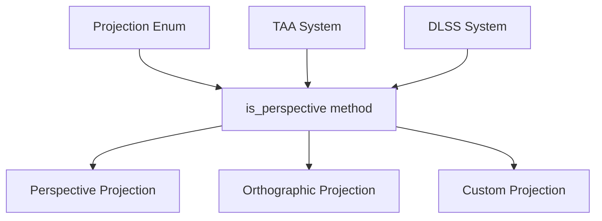

+++
title = "#20855 added anti-aliasing support for Custom Projection"
date = "2025-09-05T00:00:00"
draft = false
template = "pull_request_page.html"
in_search_index = true

[taxonomies]
list_display = ["show"]

[extra]
current_language = "en"
available_languages = {"en" = { name = "English", url = "/pull_request/bevy/2025-09/pr-20855-en-20250905" }, "zh-cn" = { name = "中文", url = "/pull_request/bevy/2025-09/pr-20855-zh-cn-20250905" }}
labels = ["C-Feature", "A-Rendering", "D-Straightforward"]
+++

# added anti-aliasing support for Custom Projection

## Basic Information
- **Title**: added anti-aliasing support for Custom Projection
- **PR Link**: https://github.com/bevyengine/bevy/pull/20855
- **Author**: diyu-motif
- **Status**: MERGED
- **Labels**: C-Feature, A-Rendering, S-Ready-For-Final-Review, D-Straightforward
- **Created**: 2025-09-03T20:11:13Z
- **Merged**: 2025-09-05T00:38:12Z
- **Merged By**: alice-i-cecile

## Description Translation
# Objective
Support anti-aliasing for Custom Projection. 

## Solution
function is_perspective() is added to Projection, it checks the matrix to determine if the Custom Projection is perspective.

## Testing

- Did you test these changes? If so, how?
 yes, we have an internal project that uses Custom Projection, I tested taa, but not the dlss, but the logic is the same.

- Are there any parts that need more testing? 
  N/A
- How can other people (reviewers) test your changes? Is there anything specific they need to know?
here is the detail: https://metashapes.com/blog/opengl-metal-projection-matrix-problem/
- If relevant, what platforms did you test these changes on, and are there any important ones you can't test?
N/A

## The Story of This Pull Request

The problem started with Bevy's anti-aliasing systems (TAA and DLSS) only working with standard perspective projections. When developers used Custom Projection, these anti-aliasing features would fail to activate because the systems were checking for the `Projection::Perspective` variant specifically, ignoring custom projection matrices that might actually represent perspective transformations.

The core issue was that anti-aliasing algorithms like TAA and DLSS require perspective projection matrices to function correctly, but the existing code used pattern matching that couldn't recognize perspective projections when they were wrapped in the `Projection::Custom` variant.

The solution approach was straightforward: instead of checking the enum variant, we needed to examine the actual projection matrix to determine if it represents a perspective transformation. The developer implemented a new method `is_perspective()` on the `Projection` enum that could handle all three variants (Perspective, Orthographic, and Custom).

For the implementation, the key insight was that perspective projection matrices have a specific characteristic in their fourth row: the w-component of the w-axis is 0.0. This mathematical property distinguishes perspective from orthographic projections, regardless of how the projection matrix was created.

The changes were minimal but effective:
1. Added the `is_perspective()` method to the Projection enum
2. Updated both TAA and DLSS systems to use this new method instead of pattern matching

This approach maintains backward compatibility while extending functionality to custom projections. The solution is robust because it works with any perspective matrix, whether created through Bevy's standard perspective projection or through custom mathematical operations.

The impact is significant for users who need custom projection matrices but still want access to Bevy's advanced anti-aliasing features. This change bridges the gap between custom rendering requirements and built-in post-processing effects.

## Visual Representation



## Key Files Changed

### `crates/bevy_camera/src/projection.rs` (+10/-0)
Added the `is_perspective()` method to the Projection enum to determine if any projection (including custom) represents a perspective transformation.

```rust
// File: crates/bevy_camera/src/projection.rs
// After:
/// Check if the projection is perspective.
/// For [`CustomProjection`], this checks if the projection matrix's w-axis's w is 0.0.
pub fn is_perspective(&self) -> bool {
    match self {
        Projection::Perspective(_) => true,
        Projection::Orthographic(_) => false,
        Projection::Custom(projection) => projection.get_clip_from_view().w_axis.w == 0.0,
    }
}
```

### `crates/bevy_anti_alias/src/dlss/extract.rs` (+1/-2)
Updated DLSS extraction to use the new `is_perspective()` method instead of pattern matching.

```rust
// File: crates/bevy_anti_alias/src/dlss/extract.rs
// Before:
let has_perspective_projection = matches!(camera_projection, Projection::Perspective(_));
// ... other code
if dlss.is_some() && camera.is_active && has_perspective_projection {

// After:
if dlss.is_some() && camera.is_active && camera_projection.is_perspective() {
```

### `crates/bevy_anti_alias/src/taa/mod.rs` (+1/-2)
Similarly updated TAA system to use the new method.

```rust
// File: crates/bevy_anti_alias/src/taa/mod.rs
// Before:
let has_perspective_projection = matches!(camera_projection, Projection::Perspective(_));
// ... other code
&& has_perspective_projection

// After:
&& camera_projection.is_perspective()
```

## Further Reading

1. [OpenGL/Metal Projection Matrix Problem](https://metashapes.com/blog/opengl-metal-projection-matrix-problem/) - Explains the mathematical details of projection matrices
2. [Bevy Camera Projection Documentation](https://docs.rs/bevy/latest/bevy/camera/projection/enum.Projection.html) - Official Bevy documentation on projection types
3. [Temporal Anti-Aliasing Explained](https://en.wikipedia.org/wiki/Temporal_anti-aliasing) - Background on TAA technique
4. [DLSS Technology Overview](https://www.nvidia.com/en-us/geforce/technologies/dlss/) - NVIDIA's explanation of DLSS