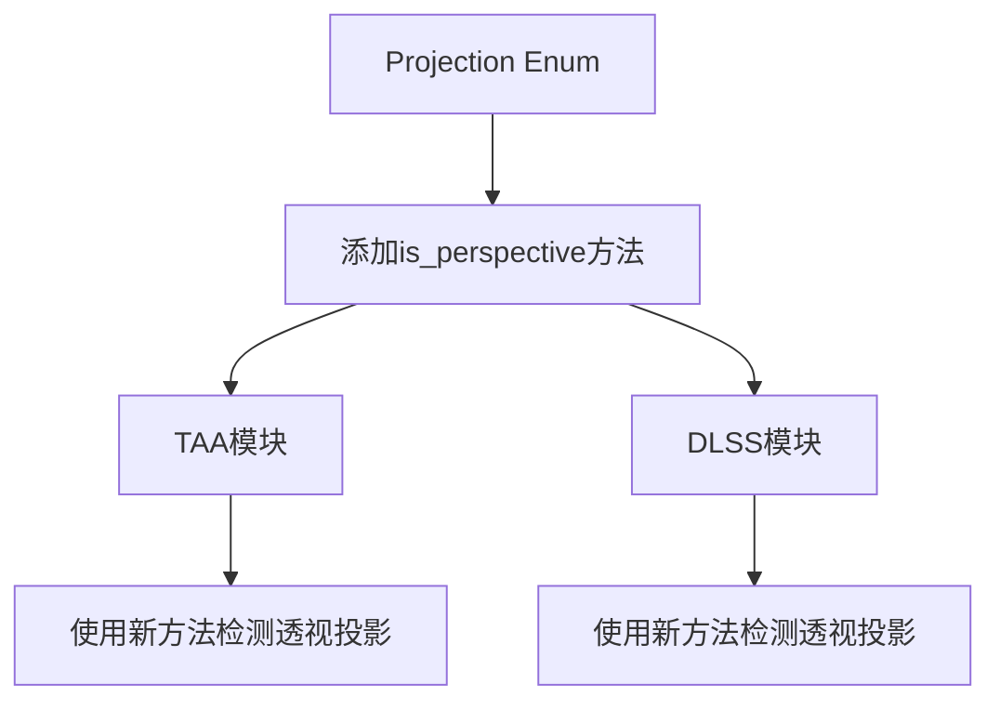

+++
title = "#20855 added anti-aliasing support for Custom Projection"
date = "2025-09-05T00:00:00"
draft = false
template = "pull_request_page.html"
in_search_index = false

[extra]
current_language = "zh-cn"
available_languages = {"en" = { name = "English", url = "/pull_request/bevy/2025-09/pr-20855-en-20250905" }, "zh-cn" = { name = "中文", url = "/pull_request/bevy/2025-09/pr-20855-zh-cn-20250905" }}
+++

# added anti-aliasing support for Custom Projection

## 基本信息
- **标题**: added anti-aliasing support for Custom Projection
- **PR链接**: https://github.com/bevyengine/bevy/pull/20855
- **作者**: diyu-motif
- **状态**: 已合并
- **标签**: C-Feature, A-Rendering, S-Ready-For-Final-Review, D-Straightforward
- **创建时间**: 2025-09-03T20:11:13Z
- **合并时间**: 2025-09-05T00:38:12Z
- **合并者**: alice-i-cecile

## 描述翻译
### Objective
支持自定义投影(Custom Projection)的抗锯齿功能。

### Solution
在Projection中添加了is_perspective()函数，它通过检查矩阵来判断自定义投影是否为透视投影。

### Testing
- 你是否测试了这些更改？如果是，如何测试的？
是的，我们有一个使用自定义投影的内部项目，我测试了TAA（时间性抗锯齿），但没有测试DLSS，不过它们的逻辑是相同的。

- 是否有任何部分需要更多测试？
N/A

- 其他人（审阅者）如何测试你的更改？他们需要了解什么特定信息吗？
详情请参阅：https://metashapes.com/blog/opengl-metal-projection-matrix-problem/

- 如果相关，你在哪些平台上测试了这些更改，是否有无法测试的重要平台？
N/A

## 本次PR的故事

这个PR解决了一个具体的渲染问题：Bevy引擎中的抗锯齿功能（包括TAA和DLSS）之前只支持标准的透视投影(Perspective Projection)，而不支持自定义投影(Custom Projection)，即使这些自定义投影实际上是透视类型的。

问题的核心在于检测逻辑。原来的代码使用模式匹配来检查投影类型：

```rust
let has_perspective_projection = matches!(camera_projection, Projection::Perspective(_));
```

这种方法对于自定义投影无效，因为自定义投影被归类为不同的枚举变体。然而，从技术上讲，自定义投影完全可能实现透视投影的数学特性。

解决方案很直接：在Projection枚举上添加一个`is_perspective()`方法，该方法能够智能地检测任何类型的投影是否为透视投影，包括自定义投影。对于自定义投影，它通过检查投影矩阵的w轴的w分量是否为0.0来判断：

```rust
pub fn is_perspective(&self) -> bool {
    match self {
        Projection::Perspective(_) => true,
        Projection::Orthographic(_) => false,
        Projection::Custom(projection) => projection.get_clip_from_view().w_axis.w == 0.0,
    }
}
```

这种方法的数学依据是标准透视投影矩阵的特性：在透视投影矩阵中，第四行（w轴）的w分量通常为0.0，这是区分透视投影和正交投影的关键特征。

实现后，TAA和DLSS模块中的提取代码被更新为使用这个新方法而不是原来的模式匹配：

```rust
// 之前：
let has_perspective_projection = matches!(camera_projection, Projection::Perspective(_));

// 之后：
if dlss.is_some() && camera.is_active && camera_projection.is_perspective()
```

这种变化保持了代码的简洁性，同时扩展了功能支持范围。从架构角度看，这是一个很好的抽象改进——将投影类型的检测逻辑封装在Projection类型自身中，而不是分散在多个使用站点。

需要注意的是，这个解决方案依赖于自定义投影正确实现其矩阵表示。如果开发者提供了不符合标准透视投影矩阵格式的自定义投影，检测可能会失败。但这是一个合理的假设，因为任何声称是透视投影的自定义实现都应该遵循标准的数学规范。

## 视觉表示



## 关键文件更改

### 1. `crates/bevy_camera/src/projection.rs` (+10/-0)
**修改内容**：添加了`is_perspective()`方法到Projection枚举中
```rust
/// Check if the projection is perspective.
/// For [`CustomProjection`], this checks if the projection matrix's w-axis's w is 0.0.
pub fn is_perspective(&self) -> bool {
    match self {
        Projection::Perspective(_) => true,
        Projection::Orthographic(_) => false,
        Projection::Custom(projection) => projection.get_clip_from_view().w_axis.w == 0.0,
    }
}
```
**原因**：提供统一的方法来检测任何类型的投影是否为透视投影，包括自定义投影。

### 2. `crates/bevy_anti_alias/src/dlss/extract.rs` (+1/-2)
**修改内容**：将硬编码的投影类型检查替换为调用新的`is_perspective()`方法
```rust
// 之前：
let has_perspective_projection = matches!(camera_projection, Projection::Perspective(_));

// 之后：
if dlss.is_some() && camera.is_active && camera_projection.is_perspective()
```
**原因**：使DLSS抗锯齿支持自定义透视投影。

### 3. `crates/bevy_anti_alias/src/taa/mod.rs` (+1/-2)
**修改内容**：同样将TAA的投影类型检查替换为调用新的`is_perspective()`方法
```rust
// 之前：
let has_perspective_projection = matches!(camera_projection, Projection::Perspective(_));

// 之后：
&& camera_projection.is_perspective()
```
**原因**：使TAA抗锯齿支持自定义透视投影。

## 延伸阅读

- [OpenGL/Metal投影矩阵问题详解](https://metashapes.com/blog/opengl-metal-projection-matrix-problem/) - 作者提供的关于投影矩阵技术的背景知识
- [Bevy相机和投影系统文档](https://bevyengine.org/learn/books/getting-started/camera/) - 了解Bevy中的相机系统
- [透视投影矩阵数学](https://www.scratchapixel.com/lessons/3d-basic-rendering/perspective-and-orthographic-projection-matrix/) - 深入理解透视投影的数学原理