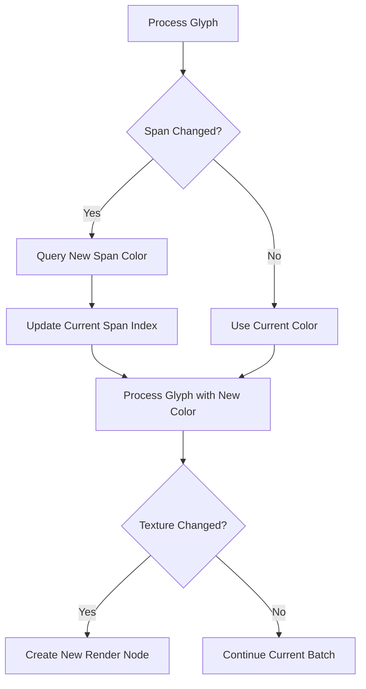

+++
title = "#20856 another text color fix"
date = "2025-09-03T00:00:00"
draft = false
template = "pull_request_page.html"
in_search_index = true

[taxonomies]
list_display = ["show"]

[extra]
current_language = "en"
available_languages = {"en" = { name = "English", url = "/pull_request/bevy/2025-09/pr-20856-en-20250903" }, "zh-cn" = { name = "中文", url = "/pull_request/bevy/2025-09/pr-20856-zh-cn-20250903" }}
labels = ["C-Bug", "A-Rendering", "A-Text", "M-Deliberate-Rendering-Change"]
+++

# another text color fix

## Basic Information
- **Title**: another text color fix
- **PR Link**: https://github.com/bevyengine/bevy/pull/20856
- **Author**: ickshonpe
- **Status**: MERGED
- **Labels**: C-Bug, A-Rendering, S-Ready-For-Final-Review, A-Text, M-Deliberate-Rendering-Change
- **Created**: 2025-09-03T20:30:44Z
- **Merged**: 2025-09-03T21:18:44Z
- **Merged By**: mockersf

## Description
# Objective

Fixes #20854

## Solution

Query for the next color on span changes before queuing the next glyph.

## Testing

Added two more cases to `testbed_ui`'s text example, the three lines of coloured text should all look identical:

```cargo run --example testbed_ui```


## The Story of This Pull Request

This PR addresses a text rendering bug where colors weren't updating correctly when transitioning between text spans with different colors. The issue occurred in Bevy's UI text rendering system when processing glyphs from multiple text spans with varying color styles.

The core problem was in the `extract_text_sections` function in `bevy_ui_render`. The original implementation attempted to update the color for the next span after processing the current glyph, but this approach had two key issues:

1. It only checked for span changes when the next glyph was from a different texture
2. It looked ahead to the next span index rather than properly tracking the current span

The solution involved restructuring the color handling logic to track span changes proactively rather than reactively. Here's how the fix works:

First, we introduce a `current_span_index` variable to track which span we're currently processing. For each glyph, we check if we've moved to a new span. If we have, we immediately query the text style for that span entity and update the current color:

```rust
let mut current_span_index = 0;

for (i, PositionedGlyph { position, atlas_info, span_index, .. }) in text_layout_info.glyphs.iter().enumerate() {
    if current_span_index != *span_index
        && let Some(span_entity) = computed_block.entities().get(*span_index).map(|t| t.entity)
    {
        color = text_styles
            .get(span_entity)
            .map(|text_color| LinearRgba::from(text_color.0))
            .unwrap_or_default();
        current_span_index = *span_index;
    }
    // ... rest of glyph processing
}
```

This ensures that color changes are applied at the beginning of each new span, rather than at the end of the previous span. The color is now correctly set before any glyphs from the new span are processed.

Additionally, the condition for creating new `ExtractedUiNode` instances was simplified. The original code checked for both span changes and texture changes:

```rust
if text_layout_info.glyphs.get(i + 1).is_none_or(|info| {
    info.span_index != *span_index || info.atlas_info.texture != atlas_info.texture
}) {
    // Create new node
}
```

This was simplified to only check for texture changes, since span-based color handling is now managed separately:

```rust
if text_layout_info
    .glyphs
    .get(i + 1)
    .is_none_or(|info| info.atlas_info.texture != atlas_info.texture)
{
    // Create new node
}
```

The PR also adds comprehensive test cases to verify the fix works correctly. Two new text examples were added to the testbed UI that demonstrate multi-color text rendering with various span configurations, including empty spans and multiple consecutive color changes.

## Visual Representation



## Key Files Changed

### `crates/bevy_ui_render/src/lib.rs`
This file contains the core text rendering logic. The changes fix how text colors are handled when processing multiple spans.

**Key changes:**
- Added span tracking with `current_span_index` variable
- Moved color query to beginning of glyph processing loop
- Simplified node creation condition to only consider texture changes

```rust
// Before:
if text_layout_info.glyphs.get(i + 1).is_none_or(|info| {
    info.span_index != *span_index || info.atlas_info.texture != atlas_info.texture
}) {
    // Color update logic here
}

// After:
if current_span_index != *span_index
    && let Some(span_entity) = computed_block.entities().get(*span_index).map(|t| t.entity)
{
    color = text_styles
        .get(span_entity)
        .map(|text_color| LinearRgba::from(text_color.0))
        .unwrap_or_default();
    current_span_index = *span_index;
}

if text_layout_info
    .glyphs
    .get(i + 1)
    .is_none_or(|info| info.atlas_info.texture != atlas_info.texture)
{
    // Node creation logic (no color update)
}
```

### `examples/testbed/ui.rs`
This file contains UI test examples. Two new test cases were added to verify the color fix works correctly.

**Key changes:**
- Added two multi-color text examples with different span configurations
- Includes cases with empty spans and multiple color changes
- Provides regression tests for the fixed behavior

```rust
// First test case - basic multi-color text
children![
    (TextSpan::new("white "), ...),
    (TextSpan::new("red "), TextColor(RED.into())),
    (TextSpan::new("green "), TextColor(GREEN.into())),
    (TextSpan::new("blue "), TextColor(BLUE.into())),
    // ...
]

// Second test case - complex with empty spans
children![
    (TextSpan::new(""), TextColor(YELLOW.into())),
    TextSpan::new(""),
    (TextSpan::new("white "), ...),
    TextSpan::new(""),
    (TextSpan::new("red "), TextColor(RED.into())),
    // ...
]
```

## Further Reading

- Bevy Text Rendering Documentation: https://bevyengine.org/learn/books/introduction/2d-rendering/ui
- PR #20854: The original issue this PR fixes
- Bevy UI System Overview: https://github.com/bevyengine/bevy/blob/main/crates/bevy_ui/README.md
- Text and Font Handling in Bevy: https://github.com/bevyengine/bevy/blob/main/crates/bevy_text/README.md