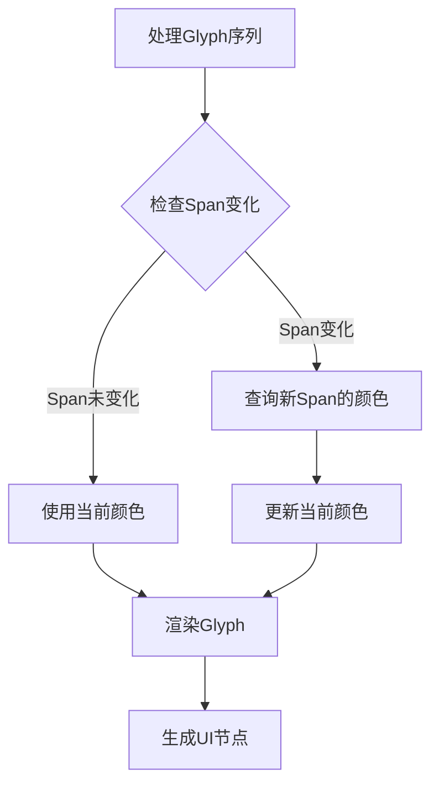

+++
title = "#20856 another text color fix"
date = "2025-09-03T00:00:00"
draft = false
template = "pull_request_page.html"
in_search_index = false

[extra]
current_language = "zh-cn"
available_languages = {"en" = { name = "English", url = "/pull_request/bevy/2025-09/pr-20856-en-20250903" }, "zh-cn" = { name = "中文", url = "/pull_request/bevy/2025-09/pr-20856-zh-cn-20250903" }}
labels = ["C-Bug", "A-Rendering", "A-Text", "M-Deliberate-Rendering-Change"]
+++

# Title

## Basic Information
- **Title**: another text color fix
- **PR Link**: https://github.com/bevyengine/bevy/pull/20856
- **Author**: ickshonpe
- **Status**: MERGED
- **Labels**: C-Bug, A-Rendering, S-Ready-For-Final-Review, A-Text, M-Deliberate-Rendering-Change
- **Created**: 2025-09-03T20:30:44Z
- **Merged**: 2025-09-03T21:18:44Z
- **Merged By**: mockersf

## Description Translation
### 目标

修复 #20854

### 解决方案

在span变化时，在排队下一个glyph之前查询下一个颜色。

### 测试

在`testbed_ui`的文本示例中添加了另外两个测试用例，三行彩色文本看起来应该完全相同：

```cargo run --example testbed_ui```


## The Story of This Pull Request

这个PR解决了一个文本渲染中的颜色处理问题。在Bevy的UI文本渲染系统中，当文本包含多个span（具有不同样式的文本片段）时，颜色更新逻辑存在缺陷。

问题的核心在于原来的颜色查询时机不正确。在`extract_text_sections`函数中，系统在处理完当前span的所有glyph后，才查询下一个span的颜色。这种方法的问题是：当处理当前span的最后一个glyph时，系统已经提前查询了下一个span的颜色，导致最后一个glyph使用了错误的颜色值。

原来的逻辑是这样的：
```rust
if text_layout_info.glyphs.get(i + 1).is_none_or(|info| {
    info.span_index != *span_index || info.atlas_info.texture != atlas_info.texture
}) {
    // 在这里查询下一个span的颜色
    color = text_styles.get(...).map(...).unwrap_or_default();
}
```

这种实现方式的问题在于，它在处理当前span的最后一个glyph时就已经查询并设置了下一个span的颜色，导致当前span的最后一个glyph使用了下一个span的颜色值。

解决方案是将颜色查询逻辑提前到span变化时立即执行。新的实现：

1. 在处理每个glyph之前，检查当前span索引是否发生了变化
2. 如果span索引发生了变化，立即查询新span对应的颜色
3. 使用正确的颜色渲染当前glyph

关键的技术改进是在glyph处理循环的开始处添加了span变化检测：
```rust
if current_span_index != *span_index
    && let Some(span_entity) = computed_block.entities().get(*span_index).map(|t| t.entity)
{
    color = text_styles
        .get(span_entity)
        .map(|text_color| LinearRgba::from(text_color.0))
        .unwrap_or_default();
    current_span_index = *span_index;
}
```

这个修改确保了每个glyph都使用其所属span的正确颜色，而不是提前使用下一个span的颜色。

为了验证修复效果，PR添加了两个额外的测试用例到`testbed_ui`示例中。这些测试用例创建了包含多个span的复杂文本布局，确保颜色渲染在各种边界情况下都能正确工作。

从工程角度来看，这个修复展示了正确处理状态机转换的重要性。在处理序列化数据（如glyph序列）时，状态更新应该在状态转换发生时立即执行，而不是延迟到后续处理阶段。

## Visual Representation



## Key Files Changed

### `crates/bevy_ui_render/src/lib.rs`

这个文件包含了文本渲染的核心逻辑。主要的修改是在`extract_text_sections`函数中改进了颜色处理逻辑。

**修改前：**
```rust
let mut color = text_color.0.to_linear();

for (i, PositionedGlyph { ... }) in text_layout_info.glyphs.iter().enumerate() {
    // 渲染glyph的逻辑...
    
    if text_layout_info.glyphs.get(i + 1).is_none_or(|info| {
        info.span_index != *span_index || info.atlas_info.texture != atlas_info.texture
    }) {
        color = text_styles
            .get(
                computed_block
                    .entities()
                    .get(*span_index + 1)
                    .map(|t| t.entity)
                    .unwrap_or(Entity::PLACEHOLDER),
            )
            .map(|text_color| LinearRgba::from(text_color.0))
            .unwrap_or_default();
    }
}
```

**修改后：**
```rust
let mut color = text_color.0.to_linear();
let mut current_span_index = 0;

for (i, PositionedGlyph { ... }) in text_layout_info.glyphs.iter().enumerate() {
    if current_span_index != *span_index
        && let Some(span_entity) = computed_block.entities().get(*span_index).map(|t| t.entity)
    {
        color = text_styles
            .get(span_entity)
            .map(|text_color| LinearRgba::from(text_color.0))
            .unwrap_or_default();
        current_span_index = *span_index;
    }
    
    // 渲染glyph的逻辑...
    
    if text_layout_info
        .glyphs
        .get(i + 1)
        .is_none_or(|info| info.atlas_info.texture != atlas_info.texture)
    {
        // 简化了纹理变化处理逻辑
    }
}
```

### `examples/testbed/ui.rs`

这个文件添加了测试用例来验证颜色修复的正确性。

**新增的测试用例：**
```rust
// 第一个测试用例：基本的颜色span序列
commands.spawn((Node { ... }, Text::new(""), children![
    (TextSpan::new("white "), ...),
    (TextSpan::new("red "), TextColor(RED.into()),),
    (TextSpan::new("green "), TextColor(GREEN.into()),),
    (TextSpan::new("blue "), TextColor(BLUE.into()),),
    (TextSpan::new("black"), TextColor(Color::BLACK), ...),
]));

// 第二个测试用例：更复杂的包含空span的序列
commands.spawn((Node { ... }, Text::new(""), children![
    (TextSpan::new(""), TextColor(YELLOW.into()),),
    TextSpan::new(""),
    (TextSpan::new("white "), ...),
    TextSpan::new(""),
    (TextSpan::new("red "), TextColor(RED.into()),),
    TextSpan::new(""),
    TextSpan::new(""),
    (TextSpan::new("green "), TextColor(GREEN.into()),),
    (TextSpan::new(""), TextColor(YELLOW.into()),),
    (TextSpan::new("blue "), TextColor(BLUE.into()),),
    TextSpan::new(""),
    (TextSpan::new(""), TextColor(YELLOW.into()),),
    (TextSpan::new("black"), TextColor(Color::BLACK), ...),
    TextSpan::new(""),
]));
```

这些测试用例创建了复杂的文本布局，包含多个颜色span和空span，确保修复在各种边界情况下都能正常工作。

## Further Reading

- [Bevy Text Rendering Documentation](https://docs.rs/bevy_ui/latest/bevy_ui/text/index.html)
- [Glyph和Span的概念](https://docs.rs/bevy_text/latest/bevy_text/struct.Text.html)
- [线性颜色空间](https://en.wikipedia.org/wiki/Linear_RGB)
- [状态机在渲染系统中的应用](https://gameprogrammingpatterns.com/state.html)