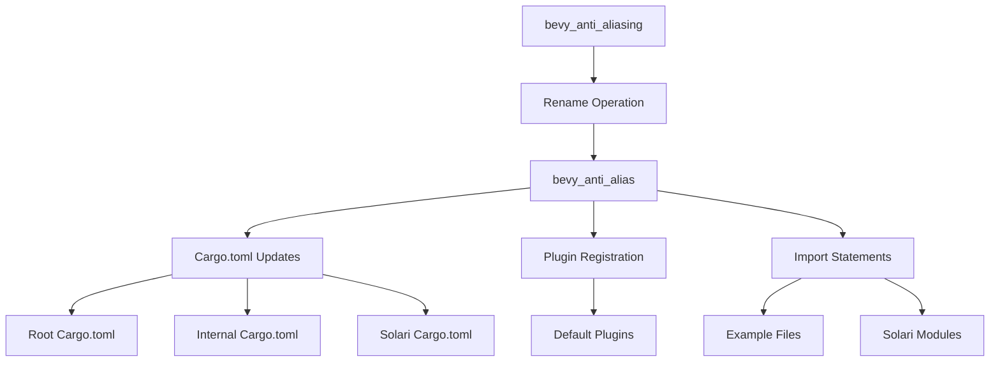

+++
title = "#20857 rename bevy_anti_aliasing to bevy_anti_alias"
date = "2025-09-04T00:00:00"
draft = false
template = "pull_request_page.html"
in_search_index = true

[taxonomies]
list_display = ["show"]

[extra]
current_language = "en"
available_languages = {"en" = { name = "English", url = "/pull_request/bevy/2025-09/pr-20857-en-20250904" }, "zh-cn" = { name = "中文", url = "/pull_request/bevy/2025-09/pr-20857-zh-cn-20250904" }}
labels = ["A-Rendering"]
+++

# Title
rename bevy_anti_aliasing to bevy_anti_alias

## Basic Information
- **Title**: rename bevy_anti_aliasing to bevy_anti_alias
- **PR Link**: https://github.com/bevyengine/bevy/pull/20857
- **Author**: atlv24
- **Status**: MERGED
- **Labels**: A-Rendering, S-Ready-For-Final-Review
- **Created**: 2025-09-04T04:32:32Z
- **Merged**: 2025-09-04T21:33:42Z
- **Merged By**: alice-i-cecile

## Description Translation
# Objective

- rename to have less suffixing
- match future bevy_post_process crate

## Solution

- remove ing

## Testing

- run anti_aliasing example (not renamed, can rename this too if desired)

## The Story of This Pull Request

This PR addresses a naming consistency issue within Bevy's anti-aliasing system. The core problem was that the crate name `bevy_anti_aliasing` used the "-ing" suffix, which didn't align with Bevy's naming conventions and would create inconsistency with a planned `bevy_post_process` crate.

The solution was straightforward: rename the crate from `bevy_anti_aliasing` to `bevy_anti_alias` by removing the "-ing" suffix. This change affects multiple areas of the codebase, including Cargo.toml files, plugin registrations, import statements, and documentation.

The implementation required updating all references to the old crate name across the entire codebase. This included:
- Renaming the crate directory and updating its Cargo.toml
- Updating feature flags and dependencies in multiple Cargo.toml files
- Modifying plugin registration in the default plugins setup
- Updating import statements in examples and internal modules
- Adjusting documentation to reflect the new naming

The technical approach was systematic: first rename the crate directory and update its internal structure, then update all external references to point to the new name. The plugin struct was also renamed from `AntiAliasingPlugin` to `AntiAliasPlugin` to maintain consistency.

This change doesn't affect functionality but improves naming consistency throughout the codebase. It follows Rust's convention of using concise, clear names for crates and aligns with Bevy's established patterns for crate naming.

## Visual Representation



## Key Files Changed

1. **Cargo.toml (root)**
   - Updated feature definitions and descriptions to use the new crate name
   ```toml
   # Before:
   bevy_anti_aliasing = ["bevy_internal/bevy_anti_aliasing"]
   
   # After:
   bevy_anti_alias = ["bevy_internal/bevy_anti_alias"]
   ```

2. **crates/bevy_anti_alias/src/lib.rs**
   - Renamed the main plugin struct
   ```rust
   // Before:
   pub struct AntiAliasingPlugin;
   
   // After:
   pub struct AntiAliasPlugin;
   ```

3. **crates/bevy_internal/Cargo.toml**
   - Updated multiple feature flags and dependencies
   ```toml
   # Before:
   smaa_luts = ["bevy_anti_aliasing?/smaa_luts", "ktx2", "bevy_image/zstd"]
   
   # After:
   smaa_luts = ["bevy_anti_alias?/smaa_luts", "ktx2", "bevy_image/zstd"]
   ```

4. **crates/bevy_internal/src/default_plugins.rs**
   - Updated plugin registration to use the new name
   ```rust
   // Before:
   bevy_anti_aliasing:::AntiAliasingPlugin,
   
   // After:
   bevy_anti_alias:::AntiAliasPlugin,
   ```

5. **crates/bevy_solari/Cargo.toml**
   - Updated dependency to use the new crate name
   ```toml
   # Before:
   bevy_anti_aliasing = { path = "../bevy_anti_aliasing", version = "0.17.0-dev" }
   
   # After:
   bevy_anti_alias = { path = "../bevy_anti_alias", version = "0.17.0-dev" }
   ```

6. **Multiple example files**
   - Updated import statements to use the new module path
   ```rust
   // Before:
   use bevy::anti_aliasing::{...};
   
   // After:
   use bevy::anti_alias::{...};
   ```

## Further Reading

- [Rust Cargo.toml Specification](https://doc.rust-lang.org/cargo/reference/manifest.html)
- [Bevy Plugin System Documentation](https://bevyengine.org/learn/book/getting-started/plugins/)
- [Bevy Anti-Aliasing Features](https://bevyengine.org/learn/book/getting-started/anti-aliasing/)