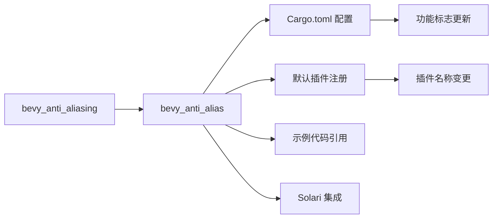

+++
title = "#20857 rename bevy_anti_aliasing to bevy_anti_alias"
date = "2025-09-04T00:00:00"
draft = false
template = "pull_request_page.html"
in_search_index = false

[extra]
current_language = "zh-cn"
available_languages = {"en" = { name = "English", url = "/pull_request/bevy/2025-09/pr-20857-en-20250904" }, "zh-cn" = { name = "中文", url = "/pull_request/bevy/2025-09/pr-20857-zh-cn-20250904" }}
labels = ["A-Rendering"]
+++

# Title
rename bevy_anti_aliasing to bevy_anti_alias

## Basic Information
- **Title**: rename bevy_anti_aliasing to bevy_anti_alias
- **PR Link**: https://github.com/bevyengine/bevy/pull/20857
- **Author**: atlv24
- **Status**: MERGED
- **Labels**: A-Rendering, S-Ready-For-Final-Review
- **Created**: 2025-09-04T04:32:32Z
- **Merged**: 2025-09-04T21:33:42Z
- **Merged By**: alice-i-cecile

## Description Translation
# 目标 (Objective)

- 重命名以减少后缀
- 与未来的 bevy_post_process crate 保持一致

## 解决方案 (Solution)

- 移除 "ing" 后缀

## 测试 (Testing)

- 运行 anti_aliasing 示例（未重命名，如果需要也可以重命名此示例）

## The Story of This Pull Request

这个 PR 的核心是一个简单的命名规范化任务。开发团队决定将抗锯齿模块的名称从 `bevy_anti_aliasing` 改为 `bevy_anti_alias`，主要出于两个技术考虑：减少不必要的后缀和与未来规划中的后处理模块命名保持一致。

在软件工程中，命名一致性对于代码维护和开发者体验至关重要。原名称 `bevy_anti_aliasing` 使用了动名词形式，而新的命名约定倾向于使用更简洁的名词形式 `bevy_anti_alias`。这种变化不仅减少了字符数量，更重要的是为整个后处理相关的模块系列建立了统一的命名模式。

实现这个重命名需要系统性地修改整个代码库中的引用点。这包括：
1. 重命名 crate 目录和文件
2. 更新 Cargo.toml 中的依赖声明
3. 修改代码中的导入语句
4. 更新插件名称和配置
5. 调整示例代码中的使用方式

从技术角度来看，这种重命名操作虽然概念上简单，但需要仔细处理以确保所有引用都被正确更新，避免破坏构建或运行时行为。PR 作者通过批量重命名和全局搜索替换的方式完成了这项工作，确保了所有相关文件的一致性修改。

值得注意的是，虽然模块名称发生了变化，但所有的公共 API 接口和功能都保持不变。这意味着现有的用户代码只需要更新导入路径，而不需要修改实际的抗锯齿配置逻辑。



## Key Files Changed

### `crates/bevy_internal/Cargo.toml` (+8/-8)
这个文件包含了 Bevy 内部模块的依赖配置。修改更新了所有对 `bevy_anti_aliasing` 的引用为 `bevy_anti_alias`，包括功能标志和依赖项声明。

```toml
# Before:
bevy_anti_aliasing = { path = "../bevy_anti_aliasing", optional = true, version = "0.17.0-dev" }

# After:
bevy_anti_alias = { path = "../bevy_anti_alias", optional = true, version = "0.17.0-dev" }
```

### `crates/bevy_internal/src/default_plugins.rs` (+3/-3)
更新了默认插件注册中的插件名称引用，确保抗锯齿插件能够正确加载。

```rust
// Before:
#[cfg(feature = "bevy_anti_aliasing")]
bevy_anti_aliasing:::AntiAliasingPlugin,

// After:
#[cfg(feature = "bevy_anti_alias")]
bevy_anti_alias:::AntiAliasPlugin,
```

### `crates/bevy_solari/Cargo.toml` (+3/-3)
更新了 Solari 模块对抗锯齿模块的依赖声明，确保构建时能正确找到重命名后的 crate。

```toml
# Before:
bevy_anti_aliasing = { path = "../bevy_anti_aliasing", version = "0.17.0-dev" }

# After:
bevy_anti_alias = { path = "../bevy_anti_alias", version = "0.17.0-dev" }
```

### `Cargo.toml` (+2/-2)
更新了根项目的功能标志定义，确保用户能够正确启用抗锯齿功能。

```toml
# Before:
bevy_anti_aliasing = ["bevy_internal/bevy_anti_aliasing"]

# After:
bevy_anti_alias = ["bevy_internal/bevy_anti_alias"]
```

### `crates/bevy_anti_alias/src/lib.rs` (+2/-2)
更新了插件本身的名称，从 `AntiAliasingPlugin` 改为 `AntiAliasPlugin`，与 crate 名称保持一致。

```rust
// Before:
pub struct AntiAliasingPlugin;

// After:
pub struct AntiAliasPlugin;
```

## Further Reading

- [Rust Cargo.toml 格式规范](https://doc.rust-lang.org/cargo/reference/manifest.html)
- [Bevy 插件系统文档](https://bevyengine.org/learn/plugins/)
- [软件工程中的命名最佳实践](https://rust-lang.github.io/api-guidelines/naming.html)