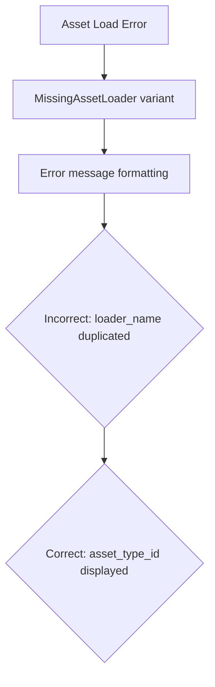

+++
title = "#20858 Fix error message in asset loader for MissingAssetLoader"
date = "2025-09-04T00:00:00"
draft = false
template = "pull_request_page.html"
in_search_index = true

[taxonomies]
list_display = ["show"]

[extra]
current_language = "en"
available_languages = {"en" = { name = "English", url = "/pull_request/bevy/2025-09/pr-20858-en-20250904" }, "zh-cn" = { name = "中文", url = "/pull_request/bevy/2025-09/pr-20858-zh-cn-20250904" }}
labels = ["C-Bug", "D-Trivial", "A-Assets"]
+++

# Fix error message in asset loader for MissingAssetLoader

## Basic Information
- **Title**: Fix error message in asset loader for MissingAssetLoader
- **PR Link**: https://github.com/bevyengine/bevy/pull/20858
- **Author**: chaosteil
- **Status**: MERGED
- **Labels**: C-Bug, D-Trivial, A-Assets
- **Created**: 2025-09-04T06:37:27Z
- **Merged**: 2025-09-04T07:18:22Z
- **Merged By**: james7132

## Description Translation
# Objective

- Addresses typo in the error message for `MissingAssetLoader`.

## Solution

- Fixed typo so TypeId is in the error message.

## Testing

Removed the glb loader and got these errors:
```
ERROR bevy_asset::server: Could not find an asset loader matching: Loader Name: None; Asset Type: Some(TypeId(0x2e8ddd3139ef47afd4012da1e702dc0f)); Extension: None; Path: Some("models/animated/Fox.glb#Animation2");
ERROR bevy_asset::server: Could not find an asset loader matching: Loader Name: None; Asset Type: Some(TypeId(0x5da2185084a1f827ba69a74a987a0946)); Extension: None; Path: Some("models/animated/Fox.glb#Scene0")
```

## The Story of This Pull Request

This PR addresses a straightforward but important bug in Bevy's asset loading system. The issue was in the error message formatting for the `MissingAssetLoader` variant of the `AssetLoadError` enum. When an asset loader couldn't be found, the error message was incorrectly displaying the loader name twice instead of showing the asset type ID.

The problem occurred in the `#[error]` attribute macro for the `MissingAssetLoader` enum variant. The format string contained a typo where `{loader_name:?}` was used instead of `{asset_type_id:?}` for the asset type field. This meant developers debugging asset loading issues would see duplicate loader name information instead of the actual TypeId of the asset that failed to load.

The fix was simple but crucial for debugging: replace the incorrect field reference in the format string. The corrected error message now properly displays the TypeId, which is essential information for identifying why a particular asset couldn't be loaded. This TypeId helps developers determine which asset type is missing a loader and whether there's a registration issue with specific asset types.

The testing methodology demonstrated the fix's effectiveness - by removing the glb loader and observing the error messages, the author confirmed that the TypeId now appears correctly in the output. This change doesn't affect the functionality of asset loading itself, but significantly improves the debugging experience by providing accurate diagnostic information.

## Visual Representation



## Key Files Changed

**File: `crates/bevy_asset/src/server/mod.rs`**

This file contains the definition of the `AssetLoadError` enum, specifically the `MissingAssetLoader` variant where the error message formatting was incorrect.

**Change:** Fixed a typo in the error message format string for the `MissingAssetLoader` variant.

```rust
// Before:
#[error("Could not find an asset loader matching: Loader Name: {loader_name:?}; Asset Type: {loader_name:?}; Extension: {extension:?}; Path: {asset_path:?};")]

// After:
#[error("Could not find an asset loader matching: Loader Name: {loader_name:?}; Asset Type: {asset_type_id:?}; Extension: {extension:?}; Path: {asset_path:?};")]
```

The change replaces the second occurrence of `loader_name` with `asset_type_id` in the format string, ensuring the actual TypeId of the asset is displayed in error messages rather than a duplicate loader name.

## Further Reading

- [Bevy Assets Documentation](https://bevyengine.org/learn/books/0.13/assets/)
- [Rust Formatting Syntax](https://doc.rust-lang.org/std/fmt/index.html)
- [TypeId in Rust](https://doc.rust-lang.org/std/any/struct.TypeId.html)
- [thiserror Crate Documentation](https://docs.rs/thiserror/latest/thiserror/) (used for error derivation in Bevy)

# Full Code Diff
```diff
diff --git a/crates/bevy_asset/src/server/mod.rs b/crates/bevy_asset/src/server/mod.rs
index 641952a67150e..8e8e6d734d7b4 100644
--- a/crates/bevy_asset/src/server/mod.rs
+++ b/crates/bevy_asset/src/server/mod.rs
@@ -1906,7 +1906,7 @@ pub enum AssetLoadError {
         actual_asset_name: &'static str,
         loader_name: &'static str,
     },
-    #[error("Could not find an asset loader matching: Loader Name: {loader_name:?}; Asset Type: {loader_name:?}; Extension: {extension:?}; Path: {asset_path:?};")]
+    #[error("Could not find an asset loader matching: Loader Name: {loader_name:?}; Asset Type: {asset_type_id:?}; Extension: {extension:?}; Path: {asset_path:?};")]
     MissingAssetLoader {
         loader_name: Option<String>,
         asset_type_id: Option<TypeId>,
```