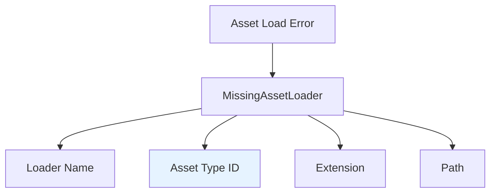

+++
title = "#20858 Fix error message in asset loader for MissingAssetLoader"
date = "2025-09-04T00:00:00"
draft = false
template = "pull_request_page.html"
in_search_index = false

[extra]
current_language = "zh-cn"
available_languages = {"en" = { name = "English", url = "/pull_request/bevy/2025-09/pr-20858-en-20250904" }, "zh-cn" = { name = "中文", url = "/pull_request/bevy/2025-09/pr-20858-zh-cn-20250904" }}
+++

# Fix error message in asset loader for MissingAssetLoader

## 基本信息
- **标题**: Fix error message in asset loader for MissingAssetLoader
- **PR链接**: https://github.com/bevyengine/bevy/pull/20858
- **作者**: chaosteil
- **状态**: 已合并
- **标签**: C-Bug, D-Trivial, A-Assets
- **创建时间**: 2025-09-04T06:37:27Z
- **合并时间**: 2025-09-04T07:18:22Z
- **合并者**: james7132

## 描述翻译
### Objective
- 修复 `MissingAssetLoader` 错误消息中的拼写错误。

### Solution
- 修复了拼写错误，使 TypeId 能够正确显示在错误消息中。

### Testing
移除了 glb loader 后得到以下错误信息：
```
ERROR bevy_asset::server: Could not find an asset loader matching: Loader Name: None; Asset Type: Some(TypeId(0x2e8ddd3139ef47afd4012da1e702dc0f)); Extension: None; Path: Some("models/animated/Fox.glb#Animation2");
ERROR bevy_asset::server: Could not find an asset loader matching: Loader Name: None; Asset Type: Some(TypeId(0x5da2185084a1f827ba69a74a987a0946)); Extension: None; Path: Some("models/animated/Fox.glb#Scene0")
```

## 本次PR的技术分析

### 问题背景与上下文
在 Bevy 引擎的资产加载系统中，当无法找到合适的资产加载器时，系统会抛出 `MissingAssetLoader` 错误。这个错误消息本应提供详细的调试信息，包括加载器名称、资产类型ID、文件扩展名和路径。然而，在原始实现中，资产类型ID字段被错误地配置为显示加载器名称，导致开发者无法获得准确的调试信息。

这个问题虽然看起来是一个简单的拼写错误，但实际上影响了调试效率。当开发者遇到资产加载失败时，错误消息无法正确显示资产的实际类型ID，这使得定位问题变得更加困难。特别是在处理复杂资产依赖链时，准确的类型信息对于诊断加载失败原因至关重要。

### 解决方案与实现
解决方案非常直接：修复错误消息格式化字符串中的字段引用。原本的错误消息模板中，资产类型字段错误地引用了 `loader_name` 而不是正确的 `asset_type_id` 字段。

修改前的代码：
```rust
#[error("Could not find an asset loader matching: Loader Name: {loader_name:?}; Asset Type: {loader_name:?}; Extension: {extension:?}; Path: {asset_path:?};")]
```

修改后的代码：
```rust
#[error("Could not find an asset loader matching: Loader Name: {loader_name:?}; Asset Type: {asset_type_id:?}; Extension: {extension:?}; Path: {asset_path:?};")]
```

这个修改确保了当系统无法找到合适的资产加载器时，错误消息能够正确显示资产的 TypeId，而不是重复显示加载器名称。

### 技术细节与实现考量
这个修复涉及 Bevy 资产系统的错误处理机制。`MissingAssetLoader` 是一个枚举变体，使用 `#[error]` 属性宏来自动生成错误消息的格式化输出。宏中的格式化字符串使用大括号语法来引用结构体字段。

关键的技术点是：
1. **TypeId 的重要性**: TypeId 是 Rust 标准库中的类型，用于唯一标识每个类型。在资产系统中，它帮助识别需要加载的资产类型。
2. **错误消息的调试价值**: 准确的错误消息对于开发者调试资产加载问题至关重要，特别是在复杂的游戏项目中可能涉及多种资产类型和加载器。

### 影响与价值
这个简单的修改带来了明显的实用价值：
1. **调试效率提升**: 开发者现在可以看到实际的资产类型ID，这有助于快速识别哪种类型的资产无法找到合适的加载器。
2. **错误诊断改进**: 准确的类型信息使得区分不同类型的资产加载问题变得更加容易。
3. **维护性增强**: 修复拼写错误提高了代码质量和可维护性。

从测试结果可以看出，修复后的错误消息现在正确显示了资产的 TypeId 值（如 `TypeId(0x2e8ddd3139ef47afd4012da1e702dc0f)`），而不是之前重复的加载器名称信息。

## 可视化关系



图中高亮部分（Asset Type ID）是本PR修复的关键字段。

## 关键文件变更

### `crates/bevy_asset/src/server/mod.rs` (+1/-1)

这个文件包含了资产服务器的主要实现，包括错误处理逻辑。修改涉及 `AssetLoadError` 枚举中的 `MissingAssetLoader` 变体的错误消息格式化字符串。

**修改前:**
```rust
#[error("Could not find an asset loader matching: Loader Name: {loader_name:?}; Asset Type: {loader_name:?}; Extension: {extension:?}; Path: {asset_path:?};")]
```

**修改后:**
```rust
#[error("Could not find an asset loader matching: Loader Name: {loader_name:?}; Asset Type: {asset_type_id:?}; Extension: {extension:?}; Path: {asset_path:?};")]
```

这个修改将错误消息中的第二个 `{loader_name:?}` 替换为 `{asset_type_id:?}`，确保了资产类型ID能够正确显示在错误消息中。

## 延伸阅读

对于想要深入了解相关概念的开发者，建议参考以下资源：

1. **Rust 的 TypeId 文档**: https://doc.rust-lang.org/std/any/struct.TypeId.html
2. **Bevy 资产系统指南**: https://bevyengine.org/learn/book/assets/
3. **Rust 的错误处理最佳实践**: https://doc.rust-lang.org/book/ch09-00-error-handling.html
4. **Bevy 的资产加载器架构**: https://github.com/bevyengine/bevy/blob/main/crates/bevy_asset/src/loader.rs

## 完整代码差异

```diff
diff --git a/crates/bevy_asset/src/server/mod.rs b/crates/bevy_asset/src/server/mod.rs
index 641952a67150e..8e8e6d734d7b4 100644
--- a/crates/bevy_asset/src/server/mod.rs
+++ b/crates/bevy_asset/src/server/mod.rs
@@ -1906,7 +1906,7 @@ pub enum AssetLoadError {
         actual_asset_name: &'static str,
         loader_name: &'static str,
     },
-    #[error("Could not find an asset loader matching: Loader Name: {loader_name:?}; Asset Type: {loader_name:?}; Extension: {extension:?}; Path: {asset_path:?};")]
+    #[error("Could not find an asset loader matching: Loader Name: {loader_name:?}; Asset Type: {asset_type_id:?}; Extension: {extension:?}; Path: {asset_path:?};")]
     MissingAssetLoader {
         loader_name: Option<String>,
         asset_type_id: Option<TypeId>,
```