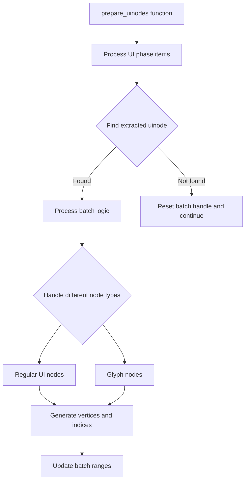

+++
title = "#20863 `prepare_uinodes` refactor"
date = "2025-09-04T00:00:00"
draft = false
template = "pull_request_page.html"
in_search_index = true

[taxonomies]
list_display = ["show"]

[extra]
current_language = "en"
available_languages = {"en" = { name = "English", url = "/pull_request/bevy/2025-09/pr-20863-en-20250904" }, "zh-cn" = { name = "中文", url = "/pull_request/bevy/2025-09/pr-20863-zh-cn-20250904" }}
labels = ["D-Trivial", "A-Rendering", "A-UI", "C-Code-Quality"]
+++

# Title
`prepare_uinodes` refactor

## Basic Information
- **Title**: `prepare_uinodes` refactor
- **PR Link**: https://github.com/bevyengine/bevy/pull/20863
- **Author**: ickshonpe
- **Status**: MERGED
- **Labels**: D-Trivial, A-Rendering, A-UI, C-Code-Quality, S-Ready-For-Final-Review
- **Created**: 2025-09-04T13:01:57Z
- **Merged**: 2025-09-04T18:07:13Z
- **Merged By**: alice-i-cecile

## Description Translation
# Objective

Flatten the inner section of `prepare_uinodes` one level by replacing the if-let-else block with let-some-else-continue.

## Testing

Should see no changes with:
```cargo run --example testbed_ui```

## The Story of This Pull Request

This PR addresses a code readability issue in Bevy's UI rendering system. The `prepare_uinodes` function in `crates/bevy_ui_render/src/lib.rs` had become complex with deep nesting levels, making it harder to maintain and understand.

The core problem was an if-let-else block structure that created unnecessary indentation levels. The original code followed this pattern:

```rust
if let Some(extracted_uinode) = extracted_uinodes.uinodes.get(item.index) {
    // Main logic with multiple nested conditionals
} else {
    batch_image_handle = AssetId::invalid();
    continue;
}
```

This structure forced the entire main processing logic to be nested inside the if block, creating significant indentation that made the code harder to read and follow.

The solution adopted a more idiomatic Rust pattern using `let-some-else-continue`. This approach flattens the code by handling the early exit case first:

```rust
let Some(extracted_uinode) = extracted_uinodes.uinodes.get(item.index) else {
    batch_image_handle = AssetId::invalid();
    continue;
};
// Main logic continues at same indentation level
```

This refactoring doesn't change any functionality - it's purely a code quality improvement. The batch processing logic for UI nodes remains exactly the same, including:
- Batch creation and management based on image handles
- Vertex generation for both regular UI nodes and glyphs
- Clipping and transformation calculations
- Bind group management for GPU images

The key technical insight here is that Rust's `let-else` syntax provides a cleaner way to handle optional values while reducing nesting. This pattern is particularly valuable in rendering code where early continues are common for handling invalid or culled elements.

The impact is primarily on maintainability. The flattened structure makes the function easier to read and modify, reducing the cognitive load for developers working on the UI rendering pipeline. This is especially important for complex rendering functions that combine multiple concerns like batching, vertex generation, and resource management.

## Visual Representation



## Key Files Changed

- `crates/bevy_ui_render/src/lib.rs` (+269/-271)

The main change is in the `prepare_uinodes` function where the if-let-else structure was replaced with let-some-else-continue:

```rust
// Before:
if let Some(extracted_uinode) = extracted_uinodes
    .uinodes
    .get(item.index)
    .filter(|n| item.entity() == n.render_entity)
{
    // Main processing logic (deeply nested)
} else {
    batch_image_handle = AssetId::invalid();
    continue;
}

// After:
let Some(extracted_uinode) = extracted_uinodes
    .uinodes
    .get(item.index)
    .filter(|n| item.entity() == n.render_entity)
else {
    batch_image_handle = AssetId::invalid();
    continue;
};
// Main processing logic (flattened)
```

The rest of the function logic remains identical, just with reduced indentation levels throughout the processing of both `ExtractedUiItem::Node` and `ExtractedUiItem::Glyphs` cases.

## Further Reading

- Rust `let-else` syntax: https://doc.rust-lang.org/rust-by-example/flow_control/let_else.html
- Bevy UI rendering architecture: https://bevyengine.org/learn/books/introduction/
- Rust code style guidelines: https://github.com/rust-lang/rfcs/blob/master/text/2438-non-arrow-style-guide.md