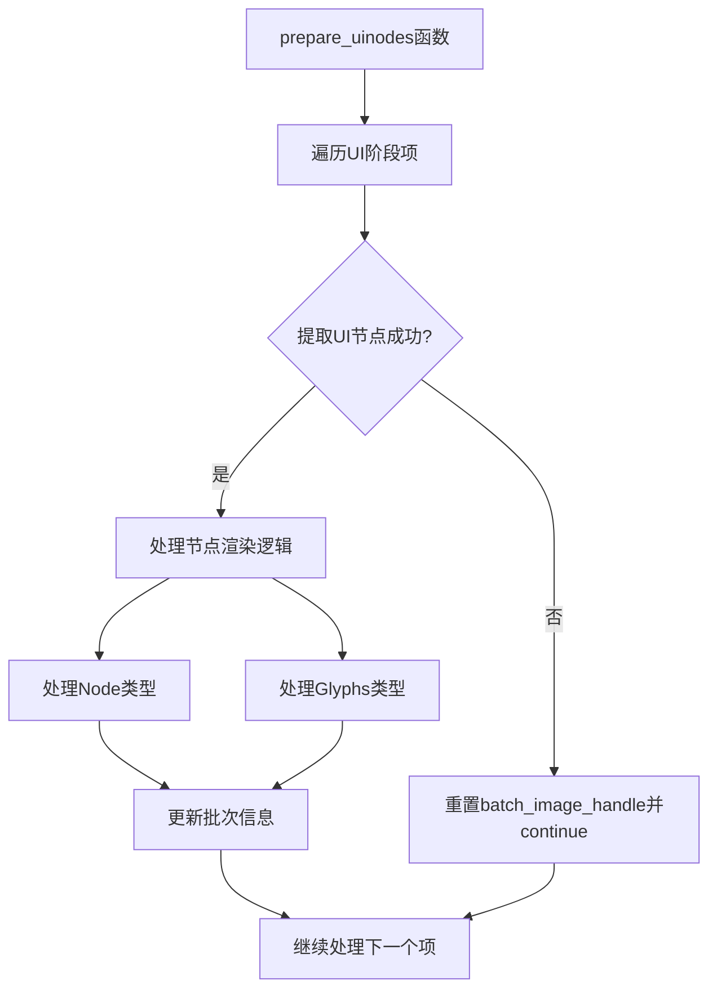

+++
title = "#20863 prepare_uinodes` refactor"
date = "2025-09-04T00:00:00"
draft = false
template = "pull_request_page.html"
in_search_index = false

[extra]
current_language = "zh-cn"
available_languages = {"en" = { name = "English", url = "/pull_request/bevy/2025-09/pr-20863-en-20250904" }, "zh-cn" = { name = "中文", url = "/pull_request/bevy/2025-09/pr-20863-zh-cn-20250904" }}
+++

# `prepare_uinodes` refactor

## 基本信息
- **标题**: `prepare_uinodes` refactor
- **PR链接**: https://github.com/bevyengine/bevy/pull/20863
- **作者**: ickshonpe
- **状态**: 已合并
- **标签**: D-Trivial, A-Rendering, A-UI, C-Code-Quality, S-Ready-For-Review
- **创建时间**: 2025-09-04T13:01:57Z
- **合并时间**: 2025-09-04T18:07:13Z
- **合并人**: alice-i-cecile

## 描述翻译
# Objective

通过使用 let-some-else-continue 替换 if-let-else 块，将 `prepare_uinodes` 内部代码扁平化一级。

## 测试

运行以下命令应该看不到任何变化：
```cargo run --example testbed_ui```

## 这个PR的故事

这个PR的核心是一个代码重构(refactoring)任务，专注于改进Bevy引擎UI渲染模块中`prepare_uinodes`函数的代码结构和可读性。该函数负责准备UI节点进行渲染，是UI渲染管线的关键组成部分。

### 问题和背景

在原始的`prepare_uinodes`函数中，存在一个深度嵌套的if-let-else结构：

```rust
if let Some(extracted_uinode) = extracted_uinodes
    .uinodes
    .get(item.index)
    .filter(|n| item.entity() == n.render_entity)
{
    // 大量的处理逻辑...
} else {
    batch_image_handle = AssetId::invalid();
}
```

这种嵌套结构导致了几个问题：
1. **代码可读性差**：深层嵌套使得代码难以理解和维护
2. **认知负担**：开发者需要跟踪多个嵌套层级才能理解整体逻辑
3. **错误处理不清晰**：else分支的处理逻辑被埋藏在深层嵌套中

### 解决方案

开发者采用了Rust中常见的"提前返回"(early return)模式，将if-let-else结构重构为let-some-else-continue模式：

```rust
let Some(extracted_uinode) = extracted_uinodes
    .uinodes
    .get(item.index)
    .filter(|n| item.entity() == n.render_entity)
else {
    batch_image_handle = AssetId::invalid();
    continue;
};
```

这种重构带来了几个显著优势：

1. **减少嵌套层级**：将原来的if-let-else嵌套减少了一层
2. **清晰错误处理**：使用continue明确跳过不符合条件的项
3. **代码扁平化**：主逻辑不再被包裹在额外的缩进层级中

### 技术实现细节

重构的关键变化是将条件提取提前处理，使得主要业务逻辑能够在更平坦的结构中执行。这种模式在Rust中被称为"let-else"模式，它允许在模式匹配失败时执行else块中的代码，然后退出当前作用域。

在UI渲染的上下文中，这个重构特别有价值，因为：
- `prepare_uinodes`函数处理大量UI节点，清晰的代码结构有助于性能分析和调试
- 渲染逻辑本身已经足够复杂，减少不必要的嵌套可以提高可维护性
- 明确的continue语句使得跳过无效节点的逻辑更加清晰

### 影响和收益

这个重构虽然不改变功能行为，但带来了重要的代码质量改进：

1. **可读性提升**：代码结构更加清晰，新开发者更容易理解渲染逻辑
2. **维护性增强**：减少嵌套使得后续修改和调试更加容易
3. **一致性改进**：符合Rust社区的代码风格最佳实践

测试验证表明重构没有改变任何功能行为，`cargo run --example testbed_ui`命令的输出保持不变，确保了重构的安全性。

## 可视化表示



## 关键文件更改

- `crates/bevy_ui_render/src/lib.rs` (+269/-271)

### 主要变更描述

这个PR主要重构了`prepare_uinodes`函数中的节点提取逻辑，将深层的if-let-else结构扁平化为let-some-else-continue模式。

**重构前代码结构**:
```rust
for item_index in 0..ui_phase.items.len() {
    let item = &mut ui_phase.items[item_index];
    if let Some(extracted_uinode) = extracted_uinodes
        .uinodes
        .get(item.index)
        .filter(|n| item.entity() == n.render_entity)
    {
        // 大量的节点处理逻辑...
    } else {
        batch_image_handle = AssetId::invalid();
    }
}
```

**重构后代码结构**:
```rust
for item_index in 0..ui_phase.items.len() {
    let item = &mut ui_phase.items[item_index];
    let Some(extracted_uinode) = extracted_uinodes
        .uinodes
        .get(item.index)
        .filter(|n| item.entity() == n.render_entity)
    else {
        batch_image_handle = AssetId::invalid();
        continue;
    };
    
    // 节点处理逻辑（保持原样）...
}
```

这个变化虽然看似简单，但显著改善了代码的可读性和维护性，是典型的代码质量改进重构。

## 延伸阅读

对于想深入了解相关技术的开发者，建议阅读以下资源：

1. **Rust let-else语法**: [Rust RFC 3137](https://rust-lang.github.io/rfcs/3137-let-else.html) - 官方let-else语法提案
2. **代码重构技术**: Martin Fowler的《Refactoring: Improving the Design of Existing Code》- 代码重构经典著作
3. **Bevy UI渲染架构**: [Bevy UI文档](https://bevy-cheatbook.github.io/) - Bevy引擎UI系统概述
4. **Rust模式匹配**: [Rust Book模式匹配章节](https://doc.rust-lang.org/book/ch18-03-pattern-syntax.html) - Rust模式匹配全面指南

# 完整代码差异
```diff
diff --git a/crates/bevy_ui_render/src/lib.rs b/crates/bevy_ui_render/src/lib.rs
index 2f272449951d2..2eb662ae42fa1 100644
--- a/crates/bevy_ui_render/src/lib.rs
+++ b/crates/bevy_ui_render/src/lib.rs
@@ -1331,105 +1331,253 @@ pub fn prepare_uinodes(
 
             for item_index in 0..ui_phase.items.len() {
                 let item = &mut ui_phase.items[item_index];
-                if let Some(extracted_uinode) = extracted_uinodes
+                let Some(extracted_uinode) = extracted_uinodes
                     .uinodes
                     .get(item.index)
                     .filter(|n| item.entity() == n.render_entity)
-                {
-                    let mut existing_batch = batches.last_mut();
-
-                    if batch_image_handle == AssetId::invalid()
-                        || existing_batch.is_none()
-                        || (batch_image_handle != AssetId::default()
-                            && extracted_uinode.image != AssetId::default()
-                            && batch_image_handle != extracted_uinode.image)
-                    {
-                        if let Some(gpu_image) = gpu_images.get(extracted_uinode.image) {
-                            batch_item_index = item_index;
-                            batch_image_handle = extracted_uinode.image;
-
-                            let new_batch = UiBatch {
-                                range: vertices_index..vertices_index,
-                                image: extracted_uinode.image,
-                            };
+                else {
+                    batch_image_handle = AssetId::invalid();
+                    continue;
+                };
 
-                            batches.push((item.entity(), new_batch));
-
-                            image_bind_groups
-                                .values
-                                .entry(batch_image_handle)
-                                .or_insert_with(|| {
-                                    render_device.create_bind_group(
-                                        "ui_material_bind_group",
-                                        &ui_pipeline.image_layout,
-                                        &BindGroupEntries::sequential((
-                                            &gpu_image.texture_view,
-                                            &gpu_image.sampler,
-                                        )),
-                                    )
-                                });
+                let mut existing_batch = batches.last_mut();
 
-                            existing_batch = batches.last_mut();
-                        } else {
-                            continue;
-                        }
-                    } else if batch_image_handle == AssetId::default()
+                if batch_image_handle == AssetId::invalid()
+                    || existing_batch.is_none()
+                    || (batch_image_handle != AssetId::default()
                         && extracted_uinode.image != AssetId::default()
+                        && batch_image_handle != extracted_uinode.image)
+                {
+                    if let Some(gpu_image) = gpu_images.get(extracted_uinode.image) {
+                        batch_item_index = item_index;
+                        batch_image_handle = extracted_uinode.image;
+
+                        let new_batch = UiBatch {
+                            range: vertices_index..vertices_index,
+                            image: extracted_uinode.image,
+                        };
+
+                        batches.push((item.entity(), new_batch));
+
+                        image_bind_groups
+                            .values
+                            .entry(batch_image_handle)
+                            .or_insert_with(|| {
+                                render_device.create_bind_group(
+                                    "ui_material_bind_group",
+                                    &ui_pipeline.image_layout,
+                                    &BindGroupEntries::sequential((
+                                        &gpu_image.texture_view,
+                                        &gpu_image.sampler,
+                                    )),
+                                )
+                            });
+
+                        existing_batch = batches.last_mut();
+                    } else {
+                        continue;
+                    }
+                } else if batch_image_handle == AssetId::default()
+                    && extracted_uinode.image != AssetId::default()
+                {
+                    if let Some(ref mut existing_batch) = existing_batch
+                        && let Some(gpu_image) = gpu_images.get(extracted_uinode.image)
                     {
-                        if let Some(ref mut existing_batch) = existing_batch
-                            && let Some(gpu_image) = gpu_images.get(extracted_uinode.image)
-                        {
-                            batch_image_handle = extracted_uinode.image;
-                            existing_batch.1.image = extracted_uinode.image;
-
-                            image_bind_groups
-                                .values
-                                .entry(batch_image_handle)
-                                .or_insert_with(|| {
-                                    render_device.create_bind_group(
-                                        "ui_material_bind_group",
-                                        &ui_pipeline.image_layout,
-                                        &BindGroupEntries::sequential((
-                                            &gpu_image.texture_view,
-                                            &gpu_image.sampler,
-                                        )),
-                                    )
-                                });
+                        batch_image_handle = extracted_uinode.image;
+                        existing_batch.1.image = extracted_uinode.image;
+
+                        image_bind_groups
+                            .values
+                            .entry(batch_image_handle)
+                            .or_insert_with(|| {
+                                render_device.create_bind_group(
+                                    "ui_material_bind_group",
+                                    &ui_pipeline.image_layout,
+                                    &BindGroupEntries::sequential((
+                                        &gpu_image.texture_view,
+                                        &gpu_image.sampler,
+                                    )),
+                                )
+                            });
+                    } else {
+                        continue;
+                    }
+                }
+                match &extracted_uinode.item {
+                    ExtractedUiItem::Node {
+                        atlas_scaling,
+                        flip_x,
+                        flip_y,
+                        border_radius,
+                        border,
+                        node_type,
+                        rect,
+                        color,
+                    } => {
+                        let mut flags = if extracted_uinode.image != AssetId::default() {
+                            shader_flags::TEXTURED
                         } else {
-                            continue;
+                            shader_flags::UNTEXTURED
+                        };
+
+                        let mut uinode_rect = *rect;
+
+                        let rect_size = uinode_rect.size();
+
+                        let transform = extracted_uinode.transform;
+
+                        // Specify the corners of the node
+                        let positions = QUAD_VERTEX_POSITIONS
+                            .map(|pos| transform.transform_point2(pos * rect_size).extend(0.));
+                        let points = QUAD_VERTEX_POSITIONS.map(|pos| pos * rect_size);
+
+                        // Calculate the effect of clipping
+                        // Note: this won't work with rotation/scaling, but that's much more complex (may need more that 2 quads)
+                        let mut positions_diff = if let Some(clip) = extracted_uinode.clip {
+                            [
+                                Vec2::new(
+                                    f32::max(clip.min.x - positions[0].x, 0.),
+                                    f32::max(clip.min.y - positions[0].y, 0.),
+                                ),
+                                Vec2::new(
+                                    f32::min(clip.max.x - positions[1].x, 0.),
+                                    f32::max(clip.min.y - positions[1].y, 0.),
+                                ),
+                                Vec2::new(
+                                    f32::min(clip.max.x - positions[2].x, 0.),
+                                    f32::min(clip.max.y - positions[2].y, 0.),
+                                ),
+                                Vec2::new(
+                                    f32::max(clip.min.x - positions[3].x, 0.),
+                                    f32::min(clip.max.y - positions[3].y, 0.),
+                                ),
+                            ]
+                        } else {
+                            [Vec2::ZERO; 4]
+                        };
+
+                        let positions_clipped = [
+                            positions[0] + positions_diff[0].extend(0.),
+                            positions[1] + positions_diff[1].extend(0.),
+                            positions[2] + positions_diff[2].extend(0.),
+                            positions[3] + positions_diff[3].extend(0.),
+                        ];
+
+                        let points = [
+                            points[0] + positions_diff[0],
+                            points[1] + positions_diff[1],
+                            points[2] + positions_diff[2],
+                            points[3] + positions_diff[3],
+                        ];
+
+                        let transformed_rect_size = transform.transform_vector2(rect_size);
+
+                        // Don't try to cull nodes that have a rotation
+                        // In a rotation around the Z-axis, this value is 0.0 for an angle of 0.0 or π
+                        // In those two cases, the culling check can proceed normally as corners will be on
+                        // horizontal / vertical lines
+                        // For all other angles, bypass the culling check
+                        // This does not properly handles all rotations on all axis
+                        if transform.x_axis[1] == 0.0 {
+                            // Cull nodes that are completely clipped
+                            if positions_diff[0].x - positions_diff[1].x >= transformed_rect_size.x
+                                || positions_diff[1].y - positions_diff[2].y
+                                    >= transformed_rect_size.y
+                            {
+                                continue;
+                            }
+                        }
+                        let uvs = if flags == shader_flags::UNTEXTURED {
+                            [Vec2::ZERO, Vec2::X, Vec2::ONE, Vec2::Y]
+                        } else {
+                            let image = gpu_images
+                                .get(extracted_uinode.image)
+                                .expect("Image was checked during batching and should still exist");
+                            // Rescale atlases. This is done here because we need texture data that might not be available in Extract.
+                            let atlas_extent = atlas_scaling
+                                .map(|scaling| image.size_2d().as_vec2() * scaling)
+                                .unwrap_or(uinode_rect.max);
+                            if *flip_x {
+                                core::mem::swap(&mut uinode_rect.max.x, &mut uinode_rect.min.x);
+                                positions_diff[0].x *= -1.;
+                                positions_diff[1].x *= -1.;
+                                positions_diff[2].x *= -1.;
+                                positions_diff[3].x *= -1.;
+                            }
+                            if *flip_y {
+                                core::mem::swap(&mut uinode_rect.max.y, &mut uinode_rect.min.y);
+                                positions_diff[0].y *= -1.;
+                                positions_diff[1].y *= -1.;
+                                positions_diff[2].y *= -1.;
+                                positions_diff[3].y *= -1.;
+                            }
+                            [
+                                Vec2::new(
+                                    uinode_rect.min.x + positions_diff[0].x,
+                                    uinode_rect.min.y + positions_diff[0].y,
+                                ),
+                                Vec2::new(
+                                    uinode_rect.max.x + positions_diff[1].x,
+                                    uinode_rect.min.y + positions_diff[1].y,
+                                ),
+                                Vec2::new(
+                                    uinode_rect.max.x + positions_diff[2].x,
+                                    uinode_rect.max.y + positions_diff[2].y,
+                                ),
+                                Vec2::new(
+                                    uinode_rect.min.x + positions_diff[3].x,
+                                    uinode_rect.max.y + positions_diff[3].y,
+                                ),
+                            ]
+                            .map(|pos| pos / atlas_extent)
+                        };
+
+                        let color = color.to_f32_array();
+                        if let NodeType::Border(border_flags) = *node_type {
+                            flags |= border_flags;
                         }
-                    }
-                    match &extracted_uinode.item {
-                        ExtractedUiItem::Node {
-                            atlas_scaling,
-                            flip_x,
-                            flip_y,
-                            border_radius,
-                            border,
-                            node_type,
-                            rect,
-                            color,
-                        } => {
-                            let mut flags = if extracted_uinode.image != AssetId::default() {
-                                shader_flags::TEXTURED
-                            } else {
-                                shader_flags::UNTEXTURED
-                            };
-
-                            let mut uinode_rect = *rect;
-
-                            let rect_size = uinode_rect.size();
 
-                            let transform = extracted_uinode.transform;
+                        for i in 0..4 {
+                            ui_meta.vertices.push(UiVertex {
+                                position: positions_clipped[i].into(),
+                                uv: uvs[i].into(),
+                                color,
+                                flags: flags | shader_flags::CORNERS[i],
+                                radius: (*border_radius).into(),
+                                border: [border.left, border.top, border.right, border.bottom],
+                                size: rect_size.into(),
+                                point: points[i].into(),
+                            });
+                        }
 
-                            // Specify the corners of the node
-                            let positions = QUAD_VERTEX_POSITIONS
-                                .map(|pos| transform.transform_point2(pos * rect_size).extend(0.));
-                            let points = QUAD_VERTEX_POSITIONS.map(|pos| pos * rect_size);
+                        for &i in &QUAD_INDICES {
+                            ui_meta.indices.push(indices_index + i as u32);
+                        }
 
-                            // Calculate the effect of clipping
-                            // Note: this won't work with rotation/scaling, but that's much more complex (may need more that 2 quads)
-                            let mut positions_diff = if let Some(clip) = extracted_uinode.clip {
+                        vertices_index += 6;
+                        indices_index += 4;
+                    }
+                    ExtractedUiItem::Glyphs { range } => {
+                        let image = gpu_images
+                            .get(extracted_uinode.image)
+                            .expect("Image was checked during batching and should still exist");
+
+                        let atlas_extent = image.size_2d().as_vec2();
+
+                        for glyph in &extracted_uinodes.glyphs[range.clone()] {
+                            let color = glyph.color.to_f32_array();
+                            let glyph_rect = glyph.rect;
+                            let rect_size = glyph_rect.size();
+
+                            // Specify the corners of the glyph
+                            let positions = QUAD_VERTEX_POSITIONS.map(|pos| {
+                                extracted_uinode
+                                    .transform
+                                    .transform_point2(glyph.translation + pos * glyph_rect.size())
+                                    .extend(0.)
+                            });
+
+                            let positions_diff = if let Some(clip) = extracted_uinode.clip {
                                 [
                                     Vec2::new(
                                         f32::max(clip.min.x - positions[0].x, 0.),
@@ -1459,91 +1607,47 @@ pub fn prepare_uinodes(
                                 positions[3] + positions_diff[3].extend(0.),
                             ];
 
-                            let points = [
-                                points[0] + positions_diff[0],
-                                points[1] + positions_diff[1],
-                                points[2] + positions_diff[2],
-                                points[3] + positions_diff[3],
-                            ];
-
-                            let transformed_rect_size = transform.transform_vector2(rect_size);
-
-                            // Don't try to cull nodes that have a rotation
-                            // In a rotation around the Z-axis, this value is 0.0 for an angle of 0.0 or π
-                            // In those two cases, the culling check can proceed normally as corners will be on
-                            // horizontal / vertical lines
-                            // For all other angles, bypass the culling check
-                            // This does not properly handles all rotations on all axis
-                            if transform.x_axis[1] == 0.0 {
-                                // Cull nodes that are completely clipped
-                                if positions_diff[0].x - positions_diff[1].x
-                                    >= transformed_rect_size.x
-                                    || positions_diff[1].y - positions_diff[2].y
-                                        >= transformed_rect_size.y
-                                {
-                                    continue;
-                                }
+                            // cull nodes that are completely clipped
+                            let transformed_rect_size =
+                                extracted_uinode.transform.transform_vector2(rect_size);
+                            if positions_diff[0].x - positions_diff[1].x
+                                >= transformed_rect_size.x.abs()
+                                || positions_diff[1].y - positions_diff[2].y
+                                    >= transformed_rect_size.y.abs()
+                            {
+                                continue;
                             }
-                            let uvs = if flags == shader_flags::UNTEXTURED {
-                                [Vec2::ZERO, Vec2::X, Vec2::ONE, Vec2::Y]
-                            } else {
-                                let image = gpu_images.get(extracted_uinode.image).expect(
-                                    "Image was checked during batching and should still exist",
-                                );
-                                // Rescale atlases. This is done here because we need texture data that might not be available in Extract.
-                                let atlas_extent = atlas_scaling
-                                    .map(|scaling| image.size_2d().as_vec2() * scaling)
-                                    .unwrap_or(uinode_rect.max);
-                                if *flip_x {
-                                    core::mem::swap(&mut uinode_rect.max.x, &mut uinode_rect.min.x);
-                                    positions_diff[0].x *= -1.;
-                                    positions_diff[1].x *= -1.;
-                                    positions_diff[2].x *= -1.;
-                                    positions_diff[3].x *= -1.;
-                                }
-                                if *flip_y {
-                                    core::mem::swap(&mut uinode_rect.max.y, &mut uinode_rect.min.y);
-                                    positions_diff[0].y *= -1.;
-                                    positions_diff[1].y *= -1.;
-                                    positions_diff[2].y *= -1.;
-                                    positions_diff[3].y *= -1.;
-                                }
-                                [
-                                    Vec2::new(
-                                        uinode_rect.min.x + positions_diff[0].x,
-                                        uinode_rect.min.y + positions_diff[0].y,
-                                    ),
-                                    Vec2::new(
-                                        uinode_rect.max.x + positions_diff[1].x,
-                                        uinode_rect.min.y + positions_diff[1].y,
-                                    ),
-                                    Vec2::new(
-                                        uinode_rect.max.x + positions_diff[2].x,
-                                        uinode_rect.max.y + positions_diff[2].y,
-                                    ),
-                                    Vec2::new(
-                                        uinode_rect.min.x + positions_diff[3].x,
-                                        uinode_rect.max.y + positions_diff[3].y,
-                                    ),
-                                ]
-                                .map(|pos| pos / atlas_extent)
-                            };
 
-                            let color = color.to_f32_array();
-                            if let NodeType::Border(border_flags) = *node_type {
-                                flags |= border_flags;
-                            }
+                            let uvs = [
+                                Vec2::new(
+                                    glyph.rect.min.x + positions_diff[0].x,
+                                    glyph.rect.min.y + positions_diff[0].y,
+                                ),
+                                Vec2::new(
+                                    glyph.rect.max.x + positions_diff[1].x,
+                                    glyph.rect.min.y + positions_diff[1].y,
+                                ),
+                                Vec2::new(
+                                    glyph.rect.max.x + positions_diff[2].x,
+                                    glyph.rect.max.y + positions_diff[2].y,
+                                ),
+                                Vec2::new(
+                                    glyph.rect.min.x + positions_diff[3].x,
+                                    glyph.rect.max.y + positions_diff[3].y,
+                                ),
+                            ]
+                            .map(|pos| pos / atlas_extent);
 
                             for i in 0..4 {
                                 ui_meta.vertices.push(UiVertex {
                                     position: positions_clipped[i].into(),
                                     uv: uvs[i].into(),
                                     color,
-                                    flags: flags | shader_flags::CORNERS[i],
-                                    radius: (*border_radius).into(),
-                                    border: [border.left, border.top, border.right, border.bottom],
+                                    flags: shader_flags::TEXTURED | shader_flags::CORNERS[i],
+                                    radius: [0.0; 4],
+                                    border: [0.0; 4],
                                     size: rect_size.into(),
-                                    point: points[i].into(),
+                                    point: [0.0; 2],
                                 });
                             }
 
@@ -1554,116 +1658,10 @@ pub fn prepare_uinodes(
                             vertices_index += 6;
                             indices_index += 4;
                         }
-                        ExtractedUiItem::Glyphs { range } => {
-                            let image = gpu_images
-                                .get(extracted_uinode.image)
-                                .expect("Image was checked during batching and should still exist");
-
-                            let atlas_extent = image.size_2d().as_vec2();
-
-                            for glyph in &extracted_uinodes.glyphs[range.clone()] {
-                                let color = glyph.color.to_f32_array();
-                                let glyph_rect = glyph.rect;
-                                let rect_size = glyph_rect.size();
-
-                                // Specify the corners of the glyph
-                                let positions = QUAD_VERTEX_POSITIONS.map(|pos| {
-                                    extracted_uinode
-                                        .transform
-                                        .transform_point2(
-                                            glyph.translation + pos * glyph_rect.size(),
-                                        )
-                                        .extend(0.)
-                                });
-
-                                let positions_diff = if let Some(clip) = extracted_uinode.clip {
-                                    [
-                                        Vec2::new(
-                                            f32::max(clip.min.x - positions[0].x, 0.),
-                                            f32::max(clip.min.y - positions[0].y, 0.),
-                                        ),
-                                        Vec2::new(
-                                            f32::min(clip.max.x - positions[1].x, 0.),
-                                            f32::max(clip.min.y - positions[1].y, 0.),
-                                        ),
-                                        Vec2::new(
-                                            f32::min(clip.max.x - positions[2].x, 0.),
-                                            f32::min(clip.max.y - positions[2].y, 0.),
-                                        ),
-                                        Vec2::new(
-                                            f32::max(clip.min.x - positions[3].x, 0.),
-                                            f32::min(clip.max.y - positions[3].y, 0.),
-                                        ),
-                                    ]
-                                } else {
-                                    [Vec2::ZERO; 4]
-                                };
-
-                                let positions_clipped = [
-                                    positions[0] + positions_diff[0].extend(0.),
-                                    positions[1] + positions_diff[1].extend(0.),
-                                    positions[2] + positions_diff[2].extend(0.),
-                                    positions[3] + positions_diff[3].extend(0.),
-                                ];
-
-                                // cull nodes that are completely clipped
-                                let transformed_rect_size =
-                                    extracted_uinode.transform.transform_vector2(rect_size);
-                                if positions_diff[0].x - positions_diff[1].x
-                                    >= transformed_rect_size.x.abs()
-                                    || positions_diff[1].y - positions_diff[2].y
-                                        >= transformed_rect_size.y.abs()
-                                {
-                                    continue;
-                                }
-
-                                let uvs = [
-                                    Vec2::new(
-                                        glyph.rect.min.x + positions_diff[0].x,
-                                        glyph.rect.min.y + positions_diff[0].y,
-                                    ),
-                                    Vec2::new(
-                                        glyph.rect.max.x + positions_diff[1].x,
-                                        glyph.rect.min.y + positions_diff[1].y,
-                                    ),
-                                    Vec2::new(
-                                        glyph.rect.max.x + positions_diff[2].x,
-                                        glyph.rect.max.y + positions_diff[2].y,
-                                    ),
-                                    Vec2::new(
-                                        glyph.rect.min.x + positions_diff[3].x,
-                                        glyph.rect.max.y + positions_diff[3].y,
-                                    ),
-                                ]
-                                .map(|pos| pos / atlas_extent);
-
-                                for i in 0..4 {
-                                    ui_meta.vertices.push(UiVertex {
-                                        position: positions_clipped[i].into(),
-                                        uv: uvs[i].into(),
-                                        color,
-                                        flags: shader_flags::TEXTURED | shader_flags::CORNERS[i],
-                                        radius: [0.0; 4],
-                                        border: [0.0; 4],
-                                        size: rect_size.into(),
-                                        point: [0.0; 2],
-                                    });
-                                }
-
-                                for &i in &QUAD_INDICES {
-                                    ui_meta.indices.push(indices_index + i as u32);
-                                }
-
-                                vertices_index += 6;
-                                indices_index += 4;
-                            }
-                        }
                     }
-                    existing_batch.unwrap().1.range.end = vertices_index;
-                    ui_phase.items[batch_item_index].batch_range_mut().end += 1;
-                } else {
-                    batch_image_handle = AssetId::invalid();
                 }
+                existing_batch.unwrap().1.range.end = vertices_index;
+                ui_phase.items[batch_item_index].batch_range_mut().end += 1;
             }
         }
 
```