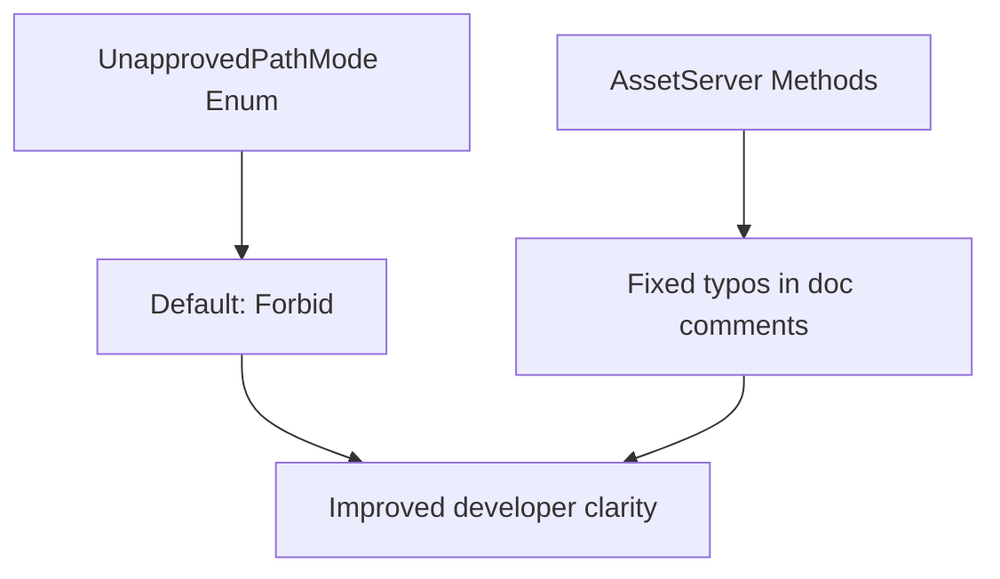

+++
title = "#20868 Improve `UnapprovedPathMode` doc"
date = "2025-09-04T00:00:00"
draft = false
template = "pull_request_page.html"
in_search_index = true

[taxonomies]
list_display = ["show"]

[extra]
current_language = "en"
available_languages = {"en" = { name = "English", url = "/pull_request/bevy/2025-09/pr-20868-en-20250904" }, "zh-cn" = { name = "中文", url = "/pull_request/bevy/2025-09/pr-20868-zh-cn-20250904" }}
labels = ["C-Docs", "D-Trivial", "A-Assets"]
+++

# Improve `UnapprovedPathMode` doc

## Basic Information
- **Title**: Improve `UnapprovedPathMode` doc 
- **PR Link**: https://github.com/bevyengine/bevy/pull/20868
- **Author**: mamekoro
- **Status**: MERGED
- **Labels**: C-Docs, D-Trivial, A-Assets, S-Ready-For-Final-Review
- **Created**: 2025-09-04T16:35:40Z
- **Merged**: 2025-09-04T18:15:51Z
- **Merged By**: alice-i-cecile

## Description Translation
# Objective

I didn't realize that `UnapprovedPathMode` defaults to `Forbid` until I read the source code, and ended up creating the issue #20865.

It would be better to improve the documentation so that the default value is clear without having to read the source code.

## Solution
- Update the documentation for `UnapprovedPathMode`.
- Fix typos.

## Testing

- `cargo test --doc -p bevy_asset`
- Run `cargo doc --open -p bevy_asset` and confirmed that the changes were correctly reflected.

## The Story of This Pull Request

This PR addresses a documentation clarity issue in Bevy's asset system. The core problem was that the `UnapprovedPathMode` enum's default behavior wasn't explicitly documented, requiring developers to read the source code to understand that it defaults to `Forbid` mode.

The issue emerged when the author, mamekoro, encountered unexpected behavior while working with asset paths. After investigating, they discovered the default was `Forbid` but realized this critical information was missing from the documentation. This led to creating issue #20865 to track the documentation gap.

The solution implemented is straightforward but important for developer experience. The PR adds explicit documentation about the default value in the `UnapprovedPathMode` enum's doc comments. Additionally, it fixes several typos in related method documentation where "unapproved" was misspelled as "unaproved" across multiple methods in the asset server.

These changes improve the developer experience by making critical information about security defaults immediately visible in documentation. The `Forbid` mode is a security feature that prevents loading assets from unapproved paths by default, so understanding this behavior is essential for developers working with Bevy's asset system.

The implementation follows standard Rust documentation practices using `///` doc comments. The changes are minimal but targeted:
1. Adding a clear statement about the default value
2. Correcting spelling errors in method documentation

Testing was performed using `cargo test --doc` to ensure documentation validity and `cargo doc --open` to visually verify the changes appeared correctly in the generated documentation.

## Visual Representation



## Key Files Changed

### `crates/bevy_asset/src/lib.rs`
Added documentation clarifying the default value of `UnapprovedPathMode`:

```rust
// Before:
/// app will include scripts or modding support, as it could allow arbitrary file
/// access for malicious code.
///
/// See [`AssetPath::is_unapproved`](crate::AssetPath::is_unapproved)
#[derive(Clone, Default)]
pub enum UnapprovedPathMode {

// After:
/// app will include scripts or modding support, as it could allow arbitrary file
/// access for malicious code.
///
/// The default value is [`Forbid`](UnapprovedPathMode::Forbid).
///
/// See [`AssetPath::is_unapproved`](crate::AssetPath::is_unapproved)
#[derive(Clone, Default)]
pub enum UnapprovedPathMode {
```

### `crates/bevy_asset/src/server/mod.rs`
Fixed typos in four method documentation comments:

```rust
// Before:
/// Same as [`load`](AssetServer::load), but you can load assets from unaproved paths

// After:
/// Same as [`load`](AssetServer::load), but you can load assets from unapproved paths
```

The same spelling correction was applied to:
- `load_acquire_unchecked`
- `load_with_settings_unchecked`
- `load_acquire_with_settings_unchecked`

## Further Reading

- [Rust Documentation Guidelines](https://rust-lang.github.io/rfcs/1574-more-api-documentation-conventions.html)
- [Bevy Asset System Documentation](https://docs.rs/bevy_asset/latest/bevy_asset/)
- [Issue #20865](https://github.com/bevyengine/bevy/issues/20865) - The original issue that prompted this documentation improvement