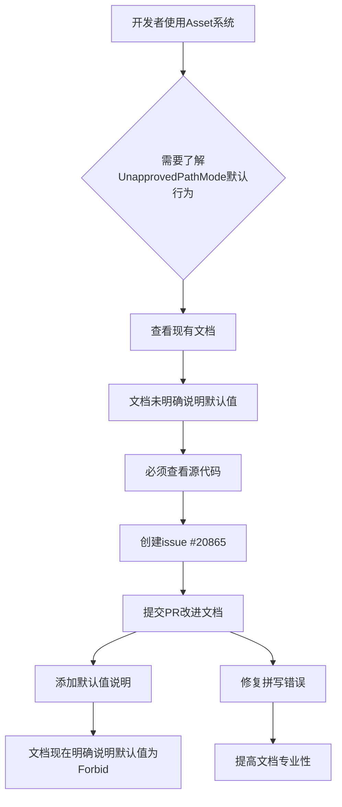

+++
title = "#20868 Improve `UnapprovedPathMode` doc"
date = "2025-09-04T00:00:00"
draft = false
template = "pull_request_page.html"
in_search_index = false

[extra]
current_language = "zh-cn"
available_languages = {"en" = { name = "English", url = "/pull_request/bevy/2025-09/pr-20868-en-20250904" }, "zh-cn" = { name = "中文", url = "/pull_request/bevy/2025-09/pr-20868-zh-cn-20250904" }}
+++

# Improve `UnapprovedPathMode` doc

## 基本信息
- **标题**: Improve `UnapprovedPathMode` doc
- **PR链接**: https://github.com/bevyengine/bevy/pull/20868
- **作者**: mamekoro
- **状态**: 已合并
- **标签**: C-Docs, D-Trivial, A-Assets, S-Ready-For-Final-Review
- **创建时间**: 2025-09-04T16:35:40Z
- **合并时间**: 2025-09-04T18:15:51Z
- **合并者**: alice-i-cecile

## 描述翻译
# Objective（目标）

直到阅读源代码之前，我都没有意识到 `UnapprovedPathMode` 默认为 `Forbid`，最终创建了 issue #20865。

最好改进文档，使得无需阅读源代码即可明确默认值。

## Solution（解决方案）
- 更新 `UnapprovedPathMode` 的文档。
- 修复拼写错误。

## Testing（测试）
- `cargo test --doc -p bevy_asset`
- 运行 `cargo doc --open -p bevy_asset` 并确认更改正确反映。

## 本次PR的故事

这个PR源于一个实际开发中遇到的困惑。开发者mamekoro在使用Bevy的资产系统时，发现`UnapprovedPathMode`的默认行为并不直观 - 直到查看源代码才确认它默认为`Forbid`模式。这种文档缺失导致了issue #20865的创建，也暴露了文档需要改进的问题。

问题的核心在于：`UnapprovedPathMode`枚举控制着资产系统如何处理未批准的路径访问，这是一个重要的安全特性。默认设置为`Forbid`意味着系统会拒绝从未批准路径加载资产，这是合理的安全默认值，但开发者无法从文档中获知这一关键信息。

解决方案直接而有效：通过简单的文档更新来明确说明默认值，同时修复了几个方法文档中的拼写错误。具体来说，在`UnapprovedPathMode`的文档注释中添加了关于默认值的说明，并将四处"unaproved"更正为正确的拼写"unapproved"。

从技术角度看，这个修改虽然简单，但体现了良好的工程实践：
1. 清晰的文档减少了开发者需要查看源代码才能理解API行为的情况
2. 拼写修正提高了代码库的专业性和可读性  
3. 修改集中在文档层面，不影响实际功能，风险极低

测试验证也很充分：运行了文档测试确保修改不会破坏现有文档，并通过本地构建文档确认更改正确显示。

这个PR的价值在于它解决了信息不对称的问题 - 现在任何开发者阅读`UnapprovedPathMode`的文档都能立即了解其默认行为，无需深入代码实现。这种改进虽然微小，但对开发者体验的提升是实实在在的。

## 可视化表示



## 关键文件变更

**crates/bevy_asset/src/lib.rs** (+2/-0)
- 在`UnapprovedPathMode`枚举的文档注释中添加了默认值说明

```rust
// 修改前：
/// app will include scripts or modding support, as it could allow arbitrary file
/// access for malicious code.
///
/// See [`AssetPath::is_unapproved`](crate::AssetPath::is_unapproved)
#[derive(Clone, Default)]
pub enum UnapprovedPathMode {

// 修改后：
/// app will include scripts or modding support, as it could allow arbitrary file
/// access for malicious code.
///
/// The default value is [`Forbid`](UnapprovedPathMode::Forbid).
///
/// See [`AssetPath::is_unapproved`](crate::AssetPath::is_unapproved)
#[derive(Clone, Default)]
pub enum UnapprovedPathMode {
```

**crates/bevy_asset/src/server/mod.rs** (+4/-4)
- 修复了四个方法文档中的拼写错误，将"unaproved"更正为"unapproved"

```rust
// 修改示例（四个类似修改）：
// 修改前：
/// but you can load assets from unaproved paths

// 修改后：
/// but you can load assets from unapproved paths
```

## 扩展阅读

- [Rust文档注释指南](https://doc.rust-lang.org/rustdoc/how-to-write-documentation.html)
- [Bevy资产系统文档](https://docs.rs/bevy_asset/latest/bevy_asset/)
- [Rust的默认trait和派生宏](https://doc.rust-lang.org/std/default/trait.Default.html)

# 完整代码差异
```diff
diff --git a/crates/bevy_asset/src/lib.rs b/crates/bevy_asset/src/lib.rs
index a4409ac947250..8d0946d68b372 100644
--- a/crates/bevy_asset/src/lib.rs
+++ b/crates/bevy_asset/src/lib.rs
@@ -267,6 +267,8 @@ pub struct AssetPlugin {
 /// app will include scripts or modding support, as it could allow arbitrary file
 /// access for malicious code.
 ///
+/// The default value is [`Forbid`](UnapprovedPathMode::Forbid).
+///
 /// See [`AssetPath::is_unapproved`](crate::AssetPath::is_unapproved)
 #[derive(Clone, Default)]
 pub enum UnapprovedPathMode {
diff --git a/crates/bevy_asset/src/server/mod.rs b/crates/bevy_asset/src/server/mod.rs
index 8e8e6d734d7b4..d71ed9a4616b7 100644
--- a/crates/bevy_asset/src/server/mod.rs
+++ b/crates/bevy_asset/src/server/mod.rs
@@ -325,7 +325,7 @@ impl AssetServer {
         self.load_with_meta_transform(path, None, (), false)
     }
 
-    /// Same as [`load`](AssetServer::load), but you can load assets from unaproved paths
+    /// Same as [`load`](AssetServer::load), but you can load assets from unapproved paths
     /// if [`AssetPlugin::unapproved_path_mode`](super::AssetPlugin::unapproved_path_mode)
     /// is [`Deny`](UnapprovedPathMode::Deny).
     ///
@@ -358,7 +358,7 @@ impl AssetServer {
         self.load_with_meta_transform(path, None, guard, false)
     }
 
-    /// Same as [`load`](AssetServer::load_acquire), but you can load assets from unaproved paths
+    /// Same as [`load`](AssetServer::load_acquire), but you can load assets from unapproved paths
     /// if [`AssetPlugin::unapproved_path_mode`](super::AssetPlugin::unapproved_path_mode)
     /// is [`Deny`](UnapprovedPathMode::Deny).
     ///
@@ -388,7 +388,7 @@ impl AssetServer {
         )
     }
 
-    /// Same as [`load`](AssetServer::load_with_settings), but you can load assets from unaproved paths
+    /// Same as [`load`](AssetServer::load_with_settings), but you can load assets from unapproved paths
     /// if [`AssetPlugin::unapproved_path_mode`](super::AssetPlugin::unapproved_path_mode)
     /// is [`Deny`](UnapprovedPathMode::Deny).
     ///
@@ -430,7 +430,7 @@ impl AssetServer {
         )
     }
 
-    /// Same as [`load`](AssetServer::load_acquire_with_settings), but you can load assets from unaproved paths
+    /// Same as [`load`](AssetServer::load_acquire_with_settings), but you can load assets from unapproved paths
     /// if [`AssetPlugin::unapproved_path_mode`](super::AssetPlugin::unapproved_path_mode)
     /// is [`Deny`](UnapprovedPathMode::Deny).
     ///
```