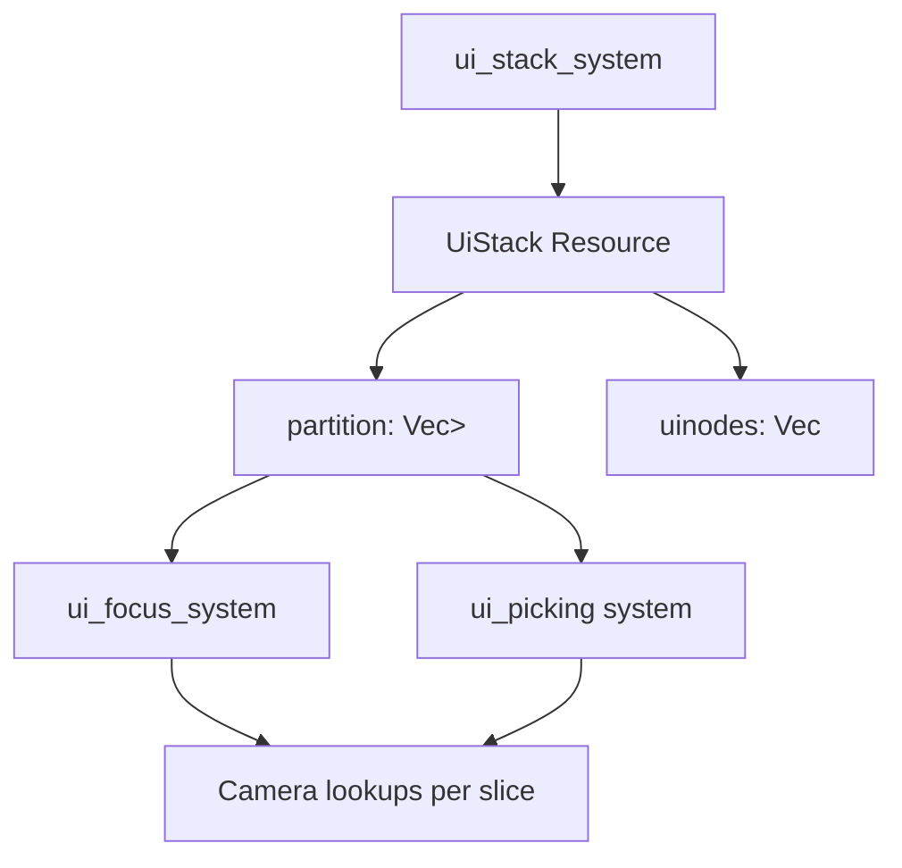

+++
title = "#20870 UI stack partition"
date = "2025-09-30T00:00:00"
draft = false
template = "pull_request_page.html"
in_search_index = true

[taxonomies]
list_display = ["show"]

[extra]
current_language = "en"
available_languages = {"en" = { name = "English", url = "/pull_request/bevy/2025-09/pr-20870-en-20250930" }, "zh-cn" = { name = "中文", url = "/pull_request/bevy/2025-09/pr-20870-zh-cn-20250930" }}
labels = ["C-Performance", "A-UI", "C-Code-Quality", "D-Modest", "A-Picking"]
+++

# Title

## Basic Information
- **Title**: UI stack partition
- **PR Link**: https://github.com/bevyengine/bevy/pull/20870
- **Author**: ickshonpe
- **Status**: MERGED
- **Labels**: C-Performance, A-UI, C-Code-Quality, S-Ready-For-Final-Review, D-Modest, A-Picking
- **Created**: 2025-09-04T19:53:45Z
- **Merged**: 2025-09-29T23:01:05Z
- **Merged By**: alice-i-cecile

## Description Translation
# Objective

In the UI picking and rendering systems, we first query for all the pickable or renderable UI nodes and then query per node for the details of the camera and its render target. But the typical application using Bevy UI will have hundreds of UI nodes and just one UI camera, so this is extremely inefficient. 

Instead, we can partition the UI stack into disjoint slices where all the UI nodes in each slice have the same camera target. Then perform any camera and render target lookups per slice, instead of per node.

## Solution

Partition the UI stack into disjoint layers of nodes sharing the same camera target. 
* Add a `partition: Vec<Range<usize>>` field to `UiStack`.
* Update the partitions in `ui_stack_system`.
* Query for cameras per slice in `ui_focus_system` and `ui_picking`.

Splitting the rendering changes off into their own PR.

---

## Testing

Some basic checks have been added to the existing `test_ui_stack_system` and `test_with_equal_global_zindex_zindex_decides_order` tests.

Examples like `ui_target_camera`, `viewport_node` and `ui_drag_and_drop` can be used to test the changes.

## Showcase

yellow this PR, red main:

```cargo run --example many_buttons --release --features bevy/trace_tracy```

`ui_picking`


`ui_stack_system`


---

## The Story of This Pull Request

This PR addresses a fundamental performance bottleneck in Bevy's UI system. The core issue was that UI picking and focus systems were performing camera lookups for every individual UI node, despite most applications having only one UI camera. With hundreds of UI nodes, this resulted in significant redundant work.

The solution introduces a partitioning strategy for the UI stack. The key insight is that UI nodes can be grouped into slices where all nodes within a slice share the same camera target. This allows camera lookups to be performed once per slice rather than once per node.

The implementation follows a clear three-step approach:

1. **Data Structure Enhancement**: Added a `partition` field to the `UiStack` resource that tracks ranges of nodes sharing the same camera target
2. **Partition Building**: Modified `ui_stack_system` to construct these partitions while building the UI stack
3. **System Optimization**: Updated `ui_focus_system` and `ui_picking` to leverage the partitions for efficient camera lookups

The performance improvements are substantial, as shown in the provided Tracy profiles. The `ui_picking` system shows significantly reduced execution time (yellow vs red), and `ui_stack_system` also benefits from the optimized data structure.

From an architectural perspective, this change maintains backward compatibility while enabling significant performance gains. The partition information is computed once and reused across multiple systems, demonstrating good data-oriented design principles.

## Visual Representation



## Key Files Changed

### `crates/bevy_ui/src/stack.rs` (+35/-3)
This file introduces the core partitioning mechanism to the UI stack system.

**Key Changes:**
- Added `partition: Vec<Range<usize>>` field to `UiStack` struct
- Modified `ui_stack_system` to track and populate partition ranges
- Enhanced tests to verify partition correctness

```rust
// Before:
#[derive(Debug, Resource, Default)]
pub struct UiStack {
    pub uinodes: Vec<Entity>,
}

// After:
#[derive(Debug, Resource, Default)]
pub struct UiStack {
    /// Partition of the `uinodes` list into disjoint slices of nodes that all share the same camera target.
    pub partition: Vec<Range<usize>>,
    /// List of UI nodes ordered from back-to-front
    pub uinodes: Vec<Entity>,
}
```

The system now tracks partition boundaries when processing root nodes:

```rust
for (root_entity, _) in root_nodes.drain(..) {
    let start = ui_stack.uinodes.len();
    update_uistack_recursive(
        &mut cache,
        root_entity,
        &children_query,
        &zindex_query,
        &mut ui_stack.uinodes,
    );
    let end = ui_stack.uinodes.len();
    ui_stack.partition.push(start..end);
}
```

### `crates/bevy_ui/src/focus.rs` (+35/-19)
This file optimizes the focus system to use partition-based camera lookups.

**Key Changes:**
- Added local `hovered_nodes` vector to reduce allocations
- Restructured iteration to process nodes by partition slices
- Performs camera lookup once per slice instead of per node

```rust
// Before: Camera lookup per node
let mut hovered_nodes = ui_stack
    .uinodes
    .iter()
    .rev()
    .filter_map(|entity| {
        let Ok(node) = node_query.get_mut(*entity) else { return None; };
        let camera_entity = node.target_camera.get()?;
        // ... cursor position and hit testing
    })

// After: Camera lookup per partition slice
for uinodes in ui_stack.partition.iter().rev().map(|range| &ui_stack.uinodes[range.clone()]) {
    let Ok(root_node) = node_query.get_mut(uinodes[0]) else { continue; };
    let Some(camera_entity) = root_node.target_camera.get() else { continue; };
    let cursor_position = camera_cursor_positions.get(&camera_entity);
    
    for entity in uinodes.iter().rev().cloned() {
        // ... use pre-computed cursor_position for all nodes in slice
    }
}
```

### `crates/bevy_ui/src/picking_backend.rs` (+53/-41)
This file applies the same optimization pattern to the UI picking system.

**Key Changes:**
- Restructured nested loops to iterate by partition slices first, then nodes
- Moved camera lookup outside the inner node loop
- Maintains the same picking logic but with optimized camera queries

```rust
// Before: Camera lookup in inner node loop
for node_entity in ui_stack.uinodes.iter().rev() {
    let Ok(node) = node_query.get(*node_entity) else { continue; };
    let Some(camera_entity) = node.target_camera.get() else { continue; };
    // ... pointer position and hit testing
}

// After: Camera lookup per partition slice
for uinodes in ui_stack.partition.iter().rev().map(|range| &ui_stack.uinodes[range.clone()]) {
    let Ok(uinode) = node_query.get(uinodes[0]) else { continue; };
    let Some(camera_entity) = uinode.target_camera.get() else { continue; };
    let pointers_on_this_cam = pointer_pos_by_camera.get(&camera_entity);
    
    for node_entity in uinodes.iter().rev().cloned() {
        // ... use pre-computed pointers_on_this_cam for all nodes in slice
    }
}
```

## Further Reading

- [Bevy UI System Documentation](https://docs.rs/bevy_ui/latest/bevy_ui/)
- [Data-Oriented Design Principles](https://gamesfromwithin.com/data-oriented-design)
- [ECS Performance Optimization Patterns](https://bevy-cheatbook.github.io/programming/ecs-intro.html)
- [Rust Range Type Documentation](https://doc.rust-lang.org/std/ops/struct.Range.html)