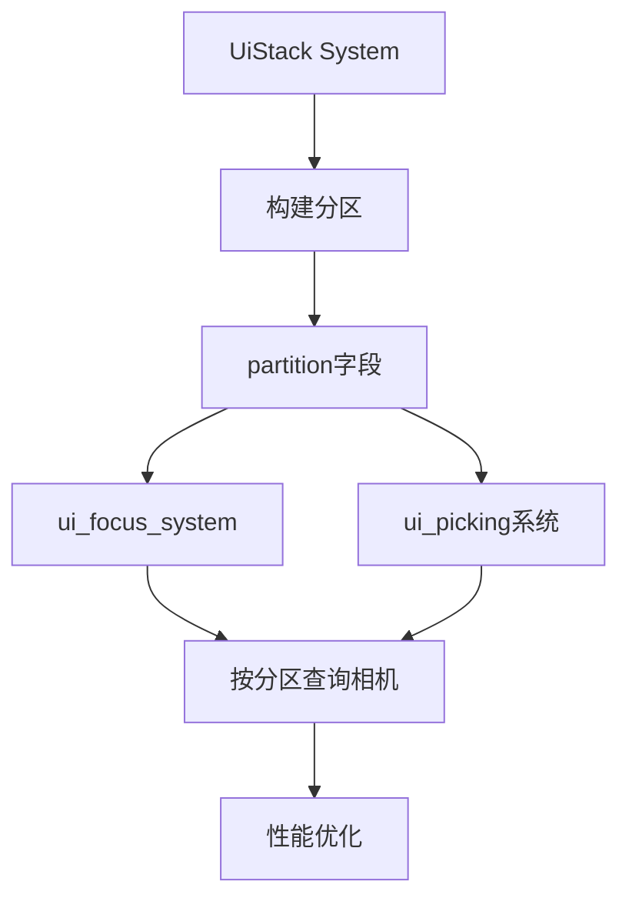

+++
title = "#20870 UI stack partition"
date = "2025-09-30T00:00:00"
draft = false
template = "pull_request_page.html"
in_search_index = false

[extra]
current_language = "zh-cn"
available_languages = {"en" = { name = "English", url = "/pull_request/bevy/2025-09/pr-20870-en-20250930" }, "zh-cn" = { name = "中文", url = "/pull_request/bevy/2025-09/pr-20870-zh-cn-20250930" }}
+++

# UI Stack Partition

## 基本信息
- **标题**: UI stack partition
- **PR链接**: https://github.com/bevyengine/bevy/pull/20870
- **作者**: ickshonpe
- **状态**: 已合并
- **标签**: C-Performance, A-UI, C-Code-Quality, S-Ready-For-Final-Review, D-Modest, A-Picking
- **创建时间**: 2025-09-04T19:53:45Z
- **合并时间**: 2025-09-29T23:01:05Z
- **合并者**: alice-i-cecile

## 描述翻译

# 目标

在UI拾取和渲染系统中，我们首先查询所有可拾取或可渲染的UI节点，然后为每个节点查询相机及其渲染目标的详细信息。但是使用Bevy UI的典型应用程序会有数百个UI节点而只有一个UI相机，因此这种实现效率极低。

我们可以将UI栈划分为不相交的切片，其中每个切片中的所有UI节点都具有相同的相机目标。然后按切片而不是按节点执行相机和渲染目标查找。

## 解决方案

将UI栈划分为共享相同相机目标的节点的不相交层。
* 向 `UiStack` 添加一个 `partition: Vec<Range<usize>>` 字段。
* 在 `ui_stack_system` 中更新分区。
* 在 `ui_focus_system` 和 `ui_picking` 中按切片查询相机。

将渲染更改拆分为单独的PR。

---

## 测试

已向现有的 `test_ui_stack_system` 和 `test_with_equal_global_zindex_zindex_decides_order` 测试添加了一些基本检查。

可以使用 `ui_target_camera`、`viewport_node` 和 `ui_drag_and_drop` 等示例来测试更改。

## 展示

黄色为此PR，红色为main分支：

```cargo run --example many_buttons --release --features bevy/trace_tracy```

`ui_picking`


`ui_stack_system`


---

## 此Pull Request的故事

### 问题识别与性能瓶颈

在Bevy引擎的UI系统中，`ui_focus_system` 和 `ui_picking` 系统负责处理用户交互，如鼠标悬停和点击检测。原有的实现存在一个明显的性能问题：系统需要为每个UI节点单独查询相机信息。

问题的核心在于，典型的UI场景中可能有数百个UI节点，但通常只有一个UI相机。原有的实现方式为：

```rust
// 原有实现：为每个节点单独查询相机
for node_entity in ui_stack.uinodes.iter().rev() {
    let Ok(node) = node_query.get(*node_entity) else { continue };
    let Some(camera_entity) = node.target_camera.get() else { continue };
    let cursor_position = camera_cursor_positions.get(&camera_entity);
    // ... 后续处理
}
```

这种实现导致了大量的重复查询，每个节点都需要通过 `node.target_camera.get()` 来获取相机实体，然后通过 `camera_cursor_positions.get(&camera_entity)` 获取光标位置。在拥有数百个UI节点的大型应用中，这种重复查询造成了显著的性能开销。

### 解决方案：UI栈分区

解决方案的核心思想是将UI栈按相机目标进行分区。所有共享相同相机目标的UI节点被分组到同一个分区中，这样系统可以按分区而不是按节点来处理相机查询。

#### 数据结构变更

首先在 `UiStack` 结构中添加了分区信息：

```rust
#[derive(Debug, Resource, Default)]
pub struct UiStack {
    /// Partition of the `uinodes` list into disjoint slices of nodes that all share the same camera target.
    pub partition: Vec<Range<usize>>,
    /// List of UI nodes ordered from back-to-front
    pub uinodes: Vec<Entity>,
}
```

#### 分区构建

在 `ui_stack_system` 中构建这些分区：

```rust
// 在遍历根节点时构建分区
for (root_entity, _) in root_nodes.drain(..) {
    let start = ui_stack.uinodes.len();
    update_uistack_recursive(
        &mut cache,
        root_entity,
        &children_query,
        &zindex_query,
        &mut ui_stack.uinodes,
    );
    let end = ui_stack.uinodes.len();
    ui_stack.partition.push(start..end);  // 添加新的分区
}
```

每个分区对应一个UI根节点及其所有子节点，这些节点天然共享相同的相机目标。

### 实现细节与优化

#### 焦点系统的优化

在 `ui_focus_system` 中，重构后的代码首先按分区处理，然后在每个分区内按节点处理：

```rust
// 按分区处理，而不是按单个节点
for uinodes in ui_stack.partition.iter().rev().map(|range| &ui_stack.uinodes[range.clone()]) {
    // 每个分区只查询一次相机信息
    let Ok(root_node) = node_query.get_mut(uinodes[0]) else { continue };
    let Some(camera_entity) = root_node.target_camera.get() else { continue };
    let cursor_position = camera_cursor_positions.get(&camera_entity);
    
    // 在分区内处理每个节点
    for entity in uinodes.iter().rev().cloned() {
        // 节点级别的处理逻辑
    }
}
```

这种改变将相机查询的次数从每个节点一次减少到每个分区一次。

#### 拾取系统的类似优化

`ui_picking` 系统也采用了相同的优化模式：

```rust
for uinodes in ui_stack.partition.iter().rev().map(|range| &ui_stack.uinodes[range.clone()]) {
    // 分区级别的相机查询
    let Ok(uinode) = node_query.get(uinodes[0]) else { continue };
    let Some(camera_entity) = uinode.target_camera.get() else { continue };
    let pointers_on_this_cam = pointer_pos_by_camera.get(&camera_entity);
    
    // 节点级别的处理
    for node_entity in uinodes.iter().rev().cloned() {
        // 拾取检测逻辑
    }
}
```

### 性能改进与测试验证

性能测试结果显示显著的改进：

- **`ui_picking` 系统**: 性能提升明显，从红色（main分支）变为黄色（此PR）
- **`ui_stack_system`**: 同样显示出性能改进

测试用例也得到了扩展，确保分区逻辑的正确性：

```rust
// 测试分区逻辑
let last_part = ui_stack.partition.last().unwrap();
assert_eq!(last_part.len(), 1);
let last_entity = ui_stack.uinodes[last_part.start];
assert_eq!(*query.get(&world, last_entity).unwrap(), Label("0"));
```

### 技术洞察与架构影响

这个优化的关键在于利用了UI节点的层级结构特性。在Bevy的UI系统中：

1. **相机目标继承**: 子节点继承父节点的相机目标
2. **分区自然形成**: 每个UI根节点及其子树天然形成一个分区
3. **遍历顺序保持**: 分区保持了原有的从后到前的渲染顺序

这种优化模式可以推广到其他需要按层级批量处理的场景中。

### 内存与计算权衡

这个实现引入了轻微的内存开销（存储分区范围），但换来了显著的计算性能提升。在典型的UI场景中，分区数量远小于节点数量，因此这种权衡是非常有利的。

## 组件关系图



## 关键文件变更

### `crates/bevy_ui/src/stack.rs` (+35/-3)

**变更描述**: 在UiStack结构中添加分区支持，并在ui_stack_system中构建分区。

**关键代码**:
```rust
// 新增分区字段
pub struct UiStack {
    pub partition: Vec<Range<usize>>,
    pub uinodes: Vec<Entity>,
}

// 在系统构建过程中创建分区
for (root_entity, _) in root_nodes.drain(..) {
    let start = ui_stack.uinodes.len();
    update_uistack_recursive(/* ... */);
    let end = ui_stack.uinodes.len();
    ui_stack.partition.push(start..end);  // 记录分区范围
}
```

### `crates/bevy_ui/src/focus.rs` (+35/-19)

**变更描述**: 重构ui_focus_system，从按节点查询改为按分区查询相机。

**关键代码**:
```rust
// 重构后的分区处理逻辑
for uinodes in ui_stack.partition.iter().rev().map(|range| &ui_stack.uinodes[range.clone()]) {
    // 分区级别：一次相机查询
    let Ok(root_node) = node_query.get_mut(uinodes[0]) else { continue };
    let Some(camera_entity) = root_node.target_camera.get() else { continue };
    let cursor_position = camera_cursor_positions.get(&camera_entity);
    
    // 节点级别处理
    for entity in uinodes.iter().rev().cloned() {
        // 原有的节点交互逻辑
    }
}
```

### `crates/bevy_ui/src/picking_backend.rs` (+53/-41)

**变更描述**: 对ui_picking系统进行类似的重构，优化相机查询。

**关键代码**:
```rust
// 分区处理模式
for uinodes in ui_stack.partition.iter().rev().map(|range| &ui_stack.uinodes[range.clone()]) {
    // 分区级别的相机解析
    let Ok(uinode) = node_query.get(uinodes[0]) else { continue };
    let Some(camera_entity) = uinode.target_camera.get() else { continue };
    let pointers_on_this_cam = pointer_pos_by_camera.get(&camera_entity);
    
    // 节点级别的拾取检测
    for node_entity in uinodes.iter().rev().cloned() {
        // 原有的拾取逻辑
    }
}
```

## 延伸阅读

- [Bevy UI 系统文档](https://bevyengine.org/learn/books/introduction/ui) - 了解Bevy UI系统的基本概念
- [ECS 查询优化模式](https://bevyengine.org/learn/books/introduction/ecs) - 实体组件系统的性能优化技巧
- [空间分区算法](https://en.wikipedia.org/wiki/Space_partitioning) - 更广泛的空间分区技术背景