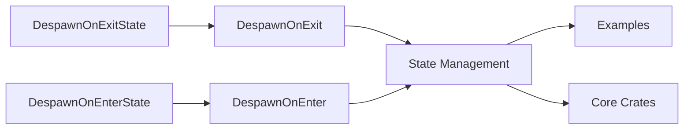

+++
title = "#20872 Rename DespawnOnExitState to DespawnOnExit"
date = "2025-09-04T00:00:00"
draft = false
template = "pull_request_page.html"
in_search_index = true

[taxonomies]
list_display = ["show"]

[extra]
current_language = "en"
available_languages = {"en" = { name = "English", url = "/pull_request/bevy/2025-09/pr-20872-en-20250904" }, "zh-cn" = { name = "中文", url = "/pull_request/bevy/2025-09/pr-20872-zh-cn-20250904" }}
labels = ["D-Trivial", "A-States"]
+++

# Title
Rename DespawnOnExitState to DespawnOnExit

## Basic Information
- **Title**: Rename DespawnOnExitState to DespawnOnExit
- **PR Link**: https://github.com/bevyengine/bevy/pull/20872
- **Author**: janhohenheim
- **Status**: MERGED
- **Labels**: D-Trivial, S-Ready-For-Final-Review, M-Needs-Migration-Guide, A-States
- **Created**: 2025-09-04T20:45:38Z
- **Merged**: 2025-09-04T21:37:18Z
- **Merged By**: mockersf

## Description Translation
# Objective

- `StateScoped` was renamed to `DespawnOnExitState`, and we introduced `DespawnOnEnterState`
- This is redundant: the type it wraps is already a state
- Often, state enums have `State` in their names, leading to stutter: `DespawnOnExitState(GameState::Gameplay)`
- This component is *very* common in games. The longer name makes it clunkier to use, so we should be careful when expanding it. I think the added clarity is good, but we can do better.

## Solution

- Compromise to `DespawnOnExit`
- Do the same for `DespawnOnEnter`

## Testing

- CI

## The Story of This Pull Request

This PR addresses a naming redundancy issue in Bevy's state management system. The problem stemmed from recent changes where `StateScoped` was renamed to `DespawnOnExitState` and a new `DespawnOnEnterState` was introduced. While these names were descriptive, they created unnecessary verbosity in code, especially when state enums already contained "State" in their names, resulting in stutter like `DespawnOnExitState(GameState::Gameplay)`.

The solution was straightforward: remove the redundant "State" suffix from both components. The new names `DespawnOnExit` and `DespawnOnEnter` maintain clarity while reducing verbosity. This change is particularly important because these components are frequently used in game development, and shorter names improve code readability and reduce typing overhead.

The implementation involved a systematic rename across the codebase, affecting both the core state management crate and numerous examples. The changes were consistent and mechanical, replacing all instances of the old names with the new ones. This included updates to:
- Type definitions and implementations
- Function parameters and queries
- Documentation comments
- Example code

The rename also required updating the migration guide to reflect these changes, ensuring users migrating from older versions would have clear instructions.

From a technical perspective, this change demonstrates good API design principles. The names are now more concise while remaining descriptive. The `DespawnOnExit` and `DespawnOnEnter` components clearly indicate their purpose - to despawn entities when exiting or entering a specific state, respectively.

The changes maintain backward compatibility in functionality while improving the developer experience. The PR was thoroughly tested through CI, ensuring that all existing functionality continued to work correctly with the new names.

## Visual Representation



## Key Files Changed

1. `crates/bevy_state/src/state_scoped.rs` (+9/-9)
   - Core component definitions and system implementations
   - Renamed both components and updated documentation

```rust
// Before:
pub struct DespawnOnExitState<S: States>(pub S);
pub struct DespawnOnEnterState<S: States>(pub S);

// After:
pub struct DespawnOnExit<S: States>(pub S);
pub struct DespawnOnEnter<S: States>(pub S);
```

2. `examples/testbed/ui.rs` (+26/-26)
   - Updated example code to use new component names
   - Affected multiple UI examples including image, text, and layout examples

```rust
// Before:
commands.spawn((Camera2d, DespawnOnExitState(super::Scene::Image)));

// After:
commands.spawn((Camera2d, DespawnOnExit(super::Scene::Image)));
```

3. `examples/testbed/3d.rs` (+20/-20)
   - Updated 3D examples including light, bloom, and gltf examples
   - Consistent rename across all 3D testbed scenes

```rust
// Before:
commands.spawn((Camera3d::default(), DespawnOnExitState(CURRENT_SCENE)));

// After:
commands.spawn((Camera3d::default(), DespawnOnExit(CURRENT_SCENE)));
```

4. `examples/testbed/2d.rs` (+14/-14)
   - Updated 2D examples including shapes, bloom, and text examples
   - Applied consistent naming changes

```rust
// Before:
commands.spawn((Camera2d, DespawnOnExitState(super::Scene::Shapes)));

// After:
commands.spawn((Camera2d, DespawnOnExit(super::Scene::Shapes)));
```

5. `examples/games/alien_cake_addict.rs` (+6/-6)
   - Updated game example to use new component names
   - Affected player, bonus, and UI entities

```rust
// Before:
commands.spawn((DespawnOnExitState(GameState::Playing), PointLight { ... }));

// After:
commands.spawn((DespawnOnExit(GameState::Playing), PointLight { ... }));
```

## Further Reading

- Bevy States Documentation: https://bevyengine.org/learn/book/features/states/
- Bevy ECS Guide: https://bevyengine.org/learn/book/ecs/
- PR #19435: Original introduction of `DespawnOnEnterState` and `DespawnOnExitState`
- PR #18818: Initial state scoped entities implementation

# Full Code Diff
[The full code diff is available at the PR link](https://github.com/bevyengine/bevy/pull/20872)