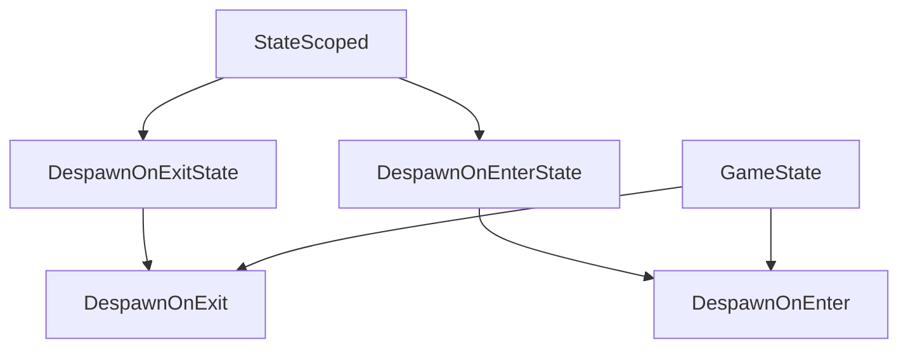

+++
title = "#20872 Rename DespawnOnExitState to DespawnOnExit"
date = "2025-09-04T00:00:00"
draft = false
template = "pull_request_page.html"
in_search_index = false

[extra]
current_language = "zh-cn"
available_languages = {"en" = { name = "English", url = "/pull_request/bevy/2025-09/pr-20872-en-20250904" }, "zh-cn" = { name = "中文", url = "/pull_request/bevy/2025-09/pr-20872-zh-cn-20250904" }}
+++

# 重命名 DespawnOnExitState 为 DespawnOnExit

## 基本信息
- **标题**: Rename DespawnOnExitState to DespawnOnExit
- **PR 链接**: https://github.com/bevyengine/bevy/pull/20872
- **作者**: janhohenheim
- **状态**: 已合并
- **标签**: D-Trivial, S-Ready-For-Final-Review, M-Needs-Migration-Guide, A-States
- **创建时间**: 2025-09-04T20:45:38Z
- **合并时间**: 2025-09-04T21:37:18Z
- **合并者**: mockersf

## 描述翻译

### 目标
- `StateScoped` 被重命名为 `DespawnOnExitState`，同时引入了 `DespawnOnEnterState`
- 这种命名存在冗余：组件包装的类型本身已经是状态（state）
- 通常，状态枚举的名称中已经包含 `State`，导致重复：`DespawnOnExitState(GameState::Gameplay)`
- 这个组件在游戏中非常常见。较长的名称使其使用起来更笨拙，因此在扩展时需要谨慎。虽然增加的清晰度是好的，但我们可以做得更好。

### 解决方案
- 折中为 `DespawnOnExit`
- 对 `DespawnOnEnter` 进行同样的处理

### 测试
- CI

## 本次 PR 的故事

这个 PR 解决了一个看似简单但实际影响广泛的命名问题。在 Bevy 的状态管理系统中，有两个用于状态范围实体管理的组件：`DespawnOnExitState` 和 `DespawnOnEnterState`。这些组件允许开发者在进入或退出特定状态时自动销毁实体，是游戏开发中非常常用的功能。

问题的核心在于命名冗余。当开发者使用这些组件时，通常需要指定一个状态枚举，而这些枚举往往已经包含 "State" 在名称中。例如：`DespawnOnExitState(GameState::Gameplay)`。这导致了不必要的重复和代码冗长。

开发者 janhohenheim 识别到这个问题，并提出了一个简洁的解决方案：移除组件名称中的 "State" 后缀。这样不仅减少了冗余，还使 API 更加简洁易用。修改后的代码看起来像这样：`DespawnOnExit(GameState::Gameplay)`。

这个改动虽然表面上只是重命名，但实际上影响了代码库的多个部分。PR 修改了 13 个文件，包括核心的 state 模块和多个示例文件。这种广泛的影响也说明了这些组件在 Bevy 生态系统中的重要性。

从技术实现角度来看，这个 PR 展示了良好的软件工程实践。所有的修改都是一致的、系统性的，没有破坏现有的功能。同时，作者还更新了迁移指南，确保现有用户能够平滑过渡到新的命名约定。

这个改动虽然简单，但对开发者体验有实质性的改善。更简洁的 API 意味着更少的打字错误、更好的代码可读性，以及更一致的命名约定。在游戏开发中，这些状态范围组件被频繁使用，因此即使是这样的小改进也能产生累积效应。

## 可视化表示



## 关键文件更改

### `crates/bevy_state/src/state_scoped.rs` (+9/-9)
这个文件包含了核心的状态范围组件定义。所有的组件名称都移除了 "State" 后缀。

```rust
// 修改前:
pub struct DespawnOnExitState<S: States>(pub S);
pub struct DespawnOnEnterState<S: States>(pub S);

// 修改后:
pub struct DespawnOnExit<S: States>(pub S);
pub struct DespawnOnEnter<S: States>(pub S);
```

### `examples/ecs/state_scoped.rs` (+4/-4)
这个示例文件展示了状态范围组件的使用方式，所有实例都更新为新的命名约定。

```rust
// 修改前:
commands.spawn((DespawnOnExitState(GameState::A), Text::new("Game is in state 'A'")));

// 修改后:
commands.spawn((DespawnOnExit(GameState::A), Text::new("Game is in state 'A'")));
```

### `examples/games/alien_cake_addict.rs` (+6/-6)
这是一个游戏示例，展示了在实际游戏场景中如何使用状态范围组件。

```rust
// 修改前:
commands.spawn((DespawnOnExitState(GameState::Playing), PointLight { ... }));

// 修改后:
commands.spawn((DespawnOnExit(GameState::Playing), PointLight { ... }));
```

### `examples/testbed/2d.rs` (+14/-14) 和 `examples/testbed/3d.rs` (+20/-20)
这些测试平台文件包含了大量的状态范围组件使用实例，全部更新为新的命名约定。

```rust
// 修改前:
commands.spawn((Camera2d, DespawnOnExitState(super::Scene::Shapes)));

// 修改后:
commands.spawn((Camera2d, DespawnOnExit(super::Scene::Shapes)));
```

### `release-content/migration-guides/rename_state_scoped.md` (+1/-1)
更新了迁移指南，反映了最新的命名变化。

```markdown
// 修改前:
| StateScoped                 | DespawnOnExitState                       |

// 修改后:
| StateScoped                 | DespawnOnExit                       |
```

## 延伸阅读

- [Bevy 状态管理文档](https://bevyengine.org/learn/books/introduction/state-management/)
- [Bevy 组件系统指南](https://bevyengine.org/learn/books/introduction/ecs/)
- [Rust 命名约定](https://rust-lang.github.io/api-guidelines/naming.html)
- [软件设计中的命名艺术](https://martinfowler.com/bliki/TwoHardThings.html)