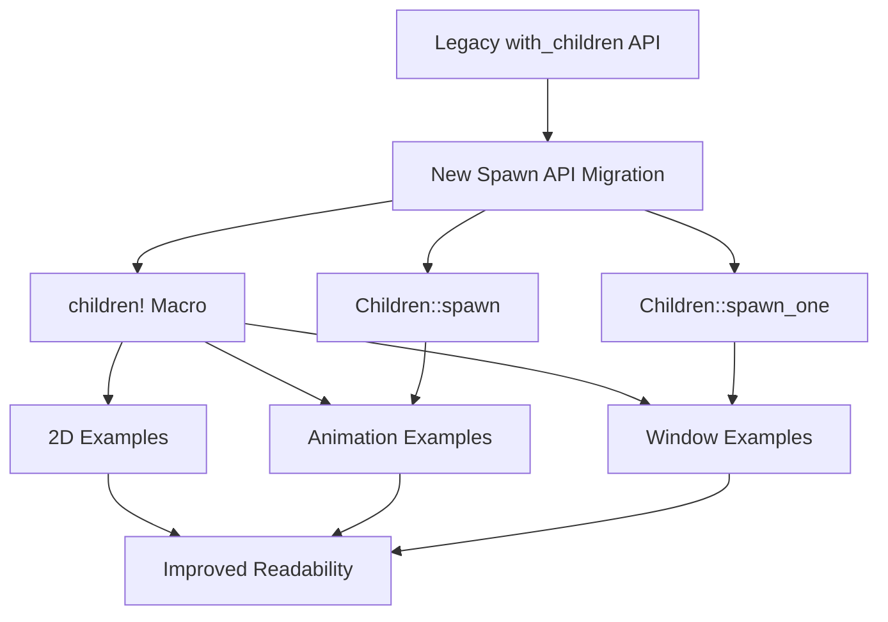

+++
title = "#20876 convert more examples to new spawn api"
date = "2025-09-06T00:00:00"
draft = false
template = "pull_request_page.html"
in_search_index = true

[taxonomies]
list_display = ["show"]

[extra]
current_language = "en"
available_languages = {"en" = { name = "English", url = "/pull_request/bevy/2025-09/pr-20876-en-20250906" }, "zh-cn" = { name = "中文", url = "/pull_request/bevy/2025-09/pr-20876-zh-cn-20250906" }}
labels = ["A-ECS", "C-Examples", "D-Straightforward"]
+++

# Title
convert more examples to new spawn api

## Basic Information
- **Title**: convert more examples to new spawn api
- **PR Link**: https://github.com/bevyengine/bevy/pull/20876
- **Author**: janis-bhm
- **Status**: MERGED
- **Labels**: A-ECS, C-Examples, S-Ready-For-Final-Review, D-Straightforward
- **Created**: 2025-09-05T01:19:47Z
- **Merged**: 2025-09-06T10:52:39Z
- **Merged By**: james7132

## Description Translation
This PR continues work on issue #18238 by converting more examples from the old `.with_children` API to the newer `Children::spawn`, `Children::spawn_one` methods, and `children!` macro. The changes affect examples in the `window`, `2d`, and `animation` folders, as well as `ecs/one_shot_systems.rs`. The author intentionally left `observer_propagation.rs` unchanged since it appears to be a good use case for `with_children`. Visual testing confirmed no functional changes.

## The Story of This Pull Request

This PR represents a systematic migration of Bevy's example codebase from the older `.with_children` API to newer, more concise spawning patterns. The work is part of a larger effort to modernize Bevy's Entity Component System (ECS) APIs and improve code consistency across the ecosystem.

The core problem being addressed is that the traditional `.with_children` pattern required nested closures and separate command contexts, which could become verbose and less readable, especially for complex entity hierarchies. The older approach looked like this:

```rust
commands.spawn((/* components */))
    .with_children(|parent| {
        parent.spawn((/* child components */));
    });
```

The solution approach leverages Bevy's newer spawning utilities that allow defining child entities more directly through either method chains or the `children!` macro. This reduces nesting and improves code clarity by keeping related entity definitions together.

The implementation systematically converts 10 different example files across multiple categories. The changes are mechanical but important for maintaining consistency and demonstrating modern Bevy patterns to users. Each conversion follows the same pattern: replacing `.with_children` closures with either direct `children!` macro usage or restructured spawning logic.

From a technical perspective, this migration demonstrates several important Bevy concepts:

1. **API Evolution**: Shows how Bevy's ECS APIs are evolving toward more ergonomic patterns
2. **Macro Usage**: The `children!` macro provides a declarative way to define entity hierarchies
3. **Bundle Composition**: Highlights how components can be grouped together cleanly

The impact is primarily on code quality and maintainability rather than performance. These changes make the examples more readable and consistent, which is crucial since examples serve as learning resources for the Bevy community. The migration also helps reduce cognitive load by eliminating unnecessary nesting.

## Visual Representation



## Key Files Changed

### `examples/2d/text2d.rs` (+38/-38)
**What changed**: Converted complex UI hierarchy from nested `.with_children` calls to a more declarative approach using the `children!` macro and a helper function.

**Before:**
```rust
commands.spawn((/* components */))
    .with_children(|commands| {
        for (text_anchor, color) in [...] {
            commands.spawn((/* components */))
                .with_child((/* components */))
                .with_child((/* components */));
        }
    });
```

**After:**
```rust
let make_child = move |(text_anchor, color): (Anchor, Color)| {
    (/* components */, children![(/* child 1 */), (/* child 2 */)])
};

commands.spawn((/* components */, children![
    make_child((Anchor::TOP_LEFT, Color::Srgba(LIGHT_SALMON))),
    // ... more children
]));
```

### `examples/animation/animation_masks.rs` (+131/-142)
**What changed**: Completely restructured the UI construction from imperative `.with_children` calls to a declarative `children!` macro approach with factory functions.

**Before:**
```rust
commands.spawn(Node { /* properties */ })
    .with_children(|parent| {
        parent.spawn(row_node.clone()).with_children(|parent| {
            add_mask_group_control(parent, "Left Front Leg", px(MASK_GROUP_BUTTON_WIDTH), MASK_GROUP_LEFT_FRONT_LEG);
        });
    });
```

**After:**
```rust
commands.spawn((
    Node { /* properties */ },
    children![
        new_mask_group_control("Left Front Leg", px(MASK_GROUP_BUTTON_WIDTH), MASK_GROUP_LEFT_FRONT_LEG),
        // ... more children
    ],
));
```

### `examples/animation/animated_ui.rs` (+32/-37)
**What changed**: Simplified the animation UI setup by using `children!` macro instead of separate child spawning.

**Before:**
```rust
commands.spawn((/* components */))
    .with_children(|builder| {
        builder.spawn((/* components */))
            .insert(AnimationTarget { /* properties */ });
    });
```

**After:**
```rust
let player = entity.id();
entity.insert(children![(
    Text::new("Bevy"),
    // ... other components
    AnimationTarget { /* properties */ },
)]);
```

### `examples/window/scale_factor_override.rs` (+25/-28)
**What changed**: Converted simple UI hierarchy to use `children!` macro for cleaner structure.

**Before:**
```rust
commands.spawn(Node { /* properties */ })
    .with_children(|parent| {
        parent.spawn((Node { /* properties */ }, BackgroundColor(/* color */)))
            .with_child((/* text components */));
    });
```

**After:**
```rust
commands.spawn((
    Node { /* properties */ },
    children![(
        Node { /* properties */ },
        BackgroundColor(/* color */),
        children![(/* text components */)]
    )],
));
```

### `examples/animation/animated_transform.rs` (+20/-26)
**What changed**: Simplified complex animation entity hierarchy using `children!` macro for nested entities.

**Before:**
```rust
commands.entity(planet_entity).insert(AnimationTarget { /* properties */ })
    .with_children(|p| {
        p.spawn((/* components */))
            .with_children(|p| {
                p.spawn((/* satellite components */));
            });
    });
```

**After:**
```rust
commands.entity(planet_entity).insert((
    AnimationTarget { /* properties */ },
    children![(
        Transform::default(),
        Visibility::default(),
        children![(/* satellite components */)]
    )],
));
```

## Further Reading

- [Bevy ECS Guide](https://bevyengine.org/learn/books/introduction/ecs-intro/) - Comprehensive guide to Bevy's Entity Component System
- [Bevy Spawning Patterns](https://bevyengine.org/examples/ecs/spawning/) - Official examples demonstrating entity spawning
- [Rust Macros Guide](https://doc.rust-lang.org/book/ch19-06-macros.html) - Understanding macro usage in Rust
- [Issue #18238](https://github.com/bevyengine/bevy/issues/18238) - The original issue tracking the spawn API migration