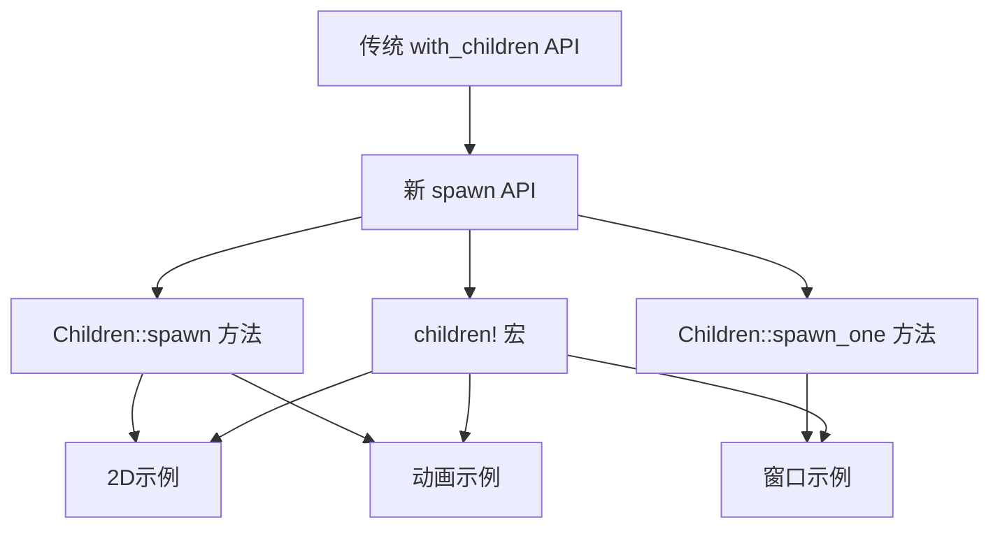

+++
title = "#20876 convert more examples to new spawn api"
date = "2025-09-06T00:00:00"
draft = false
template = "pull_request_page.html"
in_search_index = false

[extra]
current_language = "zh-cn"
available_languages = {"en" = { name = "English", url = "/pull_request/bevy/2025-09/pr-20876-en-20250906" }, "zh-cn" = { name = "中文", url = "/pull_request/bevy/2025-09/pr-20876-zh-cn-20250906" }}
+++

# convert more examples to new spawn api

## 基本信息
- **标题**: convert more examples to new spawn api
- **PR链接**: https://github.com/bevyengine/bevy/pull/20876
- **作者**: janis-bhm
- **状态**: 已合并
- **标签**: A-ECS, C-Examples, S-Ready-For-Final-Review, D-Straightforward
- **创建时间**: 2025-09-05T01:19:47Z
- **合并时间**: 2025-09-06T10:52:39Z
- **合并者**: james7132

## 描述翻译
### 目标
解决 #18238

### 解决方案
将对 `.with_children` 的调用转换为使用 `Children::spawn` 或 `Children::spawn_one` 类型或 `children!` 宏。
这涉及 `window`、`2d`、`animation` 文件夹以及 `ecs/one_shot_systems.rs`。
`observer_propagation.rs` 看起来正是 `with_children` 有用的地方，因此我特意没有修改它。
如果需要，我可以将此拆分为更多 PR 或压缩。

### 测试
我已在此补丁前后运行了示例，并通过视觉验证没有任何变化。

## 本次PR的故事

这个PR是Bevy引擎ECS系统现代化工作的一部分，专注于将现有的示例代码从传统的`.with_children` API迁移到更现代、更简洁的spawn API。这项工作属于更大的#18238 issue，旨在统一和简化Bevy中的实体创建模式。

### 问题和背景
在Bevy的早期版本中，创建带有子实体的实体通常使用`.with_children`方法，这种方式需要先创建父实体，然后通过闭包的方式在其内部创建子实体。虽然功能完整，但这种模式会导致代码嵌套层次较深，可读性降低，并且与Bevy正在推广的更声明式的ECS模式不太一致。

新的spawn API（包括`Children::spawn`、`Children::spawn_one`和`children!`宏）提供了更扁平化的代码结构，允许开发者在单个spawn调用中同时定义父实体和所有子实体，这使得代码更加简洁和易于理解。

### 解决方案方法
开发者选择了逐步迁移的策略，专注于示例代码的更新，因为这些示例是新手学习Bevy的首要参考。通过更新示例，可以确保新用户从一开始就接触到现代的API用法。

迁移策略包括：
1. 使用`children!`宏来内联定义子实体
2. 将嵌套的`.with_children`调用转换为扁平的实体结构
3. 保持功能完全不变，只改变API的使用方式

### 具体实现
这个PR修改了10个示例文件，涵盖了2D图形、动画和窗口管理等多个领域。每个修改都遵循相同的模式：将`.with_children`调用替换为`children!`宏或直接使用新的spawn方法。

以`examples/2d/sprite_scale.rs`为例，修改前后的对比展示了新API的简洁性：

```rust
// 修改前:
let mut cmd = commands.spawn((/* 组件 */));
cmd.with_children(|builder| {
    builder.spawn((/* 子组件 */));
});

// 修改后:
commands.spawn((
    /* 父组件 */,
    children![(/* 子组件 */)],
));
```

这种转变不仅减少了代码行数，还消除了嵌套闭包带来的认知负担。

### 技术洞察
`children!`宏是这次迁移的核心工具，它允许开发者在单个表达式中定义多个子实体。这个宏会展开为适当的`Children`组件，使得ECS系统能够正确建立父子关系。

值得注意的是，PR作者特意保留了`observer_propagation.rs`示例，因为它展示了`.with_children`仍然有价值的用例——当需要动态生成子实体或需要访问父实体的信息时，传统的闭包方式可能更合适。

### 影响和意义
这个PR的影响主要体现在以下几个方面：

1. **代码质量提升**：迁移后的代码更加简洁、易于阅读和维护
2. **教学价值**：更新后的示例展示了Bevy的最佳实践，帮助新用户学习现代API
3. **一致性**：整个代码库的API使用方式更加统一
4. **性能**：新的spawn API在底层可能有轻微的性能优势，因为它减少了闭包创建的开销

最重要的是，这个工作为其他开发者提供了一个清晰的模式，展示了如何将旧代码迁移到新的API，推动了整个生态系统向更现代的编程模式发展。

## 可视化表示



## 关键文件变更

### `examples/2d/sprite_scale.rs` (+4/-11)
这个文件展示了从传统嵌套模式到扁平化模式的转变，移除了临时变量和闭包，使代码更加简洁。

**修改前:**
```rust
let mut cmd = commands.spawn((/* 组件 */));
cmd.with_children(|builder| {
    builder.spawn((/* 子组件 */));
});
```

**修改后:**
```rust
commands.spawn((
    /* 父组件 */,
    children![(/* 子组件 */)],
));
```

### `examples/2d/text2d.rs` (+38/-38)
这个文件进行了较大重构，将复杂的嵌套子实体创建逻辑转换为更函数式的风格，使用闭包工厂函数生成可重用的子实体模板。

### `examples/animation/animated_transform.rs` (+20/-26)
动画示例展示了如何将多层次的父子关系转换为扁平的`children!`宏调用，使复杂的实体层次结构更加清晰。

### `examples/animation/animation_masks.rs` (+131/-142)
这是变化最大的文件，完全重构了UI控件的创建方式，引入了工厂函数模式来生成复杂的嵌套UI元素。

### `examples/window/scale_factor_override.rs` (+25/-28)
窗口示例展示了简单的UI层次结构如何通过新的API变得更加简洁和声明式。

## 扩展阅读

对于想要深入了解Bevy ECS和spawn API的开发者，推荐以下资源：

1. [Bevy官方ECS指南](https://bevyengine.org/learn/book/ecs/) - 官方ECS系统文档
2. [Bevy Cheatbook - Commands](https://bevy-cheatbook.github.io/programming/commands.html) - 命令系统使用指南
3. [PR #18238](https://github.com/bevyengine/bevy/issues/18238) - 本次迁移工作的原始issue
4. [Bevy社区讨论](https://discord.com/invite/bevy) - 在Bevy Discord中讨论ECS最佳实践

这些资源将帮助开发者更好地理解Bevy的ECS架构和现代的实体创建模式。