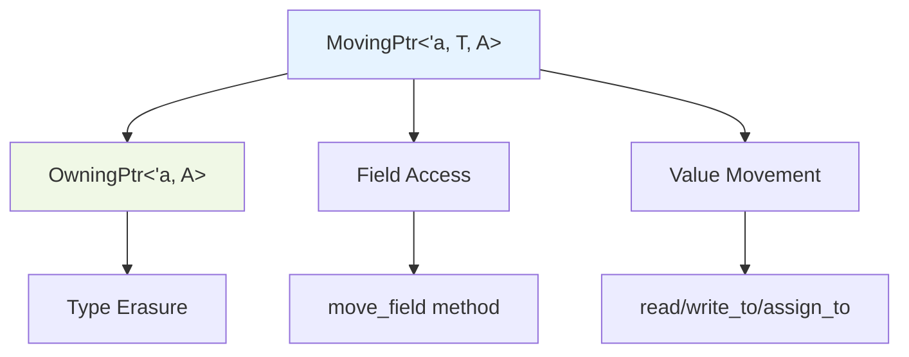

+++
title = "#20877 Introduce MovingPtr as a safer alternative to moving typed values by raw pointer"
date = "2025-09-07T00:00:00"
draft = false
template = "pull_request_page.html"
in_search_index = true

[taxonomies]
list_display = ["show"]

[extra]
current_language = "en"
available_languages = {"en" = { name = "English", url = "/pull_request/bevy/2025-09/pr-20877-en-20250907" }, "zh-cn" = { name = "中文", url = "/pull_request/bevy/2025-09/pr-20877-zh-cn-20250907" }}
labels = ["C-Usability", "A-Pointers", "D-Unsafe"]
+++

# Title

## Basic Information
- **Title**: Introduce MovingPtr as a safer alternative to moving typed values by raw pointer
- **PR Link**: https://github.com/bevyengine/bevy/pull/20877
- **Author**: james7132
- **Status**: MERGED
- **Labels**: C-Usability, S-Ready-For-Final-Review, A-Pointers, D-Unsafe
- **Created**: 2025-09-05T02:55:01Z
- **Merged**: 2025-09-07T20:57:32Z
- **Merged By**: alice-i-cecile

## Description Translation
# Objective
Make moving potentially large values, like those seen in #20571 and those seen by #20772, safer and easier to review.

## Solution
Introduce `MovingPtr<'a, T>` as a wrapper around `NonNull<T>`. This type:

 - Wraps a pointer and is thus cheap to pass through to functions.
 - Acts like a `Box<T>` that does not own the allocation it points to. It will drop the value it points to when it's dropped, but will not deallocate when it's dropped.
 - Acts like a `OwningPtr` in that it owns the values it points to and has an associated lifetime, but it has a concrete type.
 - As it owns the value, it does not implement `Clone` or `Copy`.
 - Does not support arbitrary pointer arithmetic other than to get `MovingPtr`s of the value's fields.
 - Does not support casting to types other than `ManuallyDrop<T>` and `MaybeUninit<T>`.
 - Has methods that consume the `MovingPtr` that copies the value into a target pointer or reads it onto the stack.
 - Provide unsafe functions for partially moving values of members out and returns a `MovingPtr<'a, MaybeUninit<T>>` in its stead.
 - Optionally supports unaligned pointers like `OwningPtr` for use cases like #20593.
 - Provides `From` impl for converting to `OwningPtr` to type erasure without loss of the lifetime or alignment requirements.
 - Provides a `TryFrom` impl to attempt to convert an unaligned instance into a aligned one. Can be combined with `DebugCheckedUnwrap` to assert that the conversion is sound.
 - The `deconstruct_moving_ptr` provides a less error-prone way of decomposing a `MovingPtr` into separate `MovingPtr` for its fields.

This design is loosely based on the outptr proposal for [in-place construction](https://github.com/rust-lang/lang-team/issues/336#issuecomment-3049593105), but currently eschews the requirements for a derive macro.

## Testing
CI, new doc tests pass.

## The Story of This Pull Request

This PR addresses a fundamental problem in Rust's memory management when dealing with large values that need to be moved efficiently. The core issue was that moving potentially large values by raw pointer was error-prone, unsafe, and difficult to review correctly. Developers were manually managing pointer operations that could easily lead to use-after-free bugs, double drops, or alignment issues.

The solution introduces `MovingPtr<'a, T>`, a smart pointer type that provides safe ownership semantics without taking responsibility for memory allocation. This type acts like a lifetime-bound `Box<T>` but doesn't own the underlying allocation - it only owns the value itself. When dropped, it properly drops the value but leaves the allocation management to whatever originally owned it (like a `Vec` or stack frame).

The implementation builds on Bevy's existing pointer infrastructure by extending the `IsAligned` trait with fundamental pointer operations (`read_ptr`, `copy_nonoverlapping`, `drop_in_place`) that handle both aligned and unaligned cases correctly. This allows `MovingPtr` to work seamlessly in both scenarios, which is crucial for use cases like working with packed structs or specific memory layouts.

Key engineering decisions shaped this implementation:
1. **No Clone/Copy**: Since `MovingPtr` owns the value, allowing duplication would violate Rust's ownership rules and lead to double drops.
2. **Limited pointer arithmetic**: Only field-level access is supported through `move_field`, preventing arbitrary and unsafe pointer manipulation.
3. **Integration with existing types**: `MovingPtr` can be converted to `OwningPtr` for type erasure scenarios, maintaining compatibility with Bevy's ECS system.
4. **Safe deconstruction**: The `deconstruct_moving_ptr` macro provides a structured way to break down complex types into their component fields safely.

The most technically interesting aspect is how `MovingPtr` handles partial moves through the `partial_move` method. This allows safely extracting fields from a struct while maintaining the integrity of the remaining fields, returning a `MovingPtr<'a, MaybeUninit<T>>` for the partially moved value. This is particularly valuable for ECS systems that need to move components between archetypes or storage locations.

Performance considerations were central to this design. `MovingPtr` is designed to be zero-cost - it's essentially a wrapped `NonNull<T>` with the same memory footprint and runtime characteristics. The safety checks happen at compile time through Rust's type system, with minimal runtime overhead.

The impact of this change is significant for Bevy's memory management patterns. It provides a standardized, safe way to move values in memory without the overhead of full allocation ownership. This is particularly valuable for:
- ECS component moving between storage locations
- Efficient serialization/deserialization workflows
- Safe manipulation of large data structures without copying
- Memory-efficient data processing pipelines

The implementation demonstrates several advanced Rust patterns:
- Phantom types for alignment tracking
- Safe abstraction over unsafe pointer operations
- Macro-based DSLs for complex operations (`deconstruct_moving_ptr`)
- Type conversion patterns between different pointer types

## Visual Representation



## Key Files Changed

### `crates/bevy_ptr/src/lib.rs` (+576/-22)

This file received the majority of changes, adding the `MovingPtr` type and supporting infrastructure:

**Key additions:**
```rust
#[repr(transparent)]
pub struct MovingPtr<'a, T, A: IsAligned = Aligned>(NonNull<T>, PhantomData<(&'a mut T, A)>);
```

**Extended IsAligned trait:**
```rust
pub trait IsAligned: sealed::Sealed {
    unsafe fn read_ptr<T>(ptr: *const T) -> T;
    unsafe fn copy_nonoverlapping<T>(src: *const T, dst: *mut T, count: usize);
    unsafe fn drop_in_place<T>(ptr: *mut T);
}
```

**Core MovingPtr methods:**
```rust
impl<'a, T, A: IsAligned> MovingPtr<'a, T, A> {
    pub unsafe fn new(inner: NonNull<T>) -> Self { ... }
    pub unsafe fn partial_move(...) -> MovingPtr<'a, MaybeUninit<T>, A> { ... }
    pub fn read(self) -> T { ... }
    pub unsafe fn write_to(self, dst: *mut T) { ... }
    pub fn assign_to(self, dst: &mut T) { ... }
    pub unsafe fn move_field<U>(&self, byte_offset: usize) -> MovingPtr<'a, U, Unaligned> { ... }
}
```

### `crates/bevy_ptr/README.md` (+6/-0)

Updated the documentation to include `MovingPtr` in the pointer type comparison table and add a description:

```markdown
|`MovingPtr<'a, T>`   |Yes        |Yes    |Yes           |Maybe  |Yes     |Yes             |Yes               |
```

```markdown
`MovingPtr<'a, T>` is like a lifetimed-`Box<T>` or a typed `OwningPtr<'a>` made for cheaply moving potentially large values around in memory.
It's a pointer that owns the value it points to but does not own the allocation. If dropped, it will drop the value it points to, just as
if you dropped a value of the inner type but won't deallocate the allocation where the value lived in. It provides a number of methods for moving the value
into another location in memory, including options for partial or deconstructive moves.
```

## Further Reading

- [Rustonomicon - Working with Unsafe](https://doc.rust-lang.org/nomicon/working-with-unsafe.html)
- [Rust RFC 2582 - MaybeUninit](https://rust-lang.github.io/rfcs/2582-maybe-uninit.html)
- [Bevy ECS Architecture](https://bevyengine.org/learn/architecture/ecs/)
- [NonNull documentation](https://doc.rust-lang.org/std/ptr/struct.NonNull.html)
- [In-place construction proposal](https://github.com/rust-lang/lang-team/issues/336)