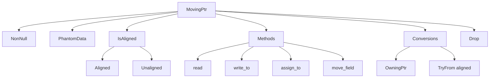

+++
title = "#20877 Introduce MovingPtr as a safer alternative to moving typed values by raw pointer"
date = "2025-09-07T00:00:00"
draft = false
template = "pull_request_page.html"
in_search_index = false

[extra]
current_language = "zh-cn"
available_languages = {"en" = { name = "English", url = "/pull_request/bevy/2025-09/pr-20877-en-20250907" }, "zh-cn" = { name = "中文", url = "/pull_request/bevy/2025-09/pr-20877-zh-cn-20250907" }}
labels = ["C-Usability", "A-Pointers", "D-Unsafe"]
+++

# Introduce MovingPtr as a safer alternative to moving typed values by raw pointer

## Basic Information
- **Title**: Introduce MovingPtr as a safer alternative to moving typed values by raw pointer
- **PR Link**: https://github.com/bevyengine/bevy/pull/20877
- **Author**: james7132
- **Status**: MERGED
- **Labels**: C-Usability, S-Ready-For-Final-Review, A-Pointers, D-Unsafe
- **Created**: 2025-09-05T02:55:01Z
- **Merged**: 2025-09-07T20:57:32Z
- **Merged By**: alice-i-cecile

## Description Translation
# Objective
使移动潜在的大值（如 #20571 和 #20772 中看到的）更安全且更易于审查。

## Solution
引入 `MovingPtr<'a, T>` 作为 `NonNull<T>` 的包装器。该类型：

- 包装指针，因此传递给函数的成本低廉。
- 类似于不拥有其指向分配的 `Box<T>`。当被丢弃时，它将丢弃其指向的值，但不会在丢弃时释放分配。
- 类似于 `OwningPtr`，因为它拥有其指向的值并具有关联的生命周期，但它具有具体类型。
- 由于它拥有该值，因此不实现 `Clone` 或 `Copy`。
- 不支持除获取值字段的 `MovingPtr` 之外的任意指针算术。
- 不支持转换为 `ManuallyDrop<T>` 和 `MaybeUninit<T>` 以外的类型。
- 具有消耗 `MovingPtr` 的方法，这些方法将值复制到目标指针或将其读取到堆栈上。
- 提供不安全函数，用于部分移出值的成员，并返回 `MovingPtr<'a, MaybeUninit<T>>` 作为替代。
- 可选地支持未对齐指针，如 `OwningPtr`，用于 #20593 等用例。
- 提供 `From` 实现，用于转换为 `OwningPtr` 以进行类型擦除，而不丢失生命周期或对齐要求。
- 提供 `TryFrom` 实现，尝试将未对齐实例转换为对齐实例。可与 `DebugCheckedUnwrap` 结合使用以断言转换是合理的。
- `deconstruct_moving_ptr` 提供了一种错误更少的方式将 `MovingPtr` 分解为其字段的单独 `MovingPtr`。

该设计大致基于 [原地构造](https://github.com/rust-lang/lang-team/issues/336#issuecomment-3049593105) 的 outptr 提案，但目前避开了对派生宏的要求。

## Testing
CI，新的文档测试通过。

## The Story of This Pull Request

在 Rust 中处理大型值时，直接通过值移动可能导致性能问题，因为涉及整个值的 memcpy。PR #20571 和 #20772 突出了对更安全、高效移动大型值方式的需求。现有的 `OwningPtr` 提供了一定帮助，但它是类型擦除的，缺乏类型安全的移动操作。

开发者引入了 `MovingPtr<'a, T>`，这是一个围绕 `NonNull<T>` 的包装器类型，设计用于安全地拥有和移动值而不拥有其分配。该类型的关键特性包括：

1. 拥有值但不拥有内存分配（类似于指向栈或 Vec 中元素的指针）
2. 防止意外复制（不实现 Clone/Copy）
3. 支持对齐和未对齐指针
4. 提供安全的方法来读取值或将其写入新位置
5. 支持部分移动和析构式移动

实现的核心是扩展 `IsAligned` trait，为对齐和未对齐情况提供专门的 `read_ptr`、`copy_nonoverlapping` 和 `drop_in_place` 方法。`MovingPtr` 通过这些方法在不同对齐情况下正确操作。

```rust
pub trait IsAligned: sealed::Sealed {
    unsafe fn read_ptr<T>(ptr: *const T) -> T;
    unsafe fn copy_nonoverlapping<T>(src: *const T, dst: *mut T, count: usize);
    unsafe fn drop_in_place<T>(ptr: *mut T);
}
```

`MovingPtr` 提供了几个关键方法：
- `make`：安全地创建 MovingPtr 的构造函数
- `read`：将值读取出指针
- `write_to`/`assign_to`：将值写入新位置
- `move_field`：获取结构体字段的 MovingPtr

还引入了 `deconstruct_moving_ptr!` 宏，用于安全地将结构体分解为其字段：

```rust
bevy_ptr::deconstruct_moving_ptr!(parent_ptr, Parent {
    field_a: FieldAType => { field_a.assign_to(&mut target_a) },
    field_b: FieldBType => { field_b.assign_to(&mut target_b) },
});
```

这些更改使 Bevy 能够更安全、高效地处理大型值的移动，减少了手动指针操作的风险，同时保持了灵活性。该实现考虑了各种边缘情况，如panic安全、对齐要求和部分移动，为处理复杂值移动提供了强大的基础。

## Visual Representation



## Key Files Changed

### `crates/bevy_ptr/src/lib.rs` (+576/-22)
主要实现了 `MovingPtr` 类型和相关功能：
1. 扩展 `IsAligned` trait 及其实现
2. 添加 `MovingPtr` 结构定义和方法
3. 实现转换 trait（From/TryFrom）
4. 实现 Drop trait
5. 添加 `deconstruct_moving_ptr!` 宏

关键代码片段：
```rust
// MovingPtr 结构定义
pub struct MovingPtr<'a, T, A: IsAligned = Aligned>(NonNull<T>, PhantomData<(&'a mut T, A)>);

// 核心方法：读取值
pub fn read(self) -> T {
    let value = unsafe { A::read_ptr(self.0.as_ptr()) };
    mem::forget(self);
    value
}

// 核心方法：移动字段
pub unsafe fn move_field<U>(&self, byte_offset: usize) -> MovingPtr<'a, U, Unaligned> {
    MovingPtr(
        unsafe { self.0.byte_add(byte_offset) }.cast::<U>(),
        PhantomData,
    )
}
```

### `crates/bevy_ptr/README.md` (+6/-0)
更新文档，添加 `MovingPtr` 到指针类型比较表并添加描述：

| 类型 | 拥有值 | 可变 | 类型已知 | 对齐 | 生命周期 | 可派生字段 | 可转换类型 |
|------|--------|------|----------|------|----------|------------|------------|
| `MovingPtr<'a, T>` | 是 | 是 | 是 | 可能 | 是 | 是 | 是 |

## Further Reading

- [Rust Nomicon: Working with Unsafe](https://doc.rust-lang.org/nomicon/working-with-unsafe.html)
- [Rust RFC: In-place constructors](https://github.com/rust-lang/rfcs/issues/2626)
- [Bevy Engine: ECS Overview](https://bevyengine.org/learn/ebook/introduction/)