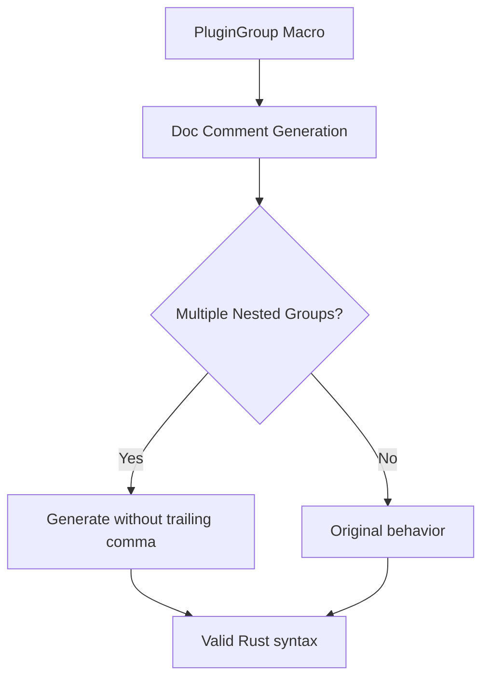

+++
title = "#20879 Fix plugin_group macro with multiple nested plugin groups"
date = "2025-09-05T00:00:00"
draft = false
template = "pull_request_page.html"
in_search_index = true

[taxonomies]
list_display = ["show"]

[extra]
current_language = "en"
available_languages = {"en" = { name = "English", url = "/pull_request/bevy/2025-09/pr-20879-en-20250905" }, "zh-cn" = { name = "中文", url = "/pull_request/bevy/2025-09/pr-20879-zh-cn-20250905" }}
labels = ["C-Bug", "D-Trivial", "A-App", "D-Macros"]
+++

# Fix plugin_group macro with multiple nested plugin groups

## Basic Information
- **Title**: Fix plugin_group macro with multiple nested plugin groups
- **PR Link**: https://github.com/bevyengine/bevy/pull/20879
- **Author**: atlv24
- **Status**: MERGED
- **Labels**: C-Bug, D-Trivial, S-Ready-For-Final-Review, A-App, D-Macros
- **Created**: 2025-09-05T03:24:38Z
- **Merged**: 2025-09-05T05:08:16Z
- **Merged By**: alice-i-cecile

## Description Translation
# Objective

- Putting multiple plugin groups inside a plugin group results in a compile error

## Solution

- remove spurious comma in doc gen

## Testing

- Found when trying to use multiple plugin groups in DefaultPlugins for #20778, fixed for that.

## The Story of This Pull Request

The developer encountered a compile error while working on PR #20778 when attempting to use multiple nested plugin groups within Bevy's `DefaultPlugins` configuration. This was a blocking issue that prevented the proper composition of plugin groups, which is a fundamental pattern in Bevy's plugin architecture.

The root cause was traced to the `plugin_group` macro in `bevy_app/src/plugin_group.rs`. Specifically, the macro's documentation generation code contained a spurious comma that caused syntax errors when multiple plugin groups were nested. The macro was generating invalid Rust syntax in the doc comments when processing multiple nested plugin groups.

The fix was straightforward but precise: removing the erroneous comma from the doc comment generation pattern. The change modified the macro's pattern matching from `$($(#[doc = ...]),+)?` to `$($(#[doc = ...])+)?`, eliminating the trailing comma that was causing the compilation failure.

To ensure this fix was robust and to prevent regression, the developer added a comprehensive test case. The test creates three plugin groups (`PluginGroupA`, `PluginGroupB`, and `PluginGroupC`) where `PluginGroupC` nests both `PluginGroupA` and `PluginGroupB`. This test verifies that the macro can properly handle multiple nested plugin groups without compilation errors.

The implementation maintains backward compatibility while fixing the specific edge case. The change is minimal and surgical, affecting only the problematic pattern in the macro without altering any other functionality. This approach follows the principle of making the smallest possible change to fix the identified issue.

## Visual Representation



## Key Files Changed

### `crates/bevy_app/src/plugin_group.rs` (+31/-2)

**What changed**: Fixed the plugin_group macro to properly handle multiple nested plugin groups by removing a spurious comma in documentation generation, and added a test case to verify the fix.

**Key modifications**:
```rust
// Before:
$($(#[doc = concat!(
    " - [`", stringify!($plugin_group_name), "`](" $(, stringify!($plugin_group_path), "::")*, stringify!($plugin_group_name), ")"
    $(, " - with feature `", $plugin_group_feature, "`")?
))),+)?

// After:
$($(#[doc = concat!(
    " - [`", stringify!($plugin_group_name), "`](" $(, stringify!($plugin_group_path), "::")*, stringify!($plugin_group_name), ")"
    $(, " - with feature `", $plugin_group_feature, "`")?
)))+)?
```

**Test case added**:
```rust
plugin_group! {
    #[derive(Default)]
    struct PluginGroupA {
        :PluginA
    }
}
plugin_group! {
    #[derive(Default)]
    struct PluginGroupB {
        :PluginB
    }
}
plugin_group! {
    struct PluginGroupC {
        :PluginC
        #[plugin_group]
        :PluginGroupA,
        #[plugin_group]
        :PluginGroupB,
    }
}
#[test]
fn construct_nested_plugin_groups() {
    PluginGroupC {}.build();
}
```

## Further Reading

- [Rust Macro Documentation](https://doc.rust-lang.org/book/ch19-06-macros.html)
- [Bevy Plugin System](https://bevyengine.org/learn/book/getting-started/plugins/)
- [Macro Pattern Matching](https://doc.rust-lang.org/reference/macros-by-example.html)