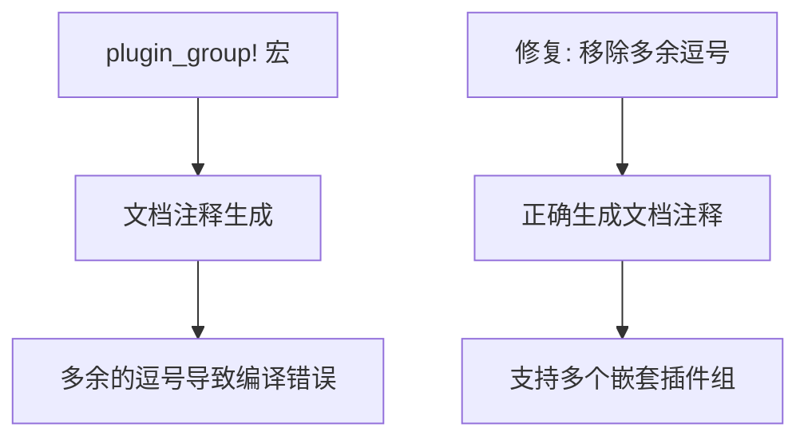

+++
title = "#20879 Fix plugin_group macro with multiple nested plugin groups"
date = "2025-09-05T00:00:00"
draft = false
template = "pull_request_page.html"
in_search_index = false

[extra]
current_language = "zh-cn"
available_languages = {"en" = { name = "English", url = "/pull_request/bevy/2025-09/pr-20879-en-20250905" }, "zh-cn" = { name = "中文", url = "/pull_request/bevy/2025-09/pr-20879-zh-cn-20250905" }}
+++

# Fix plugin_group macro with multiple nested plugin groups

## 基本信息
- **标题**: Fix plugin_group macro with multiple nested plugin groups
- **PR链接**: https://github.com/bevyengine/bevy/pull/20879
- **作者**: atlv24
- **状态**: 已合并
- **标签**: C-Bug, D-Trivial, S-Ready-For-Final-Review, A-App, D-Macros
- **创建时间**: 2025-09-05T03:24:38Z
- **合并时间**: 2025-09-05T05:08:16Z
- **合并者**: alice-i-cecile

## 描述翻译
### Objective
- 在一个插件组中放置多个插件组会导致编译错误

### Solution
- 移除文档生成中的多余逗号

### Testing
- 在尝试为 #20778 在 DefaultPlugins 中使用多个插件组时发现此问题，并已修复

## 这个PR的故事

这个PR解决了一个看似微小但影响开发体验的问题：Bevy的`plugin_group!`宏在处理多个嵌套插件组时会产生编译错误。

问题的根源在于宏展开时生成的文档注释中多了一个不必要的逗号。当开发者尝试在一个插件组中包含多个嵌套插件组时，宏会生成如下的文档注释：

```rust
// 错误生成的内容：
// - [`PluginGroupA`](path::to::PluginGroupA), - with feature `some_feature`
// - [`PluginGroupB`](path::to::PluginGroupB), - with feature `some_feature`
//                                       ^ 这里多了一个逗号
```

这个多余的逗号会导致Rust编译器报错，因为它在文档注释中产生了语法错误。虽然这个问题不影响实际功能的执行，但它阻碍了开发者使用多个嵌套插件组的模式。

解决方案非常简单直接：在`crates/bevy_app/src/plugin_group.rs`文件中，将宏定义中的文档生成部分从：

```rust
$($(#[doc = concat!(
    " - [`", stringify!($plugin_group_name), "`](" $(, stringify!($plugin_group_path), "::")*, stringify!($plugin_group_name), ")"
    $(, " - with feature `", $plugin_group_feature, "`")?
))),+)?
```

改为：

```rust
$($(#[doc = concat!(
    " - [`", stringify!($plugin_group_name), "`](" $(, stringify!($plugin_group_path), "::")*, stringify!($plugin_group_name), ")"
    $(, " - with feature `", $plugin_group_feature, "`")?
)))+)?
```

关键变化是将末尾的`),+)?`改为`))+)?`，移除了导致问题的多余逗号。

为了验证修复的有效性，PR作者还添加了相应的测试用例：

```rust
plugin_group! {
    struct PluginGroupC {
        :PluginC
        #[plugin_group]
        :PluginGroupA,
        #[plugin_group]
        :PluginGroupB,
    }
}
#[test]
fn construct_nested_plugin_groups() {
    PluginGroupC {}.build();
}
```

这个测试确保了一个插件组可以正确包含多个嵌套插件组而不会产生编译错误。

从技术角度来看，这个修复展示了宏编程中的一个常见陷阱：在生成代码时需要特别注意语法细节，即使是看似无关紧要的标点符号也可能导致编译失败。这也体现了测试驱动开发的重要性，通过添加具体的测试用例来验证修复的有效性。

这个修改虽然很小，但对于需要使用复杂插件组结构的开发者来说很有价值，它消除了一个不必要的开发障碍，使得Bevy的插件系统更加健壮和易用。

## 可视化表示



## 关键文件更改

### `crates/bevy_app/src/plugin_group.rs` (+31/-2)

这个文件包含了`plugin_group!`宏的实现，是本次修复的核心。

**主要修改：**

1. **修复宏中的文档生成问题：**
```rust
// 修改前：
$($(#[doc = concat!(
    " - [`", stringify!($plugin_group_name), "`](" $(, stringify!($plugin_group_path), "::")*, stringify!($plugin_group_name), ")"
    $(, " - with feature `", $plugin_group_feature, "`")?
))),+)?

// 修改后：
$($(#[doc = concat!(
    " - [`", stringify!($plugin_group_name), "`](" $(, stringify!($plugin_group_path), "::")*, stringify!($plugin_group_name), ")"
    $(, " - with feature `", $plugin_group_feature, "`")?
)))+)?
```

2. **添加测试用例验证修复：**
```rust
// 新增的测试代码：
plugin_group! {
    struct PluginGroupC {
        :PluginC
        #[plugin_group]
        :PluginGroupA,
        #[plugin_group]
        :PluginGroupB,
    }
}
#[test]
fn construct_nested_plugin_groups() {
    PluginGroupC {}.build();
}
```

这些修改确保了宏能够正确处理多个嵌套插件组的情况，消除了编译错误。

## 进一步阅读

- [Rust宏编程指南](https://doc.rust-lang.org/book/ch19-06-macros.html)
- [Bevy插件系统文档](https://bevyengine.org/learn/book/getting-started/plugins/)
- [Rust文档注释规范](https://doc.rust-lang.org/rustdoc/how-to-write-documentation.html)

# 完整代码差异
```diff
diff --git a/crates/bevy_app/src/plugin_group.rs b/crates/bevy_app/src/plugin_group.rs
index ee1c8cb44b3cc..a2904ff0ba5c3 100644
--- a/crates/bevy_app/src/plugin_group.rs
+++ b/crates/bevy_app/src/plugin_group.rs
@@ -143,7 +143,7 @@ macro_rules! plugin_group {
        $($(#[doc = concat!(
             " - [`", stringify!($plugin_group_name), "`](" $(, stringify!($plugin_group_path), "::")*, stringify!($plugin_group_name), ")"
             $(, " - with feature `", $plugin_group_feature, "`")?
-        )]),+)?
+        )])+)?
         $(
             ///
             $(#[doc = $post_doc])+
@@ -559,18 +559,21 @@ mod tests {
     use core::{any::TypeId, fmt::Debug};
 
     use super::PluginGroupBuilder;
-    use crate::{App, NoopPluginGroup, Plugin};
+    use crate::{App, NoopPluginGroup, Plugin, PluginGroup};
 
+    #[derive(Default)]
     struct PluginA;
     impl Plugin for PluginA {
         fn build(&self, _: &mut App) {}
     }
 
+    #[derive(Default)]
     struct PluginB;
     impl Plugin for PluginB {
         fn build(&self, _: &mut App) {}
     }
 
+    #[derive(Default)]
     struct PluginC;
     impl Plugin for PluginC {
         fn build(&self, _: &mut App) {}
@@ -873,4 +876,30 @@ mod tests {
             ]
         );
     }
+
+    plugin_group! {
+        #[derive(Default)]
+        struct PluginGroupA {
+            :PluginA
+        }
+    }
+    plugin_group! {
+        #[derive(Default)]
+        struct PluginGroupB {
+            :PluginB
+        }
+    }
+    plugin_group! {
+        struct PluginGroupC {
+            :PluginC
+            #[plugin_group]
+            :PluginGroupA,
+            #[plugin_group]
+            :PluginGroupB,
+        }
+    }
+    #[test]
+    fn construct_nested_plugin_groups() {
+        PluginGroupC {}.build();
+    }
 }
```