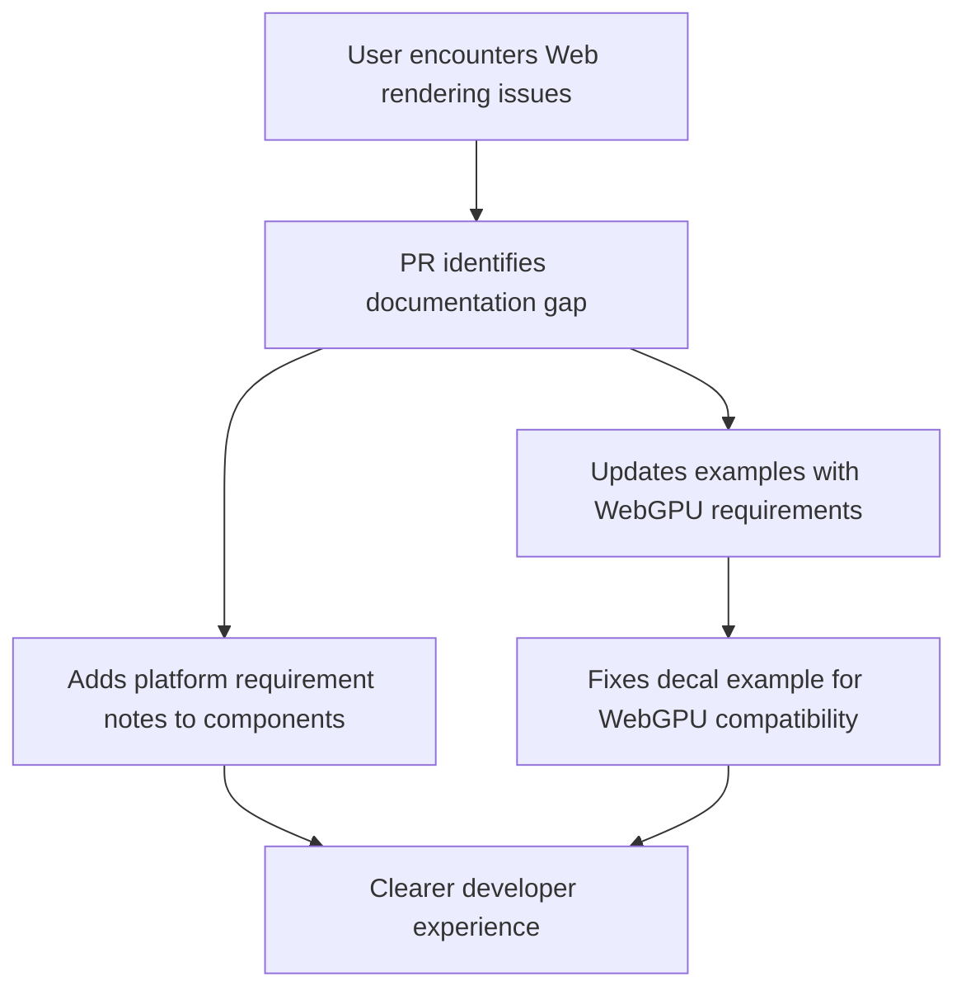

+++
title = "#20881 Note some features requiring WebGPU on Wasm builds"
date = "2025-09-05T00:00:00"
draft = false
template = "pull_request_page.html"
in_search_index = true

[taxonomies]
list_display = ["show"]

[extra]
current_language = "en"
available_languages = {"en" = { name = "English", url = "/pull_request/bevy/2025-09/pr-20881-en-20250905" }, "zh-cn" = { name = "中文", url = "/pull_request/bevy/2025-09/pr-20881-zh-cn-20250905" }}
labels = ["C-Docs", "A-Rendering", "C-Examples", "O-Web", "O-WebGPU", "O-WebGL2", "D-Straightforward"]
+++

# Title: Note some features requiring WebGPU on Wasm builds

## Basic Information
- **Title**: Note some features requiring WebGPU on Wasm builds
- **PR Link**: https://github.com/bevyengine/bevy/pull/20881
- **Author**: janhohenheim
- **Status**: MERGED
- **Labels**: C-Docs, A-Rendering, C-Examples, O-Web, S-Ready-For-Final-Review, O-WebGPU, O-WebGL2, D-Straightforward
- **Created**: 2025-09-05T04:33:43Z
- **Merged**: 2025-09-05T20:35:27Z
- **Merged By**: mockersf

## Description Translation
# Objective

- Decals are broken on web: https://github.com/bevyengine/bevy/issues/19177
  - webgl doesn't work at all, WebGPU requires non-MSAA
- Volumetric fog works only on WebGPU
- However, our users have no guidance about this!

## Solution

- Document the state of affairs.
- Fix the decal example to at least run on WebGPU

## Testing

- `bevy run --example decals --features webgpu web`

## The Story of This Pull Request

This PR addresses a practical documentation gap in Bevy's web support for advanced rendering features. The core issue was that two specific graphics features - decals and volumetric fog - had platform-specific limitations on WebAssembly builds that weren't documented, leading to user confusion when these features failed to work as expected.

The problem manifested in two distinct ways. For decals, WebGL support was completely broken, and even WebGPU required disabling multisample anti-aliasing (MSAA). Volumetric fog only worked on WebGPU and wouldn't function at all on WebGL. Without clear documentation, users had no way of knowing these limitations existed or how to work around them.

The solution approach was straightforward but important: add clear documentation to both the API components and examples. For the decal example, an additional practical fix was implemented to make it actually runnable on WebGPU by replacing MSAA with FXAA (Fast Approximate Anti-Aliasing), which provides a similar visual effect without the WebGPU compatibility issues.

The implementation involved adding concise but clear documentation comments to three key locations:

1. The `VolumetricFog` component documentation now explicitly states the WebGPU requirement for Wasm builds
2. The `ForwardDecal` component documentation explains the specific WebGPU and MSAA requirements
3. Both 3D examples (decal and volumetric fog) now include upfront notes about their WebGPU requirements

The most substantial code change was in the decal example, where the camera configuration was modified to disable MSAA and enable FXAA instead:

```rust
// Before:
DepthPrepass, // Must enable the depth prepass to render forward decals

// After:
// Must enable the depth prepass to render forward decals
DepthPrepass,
// Must disable MSAA to use decals on WebGPU
Msaa::Off,
// FXAA is a fine alternative to MSAA for anti-aliasing
Fxaa::default(),
```

This change demonstrates a practical workaround for the MSAA limitation while maintaining visual quality. The addition of FXAA provides an alternative anti-aliasing method that works within WebGPU's constraints.

The impact of these changes is significant for developers targeting web platforms. They now have clear guidance about platform limitations and practical examples of how to configure their applications to work within those constraints. This reduces frustration and debugging time when working with these advanced rendering features on the web.

## Visual Representation



## Key Files Changed

### `crates/bevy_light/src/volumetric.rs` (+2/-0)
Added documentation note about WebGPU requirement for volumetric fog on Wasm builds.

```rust
// Added documentation:
/// Requires using WebGPU on Wasm builds.
```

### `crates/bevy_pbr/src/decal/forward.rs` (+1/-0)
Added documentation note about WebGPU and MSAA requirements for decals on Wasm.

```rust
// Added documentation:
/// * On Wasm, requires using WebGPU and disabling `Msaa` on your camera.
```

### `examples/3d/decal.rs` (+8/-1)
Added WebGPU requirement note and fixed camera configuration for WebGPU compatibility.

```rust
// Added note at top:
//! Note: On Wasm, this example only runs on WebGPU

// Modified camera setup:
// Must enable the depth prepass to render forward decals
DepthPrepass,
// Must disable MSAA to use decals on WebGPU
Msaa::Off,
// FXAA is a fine alternative to MSAA for anti-aliasing
Fxaa::default(),
```

### `examples/3d/volumetric_fog.rs` (+1/-0)
Added WebGPU requirement note to volumetric fog example.

```rust
// Added note at top:
//! Note: On Wasm, this example only runs on WebGPU
```

## Further Reading

- [Bevy WebGPU Documentation](https://bevyengine.org/learn/books/introduction/platform-specifics/webgpu)
- [WebGPU vs WebGL2 Comparison](https://github.com/gpuweb/gpuweb/wiki/WebGPU-vs-WebGL)
- [MSAA and FXAA Technical Comparison](https://developer.nvidia.com/content/anti-aliasing-introduction-samples-and-fxaa)
- [Bevy Web Examples](https://github.com/bevyengine/bevy/tree/main/examples#web)