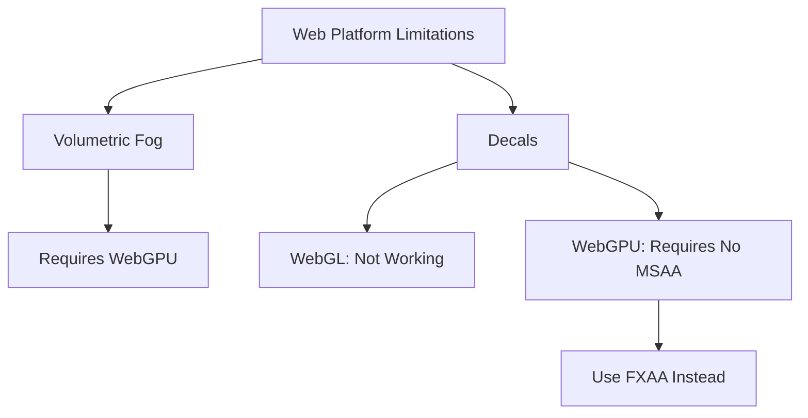

+++
title = "#20881 Note some features requiring WebGPU on Wasm builds"
date = "2025-09-05T00:00:00"
draft = false
template = "pull_request_page.html"
in_search_index = false

[extra]
current_language = "zh-cn"
available_languages = {"en" = { name = "English", url = "/pull_request/bevy/2025-09/pr-20881-en-20250905" }, "zh-cn" = { name = "中文", url = "/pull_request/bevy/2025-09/pr-20881-zh-cn-20250905" }}
labels = ["C-Docs", "A-Rendering", "C-Examples", "O-Web", "O-WebGPU", "O-WebGL2", "D-Straightforward"]
+++

# Title
PR #20881: Note some features requiring WebGPU on Wasm builds

## Basic Information
- **Title**: Note some features requiring WebGPU on Wasm builds
- **PR Link**: https://github.com/bevyengine/bevy/pull/20881
- **Author**: janhohenheim
- **Status**: MERGED
- **Labels**: C-Docs, A-Rendering, C-Examples, O-Web, S-Ready-For-Review, O-WebGPU, O-WebGL2, D-Straightforward
- **Created**: 2025-09-05T04:33:43Z
- **Merged**: 2025-09-05T20:35:27Z
- **Merged By**: mockersf

## Description Translation
# Objective

- Decals are broken on web: https://github.com/bevyengine/bevy/issues/19177
  - webgl doesn't work at all, WebGPU requires non-MSAA
- Volumetric fog works only on WebGPU
- However, our users have no guidance about this!

## Solution

- Document the state of affairs.
- Fix the decal example to at least run on WebGPU

## Testing

- `bevy run --example decals --features webgpu web`

## The Story of This Pull Request

这个PR解决了一个实际的Web平台兼容性问题。开发团队发现Bevy引擎中的两个高级渲染功能——Decals（贴花）和Volumetric Fog（体积雾）在Web环境下存在严重的兼容性问题。

问题的核心在于：Decals功能在WebGL上完全无法工作，即使在WebGPU上也需要禁用MSAA（多重采样抗锯齿）；而Volumetric Fog则只能在WebGPU上运行。但现有的文档和示例代码完全没有提及这些限制，导致用户在Web平台上尝试使用这些功能时会遇到无法预料的问题。

开发者采取了一个务实且直接的解决方案：通过添加明确的文档说明来告知用户这些限制，同时调整示例代码以确保至少能在WebGPU环境下正常运行。

在技术实现上，这个PR主要做了四件事情：

首先，在`bevy_light/src/volumetric.rs`中为VolumetricFog组件添加了文档注释，明确指出在Wasm构建中需要WebGPU支持：

```rust
/// Requires using WebGPU on Wasm builds.
```

其次，在`bevy_pbr/src/decal/forward.rs`中为ForwardDecal组件添加了更详细的平台限制说明：

```rust
/// * On Wasm, requires using WebGPU and disabling `Msaa` on your camera.
```

第三，修改了`examples/3d/decal.rs`示例，禁用了MSAA并添加了FXAA作为替代的抗锯齿方案：

```rust
// Must disable MSAA to use decals on WebGPU
Msaa::Off,
// FXAA is a fine alternative to MSAA for anti-aliasing
Fxaa::default(),
```

最后，在两个示例文件的顶部都添加了平台限制的说明注释：

```rust
//! Note: On Wasm, this example only runs on WebGPU
```

这些改动虽然看起来简单，但体现了良好的工程实践。通过明确的文档说明，用户可以避免在错误的平台上尝试使用不支持的功能；通过调整示例配置，确保了示例代码至少能在一种Web渲染后端上正常工作。

从架构角度看，这个PR保持了向后兼容性——所有改动都是添加文档或调整配置，没有修改任何核心渲染逻辑。这种处理方式既解决了用户体验问题，又不会引入新的技术风险。

## Visual Representation



## Key Files Changed

### 1. `crates/bevy_light/src/volumetric.rs` (+2/-0)
**修改目的**: 为体积雾功能添加Web平台限制说明
```rust
// 添加的代码：
///
/// Requires using WebGPU on Wasm builds.
```

### 2. `crates/bevy_pbr/src/decal/forward.rs` (+1/-0)  
**修改目的**: 为向前贴花组件添加详细的Web平台要求
```rust
// 添加的代码：
/// * On Wasm, requires using WebGPU and disabling `Msaa` on your camera.
```

### 3. `examples/3d/decal.rs` (+8/-1)
**修改目的**: 添加平台限制说明并调整示例配置以支持WebGPU
```rust
// 文件顶部添加：
//! Note: On Wasm, this example only runs on WebGPU

// 相机配置修改：
// Must disable MSAA to use decals on WebGPU
Msaa::Off,
// FXAA is a fine alternative to MSAA for anti-aliasing  
Fxaa::default(),
```

### 4. `examples/3d/volumetric_fog.rs` (+1/-0)
**修改目的**: 为体积雾示例添加平台限制说明
```rust
// 文件顶部添加：
//! Note: On Wasm, this example only runs on WebGPU
```

## Further Reading

- [Bevy WebGPU Support](https://bevyengine.org/learn/quick-start/platform-specific/web/) - Bevy官方Web平台支持文档
- [WebGPU vs WebGL2](https://developer.chrome.com/blog/webgpu-io2023/) - WebGPU与WebGL2的技术对比
- [MSAA and FXAA Comparison](https://gametimereg.com/blogs/blog/msaa-vs-fxaa) - 不同抗锯齿技术的性能和质量比较
- [Bevy Decals Documentation](https://docs.rs/bevy/latest/bevy/pbr/decal/index.html) - Bevy贴花系统官方文档