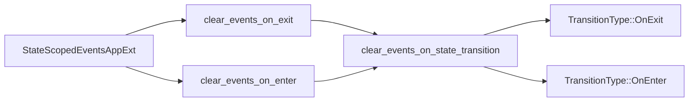

+++
title = "#20882 Rename scoped functions"
date = "2025-09-05T00:00:00"
draft = false
template = "pull_request_page.html"
in_search_index = true

[taxonomies]
list_display = ["show"]

[extra]
current_language = "en"
available_languages = {"en" = { name = "English", url = "/pull_request/bevy/2025-09/pr-20882-en-20250905" }, "zh-cn" = { name = "中文", url = "/pull_request/bevy/2025-09/pr-20882-zh-cn-20250905" }}
labels = ["D-Trivial", "A-States"]
+++

# Rename scoped functions

## Basic Information
- **Title**: Rename scoped functions
- **PR Link**: https://github.com/bevyengine/bevy/pull/20882
- **Author**: janhohenheim
- **Status**: MERGED
- **Labels**: D-Trivial, S-Ready-For-Final-Review, M-Needs-Migration-Guide, A-States
- **Created**: 2025-09-05T04:41:19Z
- **Merged**: 2025-09-05T06:02:44Z
- **Merged By**: alice-i-cecile

## Description Translation
# Objective

- Followup to https://github.com/bevyengine/bevy/pull/20872#issuecomment-3256973683
- `clear_events_on_exit_state` is now inconsistent with `DespawnOnExit`
- Fixes #20880

## Solution

- remove the suffix

## Testing

- CI

## The Story of This Pull Request

This PR addresses a naming inconsistency in Bevy's state management system that emerged from recent changes. The core issue was that after PR #20872 renamed `StateScoped` to `DespawnOnExit`, the related function `clear_events_on_exit_state` became inconsistent in naming convention.

The problem was straightforward: the function name included the redundant `_state` suffix while the component name didn't. This created an API inconsistency that could confuse developers working with Bevy's state management system. The fix was simple but important for maintaining a clean and consistent API surface.

The developer approached this by systematically removing the `_state` suffix from all related functions:
- `clear_events_on_exit_state` → `clear_events_on_exit`
- `clear_events_on_enter_state` → `clear_events_on_enter`

This change affected both the internal implementation functions and the public API methods exposed through the `StateScopedEventsAppExt` trait. The renaming was applied consistently across all implementations for both `App` and `SubApp` types.

The implementation required updating:
1. Function definitions
2. Function calls throughout the codebase
3. Test cases to use the new naming
4. Documentation in the migration guide

This change maintains backward compatibility in functionality while improving naming consistency. The migration guide was updated to reflect both the previous renaming (from `StateScoped` to `DespawnOnExit`) and this latest change.

The technical impact is minimal - this is purely a naming change that doesn't affect runtime behavior. However, it significantly improves API consistency and developer experience when working with state-scoped events in Bevy.

## Visual Representation



## Key Files Changed

### `crates/bevy_state/src/state_scoped_events.rs` (+12/-14)

This file contains the core implementation of state-scoped events functionality. The changes involved renaming functions throughout the module to remove the `_state` suffix for consistency.

Key changes:
1. Internal function renaming:
```rust
// Before:
fn clear_events_on_exit_state<S: States>(...)
fn clear_events_on_enter_state<S: States>(...)

// After:
fn clear_events_on_exit<S: States>(...)
fn clear_events_on_enter<S: States>(...)
```

2. Public API method renaming in the trait:
```rust
// Before:
fn clear_events_on_exit_state<E: BufferedEvent>(...)
fn clear_events_on_enter_state<E: BufferedEvent>(...)

// After:
fn clear_events_on_exit<E: BufferedEvent>(...)
fn clear_events_on_enter<E: BufferedEvent>(...)
```

3. Updated system registration:
```rust
// Before:
TransitionType::OnExit => app.add_systems(OnExit(state), clear_events_on_exit_state::<S>),
TransitionType::OnEnter => app.add_systems(OnEnter(state), clear_events_on_enter_state::<S>)

// After:
TransitionType::OnExit => app.add_systems(OnExit(state), clear_events_on_exit::<S>),
TransitionType::OnEnter => app.add_systems(OnEnter(state), clear_events_on_enter::<S>)
```

### `release-content/migration-guides/rename_state_scoped.md` (+3/-3)

This migration guide was updated to reflect the latest naming changes and provide clear guidance for developers migrating their code.

Key updates:
```markdown
// Before:
This is now possible with the new `DespawnOnEnter` component and `clear_events_on_enter_state` method.

// After:
This is now possible with the new `DespawnOnEnter` component and `clear_events_on_enter` method.

// Before:
Also, `clear_event_on_exit_state` no longer adds the event automatically...

// After:
Also, `clear_event_on_exit` (previously `clear_event_on_exit_state`) no longer adds the event automatically...

// Before:
| `add_state_scoped_event`      | `add_event` + `clear_events_on_exit_state` |

// After:
| `add_state_scoped_event`      | `add_event` + `clear_events_on_exit` |
```

## Further Reading

- [Bevy States Documentation](https://bevyengine.org/learn/books/introduction/states) - Official guide to state management in Bevy
- [PR #20872](https://github.com/bevyengine/bevy/pull/20872) - The previous PR that introduced the naming inconsistency
- [Issue #20880](https://github.com/bevyengine/bevy/issues/20880) - The issue tracking this naming inconsistency
- [Bevy API Guidelines](https://github.com/bevyengine/bevy/blob/main/docs/plugins_guidelines.md#api-guidelines) - Bevy's API design principles