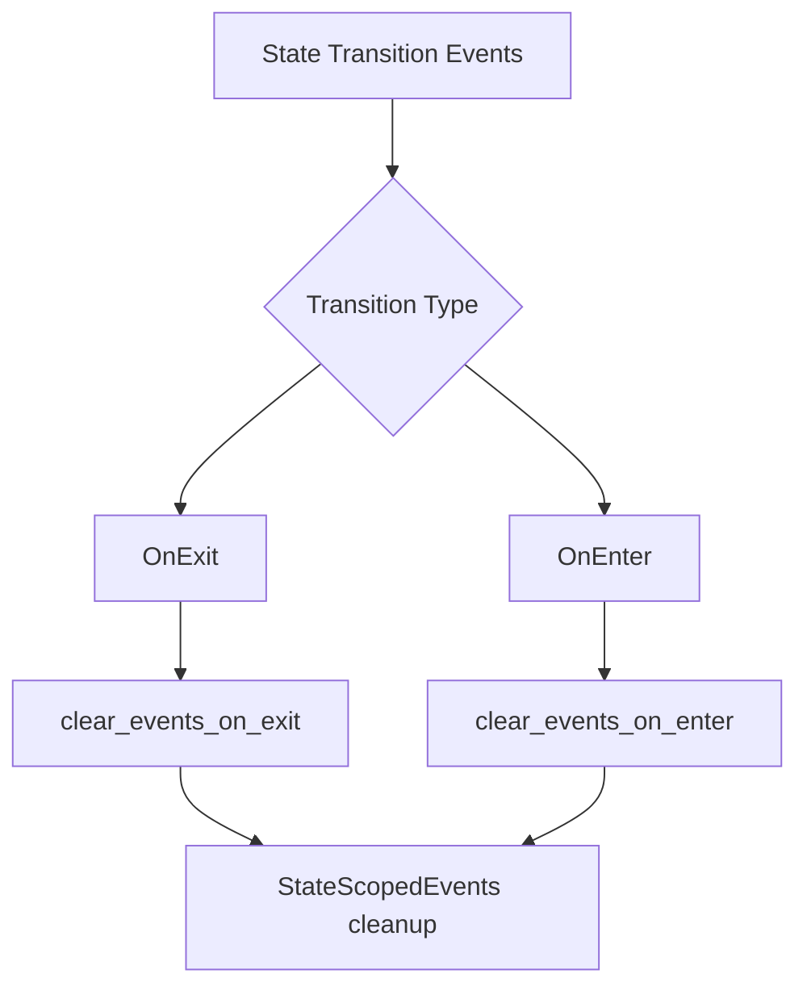

+++
title = "#20882 Rename scoped functions"
date = "2025-09-05T00:00:00"
draft = false
template = "pull_request_page.html"
in_search_index = false

[extra]
current_language = "zh-cn"
available_languages = {"en" = { name = "English", url = "/pull_request/bevy/2025-09/pr-20882-en-20250905" }, "zh-cn" = { name = "中文", url = "/pull_request/bevy/2025-09/pr-20882-zh-cn-20250905" }}
labels = ["D-Trivial", "A-States"]
+++

# Title

## Basic Information
- **Title**: Rename scoped functions
- **PR Link**: https://github.com/bevyengine/bevy/pull/20882
- **Author**: janhohenheim
- **Status**: MERGED
- **Labels**: D-Trivial, S-Ready-For-Final-Review, M-Needs-Migration-Guide, A-States
- **Created**: 2025-09-05T04:41:19Z
- **Merged**: 2025-09-05T06:02:44Z
- **Merged By**: alice-i-cecile

## Description Translation
# Objective

- Followup to https://github.com/bevyengine/bevy/pull/20872#issuecomment-3256973683
- `clear_events_on_exit_state` 现在与 `DespawnOnExit` 不一致
- 修复 #20880

## Solution

- 移除后缀

## Testing

- CI

## The Story of This Pull Request

这个PR解决了一个简单的命名一致性问题。在之前的PR #20872中，Bevy团队引入了状态作用域事件清理功能，但函数命名出现了不一致的情况。

问题的核心在于：当引入`DespawnOnExit`组件来处理状态退出时的实体清理时，相应的函数`clear_events_on_exit_state`却保留了`_state`后缀，这造成了API命名上的不一致。这种不一致性虽然看起来很小，但在大型代码库中会降低API的直观性和易用性。

开发者采用了最直接的解决方案：移除函数名中的`_state`后缀。这样修改后，`clear_events_on_exit`与`DespawnOnExit`的命名模式就保持一致了，都采用了"动作+条件"的简洁命名方式。

具体实现涉及两个主要函数的重命名：
- `clear_events_on_exit_state` → `clear_events_on_exit`
- `clear_events_on_enter_state` → `clear_events_on_enter`

这种修改不仅仅是表面上的重命名，更重要的是保持了API设计的一致性原则。一致的命名模式让开发者更容易理解和记忆API的使用方式。

测试方面，由于这是纯粹的接口重命名，功能逻辑没有任何变化，所以只需要通过CI测试确保没有破坏现有功能即可。迁移指南也相应更新，指导用户如何从旧API迁移到新API。

这个PR虽然改动很小，但体现了良好的API设计原则：保持一致性、简洁性和可预测性。这种关注细节的改进有助于提升整个代码库的质量和开发体验。

## Visual Representation



## Key Files Changed

### `crates/bevy_state/src/state_scoped_events.rs` (+12/-14)
这个文件包含了状态作用域事件处理的核心逻辑。主要修改是函数重命名：

**修改前：**
```rust
fn clear_events_on_exit_state<S: States>(
fn clear_events_on_enter_state<S: States>(
fn clear_events_on_state_transition<E: BufferedEvent, S: States>(
```

**修改后：**
```rust
fn clear_events_on_exit<S: States>(
fn clear_events_on_enter<S: States>(
fn clear_events_on_state_transition<E: BufferedEvent, S: States>(
```

相应的trait方法也进行了重命名：
```rust
// 修改前：
fn clear_events_on_exit_state<E: BufferedEvent>(&mut self, state: impl States) -> &mut Self;
fn clear_events_on_enter_state<E: BufferedEvent>(&mut self, state: impl States) -> &mut Self;

// 修改后：
fn clear_events_on_exit<E: BufferedEvent>(&mut self, state: impl States) -> &mut Self;
fn clear_events_on_enter<E: BufferedEvent>(&mut self, state: impl States) -> &mut Self;
```

测试用例中的调用也相应更新，确保使用新的函数名。

### `release-content/migration-guides/rename_state_scoped.md` (+3/-3)
迁移指南更新反映了API的变化，指导用户如何从旧命名迁移到新命名：

**修改前：**
```markdown
This is now possible with the new `DespawnOnEnter` component and `clear_events_on_enter_state` method.

Also, `clear_event_on_exit_state` no longer adds the event automatically...

| Before                        | After                                      |
|-------------------------------|--------------------------------------------|
| `add_state_scoped_event`      | `add_event` + `clear_events_on_exit_state` |
```

**修改后：**
```markdown
This is now possible with the new `DespawnOnEnter` component and `clear_events_on_enter` method.

Also, `clear_event_on_exit` (previously `clear_event_on_exit_state`) no longer adds the event automatically...

| Before                        | After                                      |
|-------------------------------|--------------------------------------------|
| `add_state_scoped_event`      | `add_event` + `clear_events_on_exit` |
```

## Further Reading

- [Bevy States Documentation](https://bevyengine.org/learn/book/getting-started/states/) - Bevy状态管理的官方文档
- [API Design Guidelines](https://rust-lang.github.io/api-guidelines/naming.html) - Rust API命名指南
- [Previous PR #20872](https://github.com/bevyengine/bevy/pull/20872) - 引入状态作用域事件功能的原始PR

# Full Code Diff
```diff
diff --git a/crates/bevy_state/src/state_scoped_events.rs b/crates/bevy_state/src/state_scoped_events.rs
index 3aaf325837f2a..4e3ef2fa0feaa 100644
--- a/crates/bevy_state/src/state_scoped_events.rs
+++ b/crates/bevy_state/src/state_scoped_events.rs
@@ -64,7 +64,7 @@ impl<S: States> Default for StateScopedEvents<S> {
     }
 }
 
-fn clear_events_on_exit_state<S: States>(
+fn clear_events_on_exit<S: States>(
     mut c: Commands,
     mut transitions: EventReader<StateTransitionEvent<S>>,
 ) {
@@ -85,7 +85,7 @@ fn clear_events_on_exit_state<S: States>(
     });
 }
 
-fn clear_events_on_enter_state<S: States>(
+fn clear_events_on_enter<S: States>(
     mut c: Commands,
     mut transitions: EventReader<StateTransitionEvent<S>>,
 ) {
@@ -119,10 +119,8 @@ fn clear_events_on_state_transition<E: BufferedEvent, S: States>(
         .resource_mut::<StateScopedEvents<S>>()
         .add_event::<E>(state.clone(), transition_type);
     match transition_type {
-        TransitionType::OnExit => app.add_systems(OnExit(state), clear_events_on_exit_state::<S>),
-        TransitionType::OnEnter => {
-            app.add_systems(OnEnter(state), clear_events_on_enter_state::<S>)
-        }
+        TransitionType::OnExit => app.add_systems(OnExit(state), clear_events_on_exit::<S>),
+        TransitionType::OnEnter => app.add_systems(OnEnter(state), clear_events_on_enter::<S>),
     };
 }
 
@@ -136,7 +134,7 @@ pub trait StateScopedEventsAppExt {
     /// All of these (state scoped entities and events cleanup, and `OnExit`)
     /// occur within schedule [`StateTransition`](crate::prelude::StateTransition)
     /// and system set `StateTransitionSystems::ExitSchedules`.
-    fn clear_events_on_exit_state<E: BufferedEvent>(&mut self, state: impl States) -> &mut Self;
+    fn clear_events_on_exit<E: BufferedEvent>(&mut self, state: impl States) -> &mut Self;
 
     /// Clears an [`BufferedEvent`] when entering the specified `state`.
     ///
@@ -146,11 +144,11 @@ pub trait StateScopedEventsAppExt {
     /// All of these (state scoped entities and events cleanup, and `OnEnter`)
     /// occur within schedule [`StateTransition`](crate::prelude::StateTransition)
     /// and system set `StateTransitionSystems::EnterSchedules`.
-    fn clear_events_on_enter_state<E: BufferedEvent>(&mut self, state: impl States) -> &mut Self;
+    fn clear_events_on_enter<E: BufferedEvent>(&mut self, state: impl States) -> &mut Self;
 }
 
 impl StateScopedEventsAppExt for App {
-    fn clear_events_on_exit_state<E: BufferedEvent>(&mut self, state: impl States) -> &mut Self {
+    fn clear_events_on_exit<E: BufferedEvent>(&mut self, state: impl States) -> &mut Self {
         clear_events_on_state_transition(
             self.main_mut(),
             PhantomData::<E>,
@@ -160,7 +158,7 @@ impl StateScopedEventsAppExt for App {
         self
     }
 
-    fn clear_events_on_enter_state<E: BufferedEvent>(&mut self, state: impl States) -> &mut Self {
+    fn clear_events_on_enter<E: BufferedEvent>(&mut self, state: impl States) -> &mut Self {
         clear_events_on_state_transition(
             self.main_mut(),
             PhantomData::<E>,
@@ -172,12 +170,12 @@ impl StateScopedEventsAppExt for App {
 }
 
 impl StateScopedEventsAppExt for SubApp {
-    fn clear_events_on_exit_state<E: BufferedEvent>(&mut self, state: impl States) -> &mut Self {
+    fn clear_events_on_exit<E: BufferedEvent>(&mut self, state: impl States) -> &mut Self {
         clear_events_on_state_transition(self, PhantomData::<E>, state, TransitionType::OnExit);
         self
     }
 
-    fn clear_events_on_enter_state<E: BufferedEvent>(&mut self, state: impl States) -> &mut Self {
+    fn clear_events_on_enter<E: BufferedEvent>(&mut self, state: impl States) -> &mut Self {
         clear_events_on_state_transition(self, PhantomData::<E>, state, TransitionType::OnEnter);
         self
     }
@@ -211,7 +209,7 @@ mod tests {
 
         app.add_event::<StandardEvent>();
         app.add_event::<StateScopedEvent>()
-            .clear_events_on_exit_state::<StateScopedEvent>(TestState::A);
+            .clear_events_on_exit::<StateScopedEvent>(TestState::A);
 
         app.world_mut().write_event(StandardEvent).unwrap();
         app.world_mut().write_event(StateScopedEvent).unwrap();
@@ -241,7 +239,7 @@ mod tests {
 
         app.add_event::<StandardEvent>();
         app.add_event::<StateScopedEvent>()
-            .clear_events_on_enter_state::<StateScopedEvent>(TestState::B);
+            .clear_events_on_enter::<StateScopedEvent>(TestState::B);
 
         app.world_mut().write_event(StandardEvent).unwrap();
         app.world_mut().write_event(StateScopedEvent).unwrap();
diff --git a/release-content/migration-guides/rename_state_scoped.md b/release-content/migration-guides/rename_state_scoped.md
index 29788e90f5c17..dc3f5b53826e8 100644
--- a/release-content/migration-guides/rename_state_scoped.md
+++ b/release-content/migration-guides/rename_state_scoped.md
@@ -8,13 +8,13 @@ as a way to remove entities/events when **exiting** a state.
 
 However, it can also be useful to have the opposite behavior,
 where entities/events are removed when **entering** a state.
-This is now possible with the new `DespawnOnEnter` component and `clear_events_on_enter_state` method.
+This is now possible with the new `DespawnOnEnter` component and `clear_events_on_enter` method.
 
 To support this addition, the previous method and component have been renamed.
-Also, `clear_event_on_exit_state` no longer adds the event automatically, so you must call `App::add_event` manually.
+Also, `clear_event_on_exit` (previously `clear_event_on_exit_state`) no longer adds the event automatically, so you must call `App::add_event` manually.
 
 | Before                        | After                                      |
 |-------------------------------|--------------------------------------------|
 | `StateScoped`                 | `DespawnOnExit`                       |
 | `clear_state_scoped_entities` | `despawn_entities_on_exit_state`           |
-| `add_state_scoped_event`      | `add_event` + `clear_events_on_exit_state` |
+| `add_state_scoped_event`      | `add_event` + `clear_events_on_exit` |
```