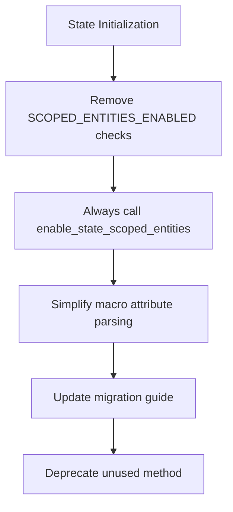

+++
title = "#20883 Always enable state scoped entities"
date = "2025-09-08T00:00:00"
draft = false
template = "pull_request_page.html"
in_search_index = true

[taxonomies]
list_display = ["show"]

[extra]
current_language = "en"
available_languages = {"en" = { name = "English", url = "/pull_request/bevy/2025-09/pr-20883-en-20250908" }, "zh-cn" = { name = "中文", url = "/pull_request/bevy/2025-09/pr-20883-zh-cn-20250908" }}
labels = ["D-Straightforward", "A-States"]
+++

# Always enable state scoped entities

## Basic Information
- **Title**: Always enable state scoped entities
- **PR Link**: https://github.com/bevyengine/bevy/pull/20883
- **Author**: janhohenheim
- **Status**: MERGED
- **Labels**: S-Ready-For-Final-Review, M-Needs-Migration-Guide, D-Straightforward, A-States
- **Created**: 2025-09-05T05:09:04Z
- **Merged**: 2025-09-08T03:55:10Z
- **Merged By**: alice-i-cecile

## Description Translation
# Objective

- Reverts https://github.com/bevyengine/bevy/pull/16180
- Fixes #20866

## Solution

- Just enable state scoped entities all the time. No need to keep API surface for disabling that tiiiiiny bit of overhead. If someone needs this, we can still trivially add it back.

## Testing

- `bevy run --example state_scope`

## The Story of This Pull Request

This PR addresses an issue where the optional state-scoped entities feature introduced unnecessary complexity to the Bevy state system. The original implementation in PR #16180 added configurability through a `scoped_entities` attribute in the `#[states]` macro, allowing developers to disable state-scoped entity cleanup for specific states. However, this created several problems:

1. **API Surface Complexity**: The feature introduced additional macro attributes and trait constants that developers needed to understand
2. **Conditional Logic**: The codebase contained multiple conditional checks for `SCOPED_ENTITIES_ENABLED` throughout the state initialization process
3. **Maintenance Overhead**: The optional nature of the feature required maintaining two code paths for state management

The solution was straightforward: remove the optionality and always enable state-scoped entities. This approach recognizes that:

- The performance overhead of state-scoped entities is minimal
- The use case for disabling this feature is extremely rare
- The complexity reduction outweighs the minor benefits of optionality

The implementation involved removing all conditional logic related to `SCOPED_ENTITIES_ENABLED`, deprecating the now-unnecessary `enable_state_scoped_entities` method, and simplifying the macro code that previously handled the `scoped_entities` attribute.

From a technical perspective, this change demonstrates several important software engineering principles:

1. **YAGNI (You Aren't Gonna Need It)**: The original implementation anticipated needs that didn't materialize in practice
2. **Simplicity Over Flexibility**: When faced with minimal overhead, choosing the simpler approach reduces cognitive load
3. **Deprecation Strategy**: The PR maintains backward compatibility by deprecating rather than immediately removing the API method

The changes affect multiple layers of the state system:
- Macro-level attribute parsing
- Trait definitions and implementations
- App extension methods
- Migration documentation

## Visual Representation



## Key Files Changed

### `crates/bevy_state/macros/src/states.rs`
This file contained the macro logic for parsing state attributes. The changes removed support for the `scoped_entities` attribute and simplified the derive macros.

**Before:**
```rust
pub const STATES: &str = "states";
pub const SCOPED_ENTITIES: &str = "scoped_entities";

struct StatesAttrs {
    scoped_entities_enabled: bool,
}

fn parse_states_attr(ast: &DeriveInput) -> Result<StatesAttrs> {
    let mut attrs = StatesAttrs {
        scoped_entities_enabled: true,
    };

    for attr in ast.attrs.iter() {
        if attr.path().is_ident(STATES) {
            attr.parse_nested_meta(|nested| {
                if nested.path.is_ident(SCOPED_ENTITIES) {
                    if let Ok(value) = nested.value() {
                        attrs.scoped_entities_enabled = value.parse::<LitBool>()?.value();
                    }
                    Ok(())
                } else {
                    Err(nested.error("Unsupported attribute"))
                }
            })?;
        }
    }

    Ok(attrs)
}
```

**After:**
```rust
// Entire attribute parsing logic removed
// Simplified macro implementation
```

### `crates/bevy_state/src/app.rs`
This file contained the app extension methods for state management. The changes removed conditional checks and always enable state-scoped entities.

**Before:**
```rust
if S::SCOPED_ENTITIES_ENABLED {
    self.enable_state_scoped_entities::<S>();
}
```

**After:**
```rust
enable_state_scoped_entities::<S>(self);
```

The `enable_state_scoped_entities` method was also deprecated:

```rust
#[doc(hidden)]
#[deprecated(
    since = "0.17.0",
    note = "State scoped entities are enabled by default. This method does nothing anymore, you can safely remove it."
)]
fn enable_state_scoped_entities<S: States>(&mut self) -> &mut Self {
    self
}
```

### `crates/bevy_state/src/state/states.rs`
Removed the `SCOPED_ENTITIES_ENABLED` constant from the `States` trait.

**Before:**
```rust
const SCOPED_ENTITIES_ENABLED: bool = false;
```

**After:**
```rust
// Constant completely removed
```

### `release-content/migration-guides/state_scoped_entities_by_default.md`
Updated the migration guide to reflect that state-scoped entities are now always enabled.

**Before:**
```markdown
State scoped entities is now enabled by default, and you don't need to call `app.enable_state_scoped_entities::<State>()` anymore.

If you were previously adding the `#[states(scoped_entities)]` attribute when deriving the `States` trait, you can remove it.

If you want to keep the previous behavior, you must add the attribute `#[states(scoped_entities = false)]`.
```

**After:**
```markdown
State scoped entities is now always enabled, and as a consequence, `app.enable_state_scoped_entities::<State>()` is no longer needed.
It has been marked as deprecated and does nothing when called.

The attribute `#[states(scoped_entities)]` has been removed. You can safely remove it from your code without replacement.
```

## Further Reading

- [Original PR #16180](https://github.com/bevyengine/bevy/pull/16180) - The PR that introduced optional state-scoped entities
- [Issue #20866](https://github.com/bevyengine/bevy/issues/20866) - The issue this PR fixes
- [Bevy State Documentation](https://docs.rs/bevy_state/latest/bevy_state/) - Official documentation for Bevy's state system
- [YAGNI Principle](https://en.wikipedia.org/wiki/You_aren%27t_gonna_need_it) - Software development principle relevant to this change

# Full Code Diff
[Full diff provided in original request]