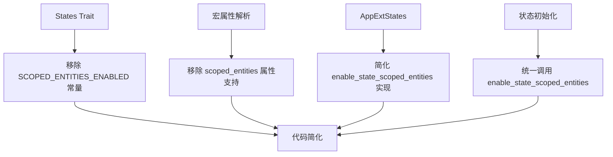

+++
title = "#20883 Always enable state scoped entities"
date = "2025-09-08T00:00:00"
draft = false
template = "pull_request_page.html"
in_search_index = false

[extra]
current_language = "zh-cn"
available_languages = {"en" = { name = "English", url = "/pull_request/bevy/2025-09/pr-20883-en-20250908" }, "zh-cn" = { name = "中文", url = "/pull_request/bevy/2025-09/pr-20883-zh-cn-20250908" }}
labels = ["D-Straightforward", "A-States"]
+++

# Title

## Basic Information
- **Title**: Always enable state scoped entities
- **PR Link**: https://github.com/bevyengine/bevy/pull/20883
- **Author**: janhohenheim
- **Status**: MERGED
- **Labels**: S-Ready-For-Final-Review, M-Needs-Migration-Guide, D-Straightforward, A-States
- **Created**: 2025-09-05T05:09:04Z
- **Merged**: 2025-09-08T03:55:10Z
- **Merged By**: alice-i-cecile

## Description Translation
# 目标

- 撤销 https://github.com/bevyengine/bevy/pull/16180
- 修复 #20866

## 解决方案

- 始终启用状态作用域实体。不再需要保留用于禁用这一微小开销的API表面。如果有人需要这个功能，我们仍然可以轻松地将其添加回来。

## 测试

- `bevy run --example state_scope`

## The Story of This Pull Request

这个PR解决了一个关于状态作用域实体(state scoped entities)的配置复杂性问题。在之前的实现中，状态作用域实体功能是可选的，开发者需要通过`#[states(scoped_entities = true/false)]`属性来显式启用或禁用，或者调用`app.enable_state_scoped_entities::<State>()`方法。

这种设计带来了几个问题：首先，它增加了API的复杂性，开发者需要记住额外的配置步骤；其次，它导致了代码冗余，因为在多个地方都需要检查`S::SCOPED_ENTITIES_ENABLED`常量来决定是否设置状态作用域实体系统；最重要的是，这种可选性实际上没有必要，因为状态作用域实体带来的性能开销极小，而提供的功能价值却很大。

PR作者采取了直接而实用的解决方案：完全移除可选性，始终启用状态作用域实体功能。这简化了代码库，减少了维护负担，同时保持了功能的完整性。

从技术实现角度来看，这个PR主要做了以下几件事情：

1. 移除了`States` trait中的`SCOPED_ENTITIES_ENABLED`常量
2. 删除了宏中解析`#[states(scoped_entities)]`属性的逻辑
3. 将`enable_state_scoped_entities`方法标记为已弃用，并使其成为空操作
4. 创建了一个统一的`enable_state_scoped_entities`函数来处理状态作用域实体的设置
5. 更新了迁移指南，反映这些变化

这种改变体现了软件工程中的一个重要原则：当某个功能的开销可以忽略不计且几乎总是需要时，应该将其设为默认启用，而不是让用户显式选择。这减少了用户的认知负担和代码的复杂性。

## Visual Representation



## Key Files Changed

### `crates/bevy_state/macros/src/states.rs` (+4/-49)
这个文件移除了对`#[states(scoped_entities)]`属性的解析支持，简化了宏实现。

```rust
// Before:
struct StatesAttrs {
    scoped_entities_enabled: bool,
}

fn parse_states_attr(ast: &DeriveInput) -> Result<StatesAttrs> {
    // 复杂的属性解析逻辑
}

// After:
// 完全移除了StatesAttrs结构和parse_states_attr函数
// 简化了derive_states和derive_substates函数
```

### `crates/bevy_state/src/app.rs` (+35/-39)
这个文件重构了状态作用域实体的启用逻辑，将重复的代码提取到统一的函数中。

```rust
// Before:
if S::SCOPED_ENTITIES_ENABLED {
    self.enable_state_scoped_entities::<S>();
}

// After:
enable_state_scoped_entities::<S>(self);

// 新增的统一函数:
fn enable_state_scoped_entities<S: States>(app: &mut SubApp) {
    // 统一的设置逻辑
}
```

### `crates/bevy_state/src/state/states.rs` (+0/-8)
移除了`States` trait中的`SCOPED_ENTITIES_ENABLED`常量。

```rust
// Before:
pub trait States: 'static + Send + Sync + Clone + PartialEq + Eq + Hash + Debug {
    const SCOPED_ENTITIES_ENABLED: bool = false;
}

// After:
pub trait States: 'static + Send + Sync + Clone + PartialEq + Eq + Hash + Debug {
    // 移除了SCOPED_ENTITIES_ENABLED常量
}
```

### `release-content/migration-guides/state_scoped_entities_by_default.md` (+5/-6)
更新了迁移指南，反映状态作用域实体现在总是启用的变化。

```markdown
// Before:
title: Entities are now state scoped by default
pull_requests: [19354]

// After:  
title: State-scoped entities are now always enabled implicitly
pull_requests: [19354, 20883]
```

### `crates/bevy_state/src/state_scoped.rs` (+0/-3)
移除了不再需要的文档说明，因为状态作用域实体现在总是启用的。

```rust
// Before:
/// To enable this feature remember to configure your application
/// with `enable_state_scoped_entities` on your state(s) of choice.

// After:
// 移除了这段文档，因为不再需要显式配置
```

## Further Reading

- [Bevy States Documentation](https://docs.rs/bevy_state/latest/bevy_state/) - Bevy状态管理的官方文档
- [Entity Component System Pattern](https://en.wikipedia.org/wiki/Entity_component_system) - ECS模式的基本概念
- [Rust Attribute Macros](https://doc.rust-lang.org/reference/procedural-macros.html#attribute-macros) - Rust属性宏的工作原理
- [Software Simplification Principles](https://en.wikipedia.org/wiki/KISS_principle) - KISS（Keep It Simple, Stupid）软件设计原则

# Full Code Diff

由于代码差异较大，此处仅展示关键变更。完整差异请查看PR链接。

这个PR展示了如何通过简化API和移除不必要的可选性来改善代码库的维护性和用户体验。它体现了"默认启用有价值功能"的设计哲学，减少了用户的配置负担。