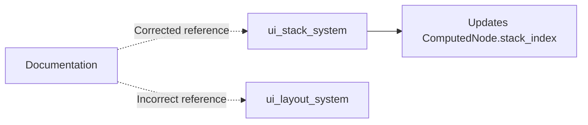

+++
title = "#20886 `ComputedNode` doc link fix"
date = "2025-09-06T00:00:00"
draft = false
template = "pull_request_page.html"
in_search_index = true

[taxonomies]
list_display = ["show"]

[extra]
current_language = "en"
available_languages = {"en" = { name = "English", url = "/pull_request/bevy/2025-09/pr-20886-en-20250906" }, "zh-cn" = { name = "中文", url = "/pull_request/bevy/2025-09/pr-20886-zh-cn-20250906" }}
labels = ["C-Docs", "D-Trivial", "A-UI"]
+++

# Title
`ComputedNode` doc link fix

## Basic Information
- **Title**: `ComputedNode` doc link fix
- **PR Link**: https://github.com/bevyengine/bevy/pull/20886
- **Author**: ickshonpe
- **Status**: MERGED
- **Labels**: C-Docs, D-Trivial, A-UI, S-Ready-For-Final-Review
- **Created**: 2025-09-05T13:54:54Z
- **Merged**: 2025-09-06T17:58:58Z
- **Merged By**: alice-i-cecile

## Description Translation
# Objective

`ComputedNode`'s `stack_index` is updated by `ui_stack_system`, not `ui_layout_system`.

## The Story of This Pull Request

This PR addresses a minor but important documentation issue in Bevy's UI system. The problem was straightforward: the documentation for the `ComputedNode::stack_index()` method incorrectly stated that the stack index was calculated by `ui_layout_system`, when in reality it's handled by `ui_stack_system`.

The stack index determines the rendering order and interaction priority of UI nodes - nodes with higher stack indices are drawn on top and receive interactions before nodes with lower indices. Accurate documentation is critical here because developers working with custom UI systems need to understand where and how this value is computed.

The fix changes the doc comment to reference the correct system location using Bevy's system set naming convention (`UiSystems::Stack`). This provides better IDE integration and navigation compared to hardcoded system names, while maintaining accuracy.

The change is minimal but demonstrates good documentation practices:
1. Keeping technical references accurate
2. Using system set identifiers for better maintainability
3. Ensuring developers can find the actual implementation

This type of documentation fix helps prevent confusion and potential bugs when developers are working with Bevy's UI system internals.

## Visual Representation



## Key Files Changed

**File**: `crates/bevy_ui/src/ui_node.rs`

**Change**: Updated documentation comment to reference the correct system that updates `stack_index`

**Before**:
```rust
/// Automatically calculated by [`super::layout::ui_layout_system`].
```

**After**:
```rust
/// Automatically calculated in [`UiSystems::Stack`](super::UiSystems::Stack).
```

This change replaces the incorrect reference to `ui_layout_system` with a correct reference to the system set where the stack index is actually calculated (`UiSystems::Stack`).

## Further Reading

- [Bevy UI System Sets](https://docs.rs/bevy_ui/latest/bevy_ui/struct.UiSystems.html)
- [Bevy Documentation Guidelines](https://github.com/bevyengine/bevy/blob/main/docs/DEVELOPMENT.md#documentation)
- [Rust Documentation Comments](https://doc.rust-lang.org/rustdoc/how-to-write-documentation.html)

# Full Code Diff
```diff
diff --git a/crates/bevy_ui/src/ui_node.rs b/crates/bevy_ui/src/ui_node.rs
index cf24be9443790..6906cd04a126f 100644
--- a/crates/bevy_ui/src/ui_node.rs
+++ b/crates/bevy_ui/src/ui_node.rs
@@ -111,7 +111,7 @@ impl ComputedNode {
     /// The order of the node in the UI layout.
     /// Nodes with a higher stack index are drawn on top of and receive interactions before nodes with lower stack indices.
     ///
-    /// Automatically calculated by [`super::layout::ui_layout_system`].
+    /// Automatically calculated in [`UiSystems::Stack`](super::UiSystems::Stack).
     pub const fn stack_index(&self) -> u32 {
         self.stack_index
     }
```