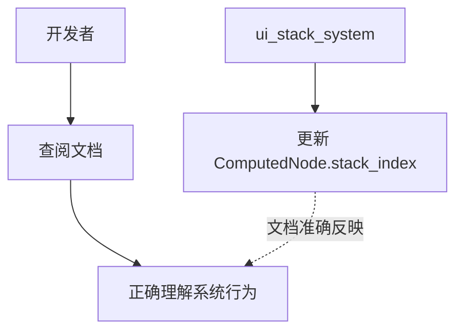

+++
title = "#20886 ComputedNode` doc link fix"
date = "2025-09-06T00:00:00"
draft = false
template = "pull_request_page.html"
in_search_index = false

[extra]
current_language = "zh-cn"
available_languages = {"en" = { name = "English", url = "/pull_request/bevy/2025-09/pr-20886-en-20250906" }, "zh-cn" = { name = "中文", url = "/pull_request/bevy/2025-09/pr-20886-zh-cn-20250906" }}
+++

# ComputedNode 文档链接修复

## 基本信息
- **标题**: `ComputedNode` doc link fix
- **PR 链接**: https://github.com/bevyengine/bevy/pull/20886
- **作者**: ickshonpe
- **状态**: 已合并
- **标签**: C-Docs, D-Trivial, A-UI, S-Ready-For-Final-Review
- **创建时间**: 2025-09-05T13:54:54Z
- **合并时间**: 2025-09-06T17:58:58Z
- **合并人**: alice-i-cecile

## 描述翻译
### 目标

`ComputedNode` 的 `stack_index` 是由 `ui_stack_system` 更新的，而不是 `ui_layout_system`。

## 本次 PR 的技术分析

这是一个典型的文档修复 PR，解决了 Bevy UI 系统中一个关键但细微的文档不准确问题。虽然修改量极小（仅一行代码），但体现了开源项目中文档准确性的重要性。

### 问题背景

在 Bevy 的 UI 系统中，`ComputedNode` 结构体的 `stack_index` 属性决定了 UI 节点的渲染顺序和交互优先级。正确的文档对于开发者理解系统行为至关重要。原本的文档错误地指出该值由 `ui_layout_system` 计算，这会导致开发者在调试或扩展功能时产生误解。

### 解决方案

PR 作者 ickshonpe 识别出这个文档错误，并提供了精确的修复。修改将文档注释中的系统引用从 `ui_layout_system` 更正为 `UiSystems::Stack`，这实际上指向了 `ui_stack_system`。

### 技术实现细节

修改集中在 `crates/bevy_ui/src/ui_node.rs` 文件中的 `ComputedNode` 结构体的 `stack_index` 方法文档注释。关键变化是更新了指向正确系统的链接：

```rust
// 修改前：
/// Automatically calculated by [`super::layout::ui_layout_system`].

// 修改后：
/// Automatically calculated in [`UiSystems::Stack`](super::UiSystems::Stack).
```

这个修改虽然简单，但具有重要意义：
1. 提供了准确的系统引用，帮助开发者快速定位相关代码
2. 使用了正确的模块路径 (`super::UiSystems::Stack`)
3. 保持了 Bevy 文档的一致性标准

### 技术影响

准确的文档对于大型开源项目如 Bevy 至关重要：
- 减少新贡献者的学习曲线
- 避免开发者基于错误信息做出错误假设
- 提高代码可维护性和可理解性

这种看似微小的文档修复实际上对项目的健康度有实质性贡献，体现了"细节决定成败"的工程理念。

## 视觉表示



## 关键文件更改

### `crates/bevy_ui/src/ui_node.rs` (+1/-1)

这个文件包含了 `ComputedNode` 结构体的定义，其中 `stack_index` 方法的文档注释被修正。

**修改前:**
```rust
/// Automatically calculated by [`super::layout::ui_layout_system`].
```

**修改后:**
```rust
/// Automatically calculated in [`UiSystems::Stack`](super::UiSystems::Stack).
```

这个修改确保了文档准确反映了 `stack_index` 的实际更新机制，避免了开发者误解。

## 延伸阅读

对于想深入了解 Bevy UI 系统的开发者，建议参考：

1. [Bevy UI 官方文档](https://docs.rs/bevy_ui/latest/bevy_ui/)
2. [Bevy 引擎架构指南](https://bevyengine.org/learn/)
3. [ECS (Entity Component System) 模式介绍](https://en.wikipedia.org/wiki/Entity_component_system)

# 完整代码差异
```diff
diff --git a/crates/bevy_ui/src/ui_node.rs b/crates/bevy_ui/src/ui_node.rs
index cf24be9443790..6906cd04a126f 100644
--- a/crates/bevy_ui/src/ui_node.rs
+++ b/crates/bevy_ui/src/ui_node.rs
@@ -111,7 +111,7 @@ impl ComputedNode {
     /// The order of the node in the UI layout.
     /// Nodes with a higher stack index are drawn on top of and receive interactions before nodes with lower stack indices.
     ///
-    /// Automatically calculated by [`super::layout::ui_layout_system`].
+    /// Automatically calculated in [`UiSystems::Stack`](super::UiSystems::Stack).
     pub const fn stack_index(&self) -> u32 {
         self.stack_index
     }
```