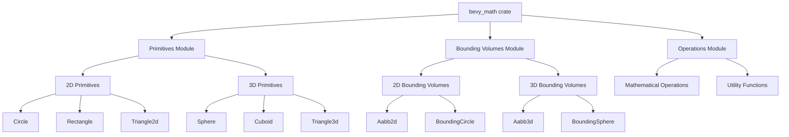

+++
title = "#20887 Change `bevy_math` to use `inline` instead of `inline(always)`"
date = "2025-09-29T00:00:00"
draft = false
template = "pull_request_page.html"
in_search_index = true

[taxonomies]
list_display = ["show"]

[extra]
current_language = "en"
available_languages = {"en" = { name = "English", url = "/pull_request/bevy/2025-09/pr-20887-en-20250929" }, "zh-cn" = { name = "中文", url = "/pull_request/bevy/2025-09/pr-20887-zh-cn-20250929" }}
labels = ["C-Performance", "A-Math", "X-Contentious"]
+++

# Change `bevy_math` to use `inline` instead of `inline(always)`

## Basic Information
- **Title**: Change `bevy_math` to use `inline` instead of `inline(always)`
- **PR Link**: https://github.com/bevyengine/bevy/pull/20887
- **Author**: greeble-dev
- **Status**: MERGED
- **Labels**: C-Performance, S-Ready-For-Final-Review, A-Math, X-Contentious
- **Created**: 2025-09-05T14:33:09Z
- **Merged**: 2025-09-29T23:15:59Z
- **Merged By**: alice-i-cecile

## Description Translation

## Objective

Move `bevy_math` closer to recommended inlining practices, and avoid problems with debuggers and optimising for size.

## Background

Some `bevy_math` modules apply `#[inline(always)]` to almost every function. This has downsides for some users - it can prevent optimising for size, and can stop the debugger from stepping into functions.

I can't find any source that advises `inline(always)` by default - the most common advice is "use rarely and only after profiling"  (example: [std lib guide](https://std-dev-guide.rust-lang.org/policy/inline.html)). I've poked around the `bevy_math` history but couldn't find anything that explains why `inline(always)` was chosen.

## Solution

This PR changes all instances of `#[inline(always)]` to `#[inline]`.

The change is very unlikely to make any difference in optimised builds - almost all the functions are tiny so they're going to be inlined either way. Benchmarks showed no difference.

The change can sometimes decrease performance in `opt-level = 0` builds - one math heavy microbenchmark took a -10% hit. But this is arguably the right trade-off if it lets the user step into functions in the debugger.

Overall, I think this is the safer default for most users. `inline(always)` has several concrete downsides, while `inline` has some trade-offs but no clear downsides.

The change also adds a new `bevy_math` benchmark which includes some of the affected functions.

## Alternatives

The change could have been taken further.

- Remove `#[inline]` from heftier functions like `BoundingSphere::from_point_cloud`.
    - Could help optimising for size. I left this out to keep things simple.
- Remove `#[inline]` entirely.
    - I think this is likely to be a good thing, but it needs more testing and would probably be controversial.

## Testing

```sh
cargo bench -p benches --bench math
```

Also:

- Checked benchmark disassembly to confirm what was inlined.
- Compiled `alien_cake_addict` with various optimisation levels to check there weren't major differences in size.

EDIT: More details in [comment 1](https://github.com/bevyengine/bevy/pull/20887#issuecomment-3261735671), [comment 2](https://github.com/bevy_math/bevy/pull/20887#issuecomment-3263596184).

## The Story of This Pull Request

This PR addresses a long-standing code quality issue in the Bevy math library - the pervasive use of `#[inline(always)]` attributes across most functions in the `bevy_math` crate. The author discovered that many modules were using this aggressive inlining directive by default, which goes against established Rust best practices.

The core problem with `inline(always)` is that it forces the compiler to inline functions regardless of optimization settings or function characteristics. This has several concrete downsides: it prevents optimization for code size, interferes with debugger functionality by making it impossible to step into functions, and can actually harm performance in some cases by increasing instruction cache pressure.

The author investigated Rust's official guidance and found that the standard library development guide explicitly recommends using `inline(always)` "rarely and only after profiling." Despite searching through the codebase history, they couldn't find any documentation explaining why this aggressive inlining strategy was originally chosen.

The solution implemented in this PR is straightforward but extensive: replace all instances of `#[inline(always)]` with `#[inline]` throughout the math library. The key difference is that `#[inline]` is just a hint to the compiler - it suggests inlining but allows the compiler to make the final decision based on optimization settings and function characteristics.

For most of the affected functions, this change has minimal performance impact in optimized builds because the functions are small enough that modern compilers will inline them anyway. The author confirmed this through benchmarking and disassembly inspection. However, there is a trade-off: in unoptimized debug builds (`opt-level = 0`), some math-heavy operations showed up to a 10% performance regression. This was deemed an acceptable trade-off given the significant improvement in debuggability.

The implementation required changes across multiple modules, with the most extensive modifications in:

- 2D and 3D primitive types (circles, rectangles, spheres, cubes, etc.)
- Bounding volume implementations (AABBs, bounding spheres)
- Mathematical operations and utility functions

One notable aspect of this change is the addition of a new benchmarking suite specifically for bounding volume operations. This provides better test coverage for the affected functions and ensures any future performance regressions can be detected.

The author considered more aggressive alternatives, such as removing inline hints entirely from larger functions or removing all inline attributes, but decided to keep the scope focused to minimize controversy and maintain the current performance characteristics for most use cases.

```rust
// Before: Force inlining regardless of context
#[inline(always)]
pub fn new(center: Vec2, half_size: Vec2) -> Self {
    debug_assert!(half_size.x >= 0.0 && half_size.y >= 0.0);
    Self { center, half_size }
}

// After: Let the compiler decide based on optimization settings
#[inline]
pub fn new(center: Vec2, half_size: Vec2) -> Self {
    debug_assert!(half_size.x >= 0.0 && half_size.y >= 0.0);
    Self { center, half_size }
}
```

The technical insight here is that modern compilers are generally quite good at making inlining decisions on their own. For small, frequently called functions like mathematical operations and constructors, compilers will typically inline them in optimized builds regardless of the `#[inline]` hint. The hint primarily serves to suggest inlining even in debug builds, which can be beneficial for performance-critical math operations while still allowing debuggers to function properly.

This change represents a shift toward more conventional Rust development practices while maintaining the performance characteristics that game engines require. It demonstrates the importance of balancing performance optimization with developer experience and tooling compatibility.

## Visual Representation



## Key Files Changed

### `crates/bevy_math/src/primitives/dim2.rs` (+133/-133)
This file contains 2D geometric primitives like circles, rectangles, and triangles. The changes replace all `#[inline(always)]` attributes with `#[inline]` for constructors, accessors, and geometric operations.

```rust
// Example change from the file:
// Before:
#[inline(always)]
pub const fn new(radius: f32) -> Self {
    Self { radius }
}

// After:
#[inline]
pub const fn new(radius: f32) -> Self {
    Self { radius }
}
```

### `crates/bevy_math/src/primitives/dim3.rs` (+80/-80)
Similar to the 2D primitives file, this contains 3D geometric primitives like spheres, cuboids, and 3D triangles. The same inline attribute changes were applied throughout.

```rust
// Example from 3D primitives:
// Before:
#[inline(always)]
pub const fn new(radius: f32) -> Self {
    Self { radius }
}

// After:
#[inline]
pub const fn new(radius: f32) -> Self {
    Self { radius }
}
```

### `crates/bevy_math/src/ops.rs` (+64/-64)
This file contains mathematical operations and utility functions that wrap either standard library functions or libm functions. The changes ensure consistent inlining behavior across different mathematical operations.

```rust
// Example from mathematical operations:
// Before:
#[inline(always)]
pub fn powf(x: f32, y: f32) -> f32 {
    f32::powf(x, y)
}

// After:
#[inline]
pub fn powf(x: f32, y: f32) -> f32 {
    f32::powf(x, y)
}
```

### `crates/bevy_math/src/bounding/bounded2d/mod.rs` (+37/-37)
Contains 2D bounding volume implementations (AABBs and bounding circles). These are performance-critical for collision detection and spatial queries.

```rust
// Example from bounding volumes:
// Before:
#[inline(always)]
pub fn new(center: Vec2, half_size: Vec2) -> Self {
    debug_assert!(half_size.x >= 0.0 && half_size.y >= 0.0);
    Self { center, half_size }
}

// After:
#[inline]
pub fn new(center: Vec2, half_size: Vec2) -> Self {
    debug_assert!(half_size.x >= 0.0 && half_size.y >= 0.0);
    Self { center, half_size }
}
```

### `crates/bevy_math/src/bounding/bounded3d/mod.rs` (+36/-36)
Contains 3D bounding volume implementations (AABBs and bounding spheres). Similar changes were applied to maintain consistency with the 2D versions.

## Further Reading

- [Rust Standard Library Development Guide - Inline Attributes](https://std-dev-guide.rust-lang.org/policy/inline.html)
- [The Rust Performance Book - Inlining](https://nnethercote.github.io/perf-book/inlining.html)
- [Rust Reference - Attributes](https://doc.rust-lang.org/reference/attributes.html)
- [Bevy Engine Documentation](https://bevyengine.org/learn/)
- [Game Engine Architecture - Mathematical Foundations](https://gameenginearchitecture.com/)