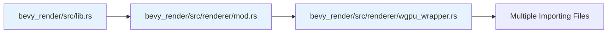

+++
title = "#20889 Move WgpuWrapper back to where it was"
date = "2025-09-05T00:00:00"
draft = false
template = "pull_request_page.html"
in_search_index = true

[taxonomies]
list_display = ["show"]

[extra]
current_language = "en"
available_languages = {"en" = { name = "English", url = "/pull_request/bevy/2025-09/pr-20889-en-20250905" }, "zh-cn" = { name = "中文", url = "/pull_request/bevy/2025-09/pr-20889-zh-cn-20250905" }}
labels = ["A-Rendering"]
+++

# Move WgpuWrapper back to where it was

## Basic Information
- **Title**: Move WgpuWrapper back to where it was
- **PR Link**: https://github.com/bevyengine/bevy/pull/20889
- **Author**: atlv24
- **Status**: MERGED
- **Labels**: A-Rendering, S-Ready-For-Final-Review
- **Created**: 2025-09-05T16:17:21Z
- **Merged**: 2025-09-05T20:35:27Z
- **Merged By**: mockersf

## Description Translation
# Objective

- Fixes #20861

## Solution

- When i moved wgpu wrapper back to bevy_render, i didn't notice it was actually somewhere else originally. Lets keep it there to avoid a breaking change. Sorry again for juggling around this thing between different places lmao

## Testing

- ci

## The Story of This Pull Request

This PR addresses a straightforward but important issue: maintaining backward compatibility in the Bevy renderer's module structure. The problem originated when the `WgpuWrapper` type was moved from its original location in `bevy_render/src/renderer/` to the root `bevy_render/src/` directory. While this might seem like a minor organizational change, it actually constituted a breaking change for any external code that imported `WgpuWrapper` from its original path.

The developer realized this mistake after the fact and created this PR to revert the change. The core issue was that moving the type broke existing imports in downstream code, which is a significant concern for a game engine like Bevy that needs to maintain stable APIs for its users.

The solution approach was simple but effective: move `WgpuWrapper` back to its original location in the renderer module and update all the import statements throughout the codebase to reference the correct path. This involved:

1. Moving the `wgpu_wrapper.rs` file from `crates/bevy_render/src/` to `crates/bevy_render/src/renderer/`
2. Updating the module declaration in `lib.rs` to reflect the new location
3. Fixing import statements across 14 different files that referenced `WgpuWrapper`

The implementation shows a consistent pattern across all modified files. Import statements that previously referenced `crate::WgpuWrapper` were updated to use `crate::renderer::WgpuWrapper`. For example:

```rust
// Before:
use crate::WgpuWrapper;

// After:
use crate::renderer::WgpuWrapper;
```

Similarly, in module files where `WgpuWrapper` was re-exported, the export path was updated:

```rust
// In crates/bevy_render/src/renderer/mod.rs
// Added:
pub use wgpu_wrapper::WgpuWrapper;

// Removed from crates/bevy_render/src/lib.rs:
pub use wgpu_wrapper::WgpuWrapper;
```

The technical insight here is about maintaining API stability in a large codebase. Even seemingly innocuous file moves can have significant downstream effects when types are publicly exported. The Bevy team correctly prioritizes backward compatibility, recognizing that breaking changes should be intentional and well-communicated, not accidental.

The impact of this change is purely structural - no functionality was modified. However, it prevents breaking existing code that depends on the original import path for `WgpuWrapper`. This demonstrates good software engineering practices around API stability and version management.

## Visual Representation



## Key Files Changed

The most significant files changed in this PR:

**1. `crates/bevy_render/src/lib.rs` (+0/-2)**
- Removed the module declaration and re-export for `wgpu_wrapper`
- This file no longer directly exposes `WgpuWrapper` from the root

**2. `crates/bevy_render/src/renderer/mod.rs` (+2/-1)**
- Added module declaration for `wgpu_wrapper`
- Added re-export of `WgpuWrapper` from the renderer module
- Updated the import structure to maintain internal consistency

**3. `crates/bevy_render/src/renderer/wgpu_wrapper.rs` (moved)**
- File physically moved from `crates/bevy_render/src/wgpu_wrapper.rs`
- No content changes, just location change

**4. Multiple import files (14 files total)**
- Updated import statements to use the correct path
- Consistent pattern of changing `use crate::WgpuWrapper` to `use crate::renderer::WgpuWrapper`

Example of import changes:
```rust
// File: crates/bevy_render/src/render_resource/bind_group.rs
// Before:
use crate::WgpuWrapper;

// After:
use crate::renderer::{RenderDevice, WgpuWrapper};
```

## Further Reading

- [Rust Module System](https://doc.rust-lang.org/book/ch07-02-defining-modules-to-control-scope-and-privacy.html)
- [Semantic Versioning and Breaking Changes](https://semver.org/)
- [Bevy Engine Architecture](https://bevyengine.org/learn/architecture/)
- [wgpu Documentation](https://docs.rs/wgpu/latest/wgpu/) (the underlying graphics API that WgpuWrapper abstracts)