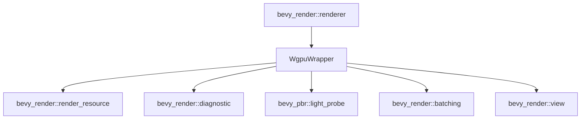

+++
title = "#20889 Move WgpuWrapper back to where it was"
date = "2025-09-05T00:00:00"
draft = false
template = "pull_request_page.html"
in_search_index = false

[extra]
current_language = "zh-cn"
available_languages = {"en" = { name = "English", url = "/pull_request/bevy/2025-09/pr-20889-en-20250905" }, "zh-cn" = { name = "中文", url = "/pull_request/bevy/2025-09/pr-20889-zh-cn-20250905" }}
+++

# Move WgpuWrapper back to where it was

## 基本信息
- **标题**: Move WgpuWrapper back to where it was
- **PR 链接**: https://github.com/bevyengine/bevy/pull/20889
- **作者**: atlv24
- **状态**: 已合并
- **标签**: A-Rendering, S-Ready-For-Final-Review
- **创建时间**: 2025-09-05T16:17:21Z
- **合并时间**: 2025-09-05T20:35:27Z
- **合并者**: mockersf

## 描述翻译

### 目标
- 修复 #20861

### 解决方案
- 当我把 wgpu wrapper 移回 bevy_render 时，我没有注意到它原本在其他位置。让我们保持在那里以避免破坏性变更。再次抱歉把这个东西在不同地方来回移动 lmao

### 测试
- ci

## 这个 Pull Request 的故事

这个 PR 是一个典型的代码结构调整案例，涉及 Bevy 渲染引擎中 `WgpuWrapper` 类型的定位问题。整个故事源于一次不小心的模块结构调整，导致了潜在的破坏性变更。

问题的核心在于 `WgpuWrapper` 类型的位置变动。在之前的某个 PR 中，这个类型被从 `bevy_render::renderer` 模块移动到了 `bevy_render` 的根目录。虽然这种移动在技术上不会影响功能（因为导入路径可以通过调整来适应），但它确实构成了一个破坏性变更（breaking change），因为外部代码可能依赖于原来的导入路径。

开发者 atlv24 在意识到这个问题后，迅速提交了这个修复 PR。从技术角度看，这涉及到两个主要方面的修改：

1. **文件位置调整**：将 `wgpu_wrapper.rs` 文件从 `crates/bevy_render/src/` 移动回原来的位置 `crates/bevy_render/src/renderer/`
2. **导入路径修正**：更新所有引用 `WgpuWrapper` 的模块，使其从正确的路径导入

让我们看看具体的代码变化。在 `bevy_render/src/lib.rs` 中，移除了单独的 `wgpu_wrapper` 模块声明：

```rust
// 修改前:
mod wgpu_wrapper;
pub use wgpu_wrapper::WgpuWrapper;

// 修改后:
// (wgpu_wrapper 模块现在通过 renderer 模块导出)
```

同时在 `bevy_render/src/renderer/mod.rs` 中，重新导出了 `WgpuWrapper`：

```rust
// 新增:
mod wgpu_wrapper;
pub use wgpu_wrapper::WgpuWrapper;
```

最重要的变化体现在各个使用 `WgpuWrapper` 的模块中。几乎所有导入语句都从：

```rust
use crate::WgpuWrapper;
```

改为：

```rust
use crate::renderer::WgpuWrapper;
```

或者更具体的路径。这种变化影响了 14 个文件，包括渲染资源管理、管线缓存、诊断工具等多个核心模块。

从工程角度来看，这个 PR 体现了几个重要的软件开发原则：

1. **向后兼容性**：即使是一个内部类型的移动，也可能影响外部用户，因此需要谨慎处理
2. **模块化设计**：将相关的类型组织在合适的模块中有助于代码的可维护性
3. **快速响应**：开发者及时发现并修复了引入的问题

这个修复虽然看起来简单，但对于维护 Bevy 生态的稳定性很重要。它确保了依赖特定导入路径的外部代码不会因为内部重构而突然崩溃。

## 可视化表示



## 关键文件变更

### `crates/bevy_render/src/lib.rs`
**变更描述**：移除了单独的 `wgpu_wrapper` 模块声明，因为该类型现在通过 `renderer` 模块导出
```rust
// 修改前:
mod wgpu_wrapper;
pub use wgpu_wrapper::WgpuWrapper;

// 修改后:
// (相应代码被移除)
```

### `crates/bevy_render/src/renderer/mod.rs`
**变更描述**：在 renderer 模块中重新引入并导出 `WgpuWrapper`
```rust
// 新增:
mod wgpu_wrapper;
pub use wgpu_wrapper::WgpuWrapper;
```

### `crates/bevy_render/src/render_resource/bind_group.rs`
**变更描述**：更新导入路径以使用正确位置的 `WgpuWrapper`
```rust
// 修改前:
use crate::WgpuWrapper;

// 修改后:
use crate::renderer::{RenderDevice, WgpuWrapper};
```

### `crates/bevy_pbr/src/light_probe/mod.rs`
**变更描述**：修正 light probe 模块中的导入语句
```rust
// 修改前:
use bevy_render::{
    // ...
    Extract, ExtractSchedule, Render, RenderApp, RenderSystems, WgpuWrapper,
};

// 修改后:
use bevy_render::{
    // ...
    Extract, ExtractSchedule, Render, RenderApp, RenderSystems,
};
// WgpuWrapper 现在从 renderer 子模块导入
```

### `crates/bevy_render/src/renderer/render_device.rs`
**变更描述**：更新 render device 实现中的导入路径
```rust
// 修改前:
use crate::WgpuWrapper;

// 修改后:
use crate::renderer::WgpuWrapper;
```

## 延伸阅读

- [Rust 模块系统指南](https://doc.rust-lang.org/book/ch07-02-defining-modules-to-control-scope-and-privacy.html)
- [Bevy 渲染架构概述](https://bevyengine.org/learn/quick-start/introduction/)
- [Semantic Versioning 和破坏性变更](https://semver.org/#spec-item-8)
- [WGPU 图形 API 文档](https://docs.rs/wgpu/latest/wgpu/)