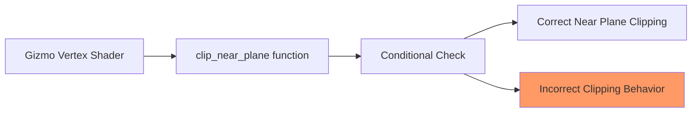

+++
title = "#20890 Fix gizmo near plane clipping bug"
date = "2025-09-05T00:00:00"
draft = false
template = "pull_request_page.html"
in_search_index = true

[taxonomies]
list_display = ["show"]

[extra]
current_language = "en"
available_languages = {"en" = { name = "English", url = "/pull_request/bevy/2025-09/pr-20890-en-20250905" }, "zh-cn" = { name = "中文", url = "/pull_request/bevy/2025-09/pr-20890-zh-cn-20250905" }}
labels = ["A-Rendering"]
+++

# Fix gizmo near plane clipping bug

## Basic Information
- **Title**: Fix gizmo near plane clipping bug
- **PR Link**: https://github.com/bevyengine/bevy/pull/20890
- **Author**: atlv24
- **Status**: MERGED
- **Labels**: A-Rendering, S-Needs-Review
- **Created**: 2025-09-05T17:17:13Z
- **Merged**: 2025-09-05T20:33:36Z
- **Merged By**: mockersf

## Description Translation
# Objective

- Fixes #19205

## Solution

- so it turns out a wrong optimization got made at some point, where a division by w was avoided by multiplying both sides of an inequality by w. This is wrong, because w can be negative, which should flip the inequality.
- So instead, we document what it should be doing, which is computing the depth values and comparing to near plane, and then avoid the divison in a sign-aware way using sign and abs.

## Testing

- slightly tweaked repro by anthony in #20773
- 3d_gizmos works as expected

## The Story of This Pull Request

This PR addresses a specific bug in Bevy's gizmo rendering system where near plane clipping was incorrectly handled. The issue manifested when gizmos would disappear or render incorrectly when positioned near the camera's near clipping plane.

The core problem was in the WGSL shader code for the `clip_near_plane` function. The original implementation attempted to optimize out division operations by multiplying both sides of an inequality by the w component. While mathematically sound for positive values, this approach fails when w is negative, as the inequality direction should flip in such cases but doesn't.

The solution replaces the flawed optimization with a more robust approach that uses sign-aware comparisons. Instead of directly comparing `a.z > a.w`, the new implementation uses `a.z * sign(a.w) > abs(a.w)`, which correctly handles both positive and negative w values without requiring division operations. This maintains the performance benefit of avoiding division while ensuring mathematical correctness.

The fix is minimal and surgical - it only modifies the conditional check in the clipping function while preserving the actual interpolation logic, which was already correct. The updated code also includes better documentation explaining what the comparison is actually trying to achieve (checking if the depth value exceeds the near plane limit).

Testing confirmed the fix resolves the issue using a modified version of the original reproduction case, and the standard 3d_gizmos example continues to work as expected.

## Visual Representation



## Key Files Changed

**crates/bevy_gizmos/src/lines.wgsl** (+3/-2)

This file contains the WGSL shader code for gizmo line rendering. The changes fix the mathematical error in the near plane clipping logic.

```wgsl
// Before:
if a.z > a.w && b.z <= b.w {

// After:
// equivalent to `a.z / a.w > 1.0 && b.z / b.w <= 1.0` but avoids divs
if a.z * sign(a.w) > abs(a.w) && b.z * sign(b.w) <= abs(b.w) {
```

The key change replaces the simple comparison with a sign-aware comparison that correctly handles negative w values while still avoiding division operations for performance.

## Further Reading

- [WGSL Language Specification](https://www.w3.org/TR/WGSL/) - Official WebGPU Shading Language documentation
- [Perspective Projection and Homogeneous Coordinates](https://www.scratchapixel.com/lessons/3d-basic-rendering/perspective-and-orthographic-projection-matrix/) - Explanation of homogeneous coordinates and perspective division
- [Bevy Gizmos Documentation](https://docs.rs/bevy/latest/bevy/gizmos/) - Official Bevy gizmo system documentation

# Full Code Diff
```diff
diff --git a/crates/bevy_gizmos/src/lines.wgsl b/crates/bevy_gizmos/src/lines.wgsl
index 1181e3f59cdb8..cf6d5c1db7b4d 100644
--- a/crates/bevy_gizmos/src/lines.wgsl
+++ b/crates/bevy_gizmos/src/lines.wgsl
@@ -136,8 +136,9 @@ fn vertex(vertex: VertexInput) -> VertexOutput {
 }
 
 fn clip_near_plane(a: vec4<f32>, b: vec4<f32>) -> vec4<f32> {
-    // Move a if a is behind the near plane and b is in front. 
-    if a.z > a.w && b.z <= b.w {
+    // Move a if a is behind the near plane and b is in front.
+    // equivalent to `a.z / a.w > 1.0 && b.z / b.w <= 1.0` but avoids divs
+    if a.z * sign(a.w) > abs(a.w) && b.z * sign(b.w) <= abs(b.w) {
         // Interpolate a towards b until it's at the near plane.
         let distance_a = a.z - a.w;
         let distance_b = b.z - b.w;
```