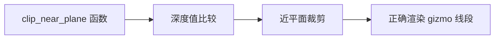

+++
title = "#20890 Fix gizmo near plane clipping bug"
date = "2025-09-05T00:00:00"
draft = false
template = "pull_request_page.html"
in_search_index = false

[extra]
current_language = "zh-cn"
available_languages = {"en" = { name = "English", url = "/pull_request/bevy/2025-09/pr-20890-en-20250905" }, "zh-cn" = { name = "中文", url = "/pull_request/bevy/2025-09/pr-20890-zh-cn-20250905" }}
+++

# Fix gizmo near plane clipping bug

## 基本信息
- **标题**: Fix gizmo near plane clipping bug
- **PR 链接**: https://github.com/bevyengine/bevy/pull/20890
- **作者**: atlv24
- **状态**: 已合并
- **标签**: A-Rendering, S-Needs-Review
- **创建时间**: 2025-09-05T17:17:13Z
- **合并时间**: 2025-09-05T20:33:36Z
- **合并者**: mockersf

## 描述翻译

### Objective
- 修复 #19205

### Solution
- 事实证明，在某个时候做了一个错误的优化，通过将不等式两边乘以 w 来避免除以 w。这是错误的，因为 w 可能是负数，这会翻转不等式。
- 因此，我们改为记录它应该做什么，即计算深度值并与近平面进行比较，然后使用 sign 和 abs 以符号感知的方式避免除法。

### Testing
- 稍微调整了 anthony 在 #20773 中的复现
- 3d_gizmos 按预期工作

## 本次 PR 的故事

这个 PR 解决了一个在 Bevy 引擎的 gizmo 渲染中的近平面裁剪 bug。问题出现在 `lines.wgsl` 着色器文件中的 `clip_near_plane` 函数，该函数负责处理线段在近平面处的裁剪。

问题的根源在于一个错误的优化尝试。原始代码试图通过将不等式两边乘以 w 来避免除以 w 的操作，但忽略了 w 可能为负数的情况。在齐次坐标中，w 分量可以为负，这会导致不等式方向错误地翻转，从而产生错误的裁剪结果。

解决方案采用了更加稳健的方法。开发者没有简单地恢复除法操作，而是使用了符号感知的比较方式：通过 `sign(a.w)` 和 `abs(a.w)` 的组合来正确比较深度值与近平面的关系，同时避免了实际的除法运算。这种方法既保持了性能（避免除法），又确保了数学上的正确性。

修改后的代码逻辑更加清晰，注释也做了相应更新，解释了条件判断的等价数学表达式。这个修复确保了 gizmo 线段在近平面处的正确裁剪行为，解决了之前可能出现的渲染异常。

## 可视化表示



## 关键文件变更

### `crates/bevy_gizmos/src/lines.wgsl` (+3/-2)

这个文件中的 `clip_near_plane` 函数是本次修复的核心。修改前的代码使用了不正确的数学比较，修改后使用了符号感知的比较方式。

**修改前:**
```wgsl
fn clip_near_plane(a: vec4<f32>, b: vec4<f32>) -> vec4<f32> {
    // Move a if a is behind the near plane and b is in front. 
    if a.z > a.w && b.z <= b.w {
        // Interpolate a towards b until it's at the near plane.
        let distance_a = a.z - a.w;
        let distance_b = b.z - b.w;
```

**修改后:**
```wgsl
fn clip_near_plane(a: vec4<f32>, b: vec4<f32>) -> vec4<f32> {
    // Move a if a is behind the near plane and b is in front.
    // equivalent to `a.z / a.w > 1.0 && b.z / b.w <= 1.0` but avoids divs
    if a.z * sign(a.w) > abs(a.w) && b.z * sign(b.w) <= abs(b.w) {
        // Interpolate a towards b until it's at the near plane.
        let distance_a = a.z - a.w;
        let distance_b = b.z - b.w;
```

这个修改确保了在齐次坐标中 w 分量为负时，比较操作仍然能正确进行，避免了近平面裁剪的错误。

## 延伸阅读

- [WebGPU Shading Language](https://gpuweb.github.io/gpuweb/wgsl/) - WGSL 语言规范
- [Homogeneous Coordinates](https://en.wikipedia.org/wiki/Homogeneous_coordinates) - 齐次坐标的数学原理
- [Clipping (computer graphics)](https://en.wikipedia.org/wiki/Clipping_(computer_graphics)) - 计算机图形学中的裁剪技术