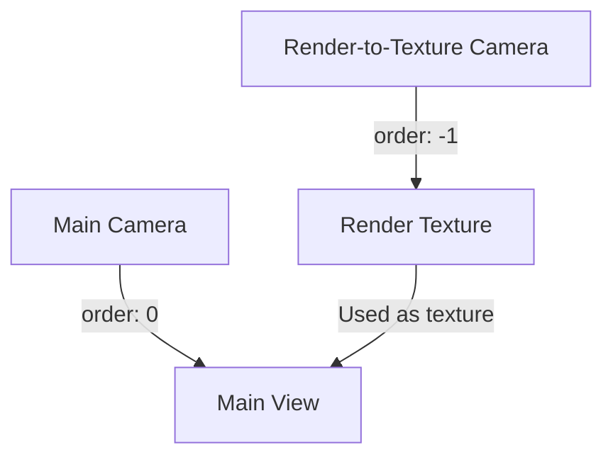

+++
title = "#20892 Put order parameter back in render_to_texture example's camera"
date = "2025-09-07T00:00:00"
draft = false
template = "pull_request_page.html"
in_search_index = true

[taxonomies]
list_display = ["show"]

[extra]
current_language = "en"
available_languages = {"en" = { name = "English", url = "/pull_request/bevy/2025-09/pr-20892-en-20250907" }, "zh-cn" = { name = "中文", url = "/pull_request/bevy/2025-09/pr-20892-zh-cn-20250907" }}
labels = ["A-Rendering", "C-Examples", "A-UI", "D-Straightforward", "A-Camera", "C-Refinement"]
+++

# Title: Put order parameter back in render_to_texture example's camera

## Basic Information
- **Title**: Put order parameter back in render_to_texture example's camera
- **PR Link**: https://github.com/bevyengine/bevy/pull/20892
- **Author**: beholdnec
- **Status**: MERGED
- **Labels**: A-Rendering, C-Examples, A-UI, S-Ready-For-Final-Review, D-Straightforward, A-Camera, C-Refinement
- **Created**: 2025-09-05T18:47:14Z
- **Merged**: 2025-09-07T03:17:23Z
- **Merged By**: alice-i-cecile

## Description Translation
# Objective

The "order" parameter for the render_to_texture example's camera went missing in https://github.com/bevyengine/bevy/commit/d46a05e387234116c12754fde5f8a7c07a057cf6 .
Without the order parameter, the RT texture lags a frame behind, which is rarely what developers want. This PR puts it back.

## Solution

The order parameter is added to the camera.

## Testing

Tested and works. The render_ui_to_texture camera feels less laggy now!

## The Story of This Pull Request

This PR addresses a regression in Bevy's render-to-texture functionality where the camera's order parameter was accidentally removed in a previous commit. The issue manifested as a one-frame lag in the rendered texture output, which created a suboptimal developer experience when using these examples as reference implementations.

The core problem stems from how Bevy's camera ordering system works. Cameras with higher order values render after cameras with lower order values. When multiple cameras have the same order value, their rendering order becomes undefined. In the render-to-texture examples, we have two cameras: one that renders to a texture and another that renders the main view. Without explicit ordering, these cameras might render in any sequence, potentially causing the texture to be one frame stale when used in the main view.

The solution was straightforward: restore the camera order parameter to ensure the render-to-texture camera processes before the main camera. By setting `order: -1` on the render-to-texture camera, we guarantee it renders before the main camera (which defaults to order 0), ensuring the texture is updated in the same frame it's displayed.

This change demonstrates an important Bevy concept: camera ordering is crucial when working with multiple cameras, especially when one camera depends on another's output. The fix is minimal but impactful, immediately resolving the frame lag issue without requiring architectural changes or complex workarounds.

## Visual Representation



## Key Files Changed

### `examples/3d/render_to_texture.rs`
**Changes**: Added camera order parameter to ensure proper rendering sequence
**Code**:
```rust
// Before:
commands.spawn((
    Camera3d::default(),
    Camera {
        target: image_handle.clone().into(),
        clear_color: Color::WHITE.into(),
        ..default()
    },
    Transform::from_xyz(0.0, 0.0, 15.0).looking_at(Vec3::ZERO, Vec3::Y),
));

// After:
commands.spawn((
    Camera3d::default(),
    Camera {
        // render before the "main pass" camera
        order: -1,
        target: image_handle.clone().into(),
        clear_color: Color::WHITE.into(),
        ..default()
    },
    Transform::from_xyz(0.0, 0.0, 15.0).looking_at(Vec3::ZERO, Vec3::Y),
));
```

### `examples/ui/render_ui_to_texture.rs`
**Changes**: Added identical camera order parameter for UI rendering example
**Code**:
```rust
// Before:
commands
    .spawn((
        Camera2d,
        Camera {
            target: RenderTarget::Image(image_handle.clone().into()),
            ..default()
        },
        UiCameraConfig { show_ui: false },
    ));

// After:
commands
    .spawn((
        Camera2d,
        Camera {
            // render before the "main pass" camera
            order: -1,
            target: RenderTarget::Image(image_handle.clone().into()),
            ..default()
        },
        UiCameraConfig { show_ui: false },
    ));
```

## Further Reading

- [Bevy Camera Component Documentation](https://docs.rs/bevy/latest/bevy/prelude/struct.Camera.html)
- [Bevy Render to Texture Example](https://github.com/bevyengine/bevy/blob/main/examples/3d/render_to_texture.rs)
- [Bevy UI Render to Texture Example](https://github.com/bevyengine/bevy/blob/main/examples/ui/render_ui_to_texture.rs)
- [Bevy Camera Ordering System](https://bevy-cheatbook.github.io/features/cameras.html#camera-order)