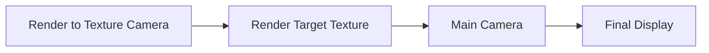

+++
title = "#20892 Put order parameter back in render_to_texture example's camera"
date = "2025-09-07T00:00:00"
draft = false
template = "pull_request_page.html"
in_search_index = false

[extra]
current_language = "zh-cn"
available_languages = {"en" = { name = "English", url = "/pull_request/bevy/2025-09/pr-20892-en-20250907" }, "zh-cn" = { name = "中文", url = "/pull_request/bevy/2025-09/pr-20892-zh-cn-20250907" }}
+++

# 标题：Put order parameter back in render_to_texture example's camera

## 基本信息
- **标题**: Put order parameter back in render_to_texture example's camera
- **PR链接**: https://github.com/bevyengine/bevy/pull/20892
- **作者**: beholdnec
- **状态**: 已合并
- **标签**: A-Rendering, C-Examples, A-UI, S-Ready-For-Final-Review, D-Straightforward, A-Camera, C-Refinement
- **创建时间**: 2025-09-05T18:47:14Z
- **合并时间**: 2025-09-07T03:17:23Z
- **合并者**: alice-i-cecile

## 描述翻译
# 目标

在 https://github.com/bevyengine/bevy/commit/d46a05e387234116c12754fde5f8a7c07a057cf6 提交中，render_to_texture 示例相机的 "order" 参数丢失了。
没有 order 参数，RT 纹理会延迟一帧，这通常不是开发者想要的。这个 PR 将其恢复。

## 解决方案

将 order 参数添加到相机中。

## 测试

已测试并正常工作。render_ui_to_texture 相机现在感觉不那么延迟了！

## 这个 PR 的故事

这个 PR 解决了一个看似简单但影响重大的问题：渲染到纹理（render to texture）示例中的相机顺序参数意外丢失。问题起源于之前的提交 d46a05e387234116c12754fde5f8a7c07a057cf6，在该提交中 order 参数被无意中移除。

在 Bevy 的渲染系统中，相机的渲染顺序由 `order` 参数控制。数值较小的相机会先渲染，数值较大的后渲染。对于渲染到纹理的场景，通常需要将渲染到纹理的相机设置为在主相机之前渲染（order 为 -1），这样纹理才能在下一帧被正确使用。

当 order 参数缺失时，渲染到纹理的相机会使用默认值 0，这意味着它与主相机在同一顺序渲染，导致纹理数据延迟一帧可用。这会造成明显的视觉延迟，特别是在 UI 渲染到纹理的场景中，用户体验会受到影响。

解决方案直接明了：在两个受影响的示例文件中重新添加 `order: -1` 参数到相机组件中。这个修改确保了渲染到纹理的相机始终在主相机之前执行，从而保证纹理数据的及时更新。

从技术角度来看，这个修复展示了 Bevy 渲染系统的一个重要特性：渲染顺序的显式控制。在复杂的渲染场景中，正确地管理渲染顺序对于确保视觉效果的准确性至关重要。



## 关键文件更改

- `examples/3d/render_to_texture.rs` (+2/-0)
- `examples/ui/render_ui_to_texture.rs` (+2/-0)

**examples/3d/render_to_texture.rs**:
这个文件中的修改为 3D 渲染到纹理示例的相机添加了 order 参数。

```rust
// 修改前:
commands.spawn((
    Camera3d::default(),
    Camera {
        target: image_handle.clone().into(),
        clear_color: Color::WHITE.into(),
        ..default()
    },
    Transform::from_xyz(0.0, 0.0, 15.0).looking_at(Vec3::ZERO, Vec3::Y),
));

// 修改后:
commands.spawn((
    Camera3d::default(),
    Camera {
        // render before the "main pass" camera
        order: -1,
        target: image_handle.clone().into(),
        clear_color: Color::WHITE.into(),
        ..default()
    },
    Transform::from_xyz(0.0, 0.0, 15.0).looking_at(Vec3::ZERO, Vec3::Y),
));
```

**examples/ui/render_ui_to_texture.rs**:
这个文件中的修改为 UI 渲染到纹理示例的相机添加了 order 参数。

```rust
// 修改前:
commands
    .spawn((
        Camera2d,
        Camera {
            target: RenderTarget::Image(image_handle.clone().into()),
            ..default()
        },
        UiCameraConfig { show_ui: false },
    ));

// 修改后:
commands
    .spawn((
        Camera2d,
        Camera {
            // render before the "main pass" camera
            order: -1,
            target: RenderTarget::Image(image_handle.clone().into()),
            ..default()
        },
        UiCameraConfig { show_ui: false },
    ));
```

## 进一步阅读

- [Bevy 相机文档](https://docs.rs/bevy/latest/bevy/prelude/struct.Camera.html)
- [Bevy 渲染顺序说明](https://bevy-cheatbook.github.io/features/camera-order.html)
- [渲染到纹理技术介绍](https://learnopengl.com/Advanced-OpenGL/Framebuffers)