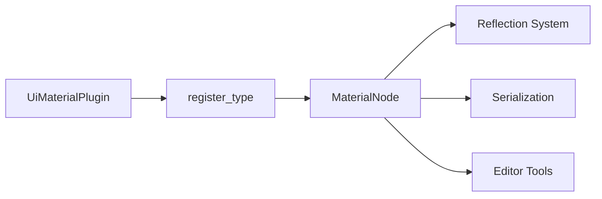

+++
title = "#20893 Add `register_type` for `MaterialNode`"
date = "2025-09-05T00:00:00"
draft = false
template = "pull_request_page.html"
in_search_index = true

[taxonomies]
list_display = ["show"]

[extra]
current_language = "en"
available_languages = {"en" = { name = "English", url = "/pull_request/bevy/2025-09/pr-20893-en-20250905" }, "zh-cn" = { name = "中文", url = "/pull_request/bevy/2025-09/pr-20893-zh-cn-20250905" }}
labels = ["D-Trivial", "A-UI"]
+++

# Add `register_type` for `MaterialNode`

## Basic Information
- **Title**: Add `register_type` for `MaterialNode`
- **PR Link**: https://github.com/bevyengine/bevy/pull/20893
- **Author**: ickshonpe
- **Status**: MERGED
- **Labels**: D-Trivial, A-UI, S-Ready-For-Final-Review
- **Created**: 2025-09-05T20:56:19Z
- **Merged**: 2025-09-05T22:50:32Z
- **Merged By**: alice-i-cecile

## Description Translation
# Objective

Add a `register_type` for `MaterialNode` to the `UiMaterialPlugin`. Removed this temporarily when moving everything to the `bevy_ui_render` crate and forgot to put it back.

## The Story of This Pull Request

This PR addresses a straightforward but important oversight in Bevy's UI material system. During a previous code migration where UI material functionality was moved to the `bevy_ui_render` crate, the type registration for `MaterialNode` was temporarily removed but never restored.

The core issue was that `MaterialNode<M>` wasn't being registered with Bevy's reflection system, which meant this type couldn't be properly serialized, deserialized, or inspected in editor tools. Type registration is essential for Bevy's scene system and editor functionality to work correctly with custom types.

The solution was simple but necessary: uncomment the `register_type::<MaterialNode<M>>()` call in the `UiMaterialPlugin` implementation. This single line change ensures that the generic `MaterialNode` type gets properly registered with Bevy's reflection system when the plugin is initialized.

The implementation change is minimal but important for maintaining consistency across the codebase. The removed commented-out line for `ExtractComponentPlugin` suggests this was part of a cleanup process where unnecessary code was removed while restoring the essential type registration.

This fix ensures that any UI materials using the `MaterialNode` component will work correctly with Bevy's reflection and serialization systems, maintaining compatibility with scene saving/loading and editor functionality.

## Visual Representation



## Key Files Changed

### `crates/bevy_ui_render/src/ui_material_pipeline.rs`
This file contains the implementation of the UI material pipeline plugin. The changes restore the type registration for `MaterialNode<M>` that was accidentally omitted during a previous code migration.

**Code Changes:**
```rust
// Before:
app.init_asset::<M>()
    //.register_type::<MaterialNode<M>>()
    .add_plugins((
        //ExtractComponentPlugin::<MaterialNode<M>>::extract_visible(),
        RenderAssetPlugin::<PreparedUiMaterial<M>>::default(),
    ));

// After:
app.init_asset::<M>()
    .register_type::<MaterialNode<M>>()
    .add_plugins(RenderAssetPlugin::<PreparedUiMaterial<M>>::default());
```

The change uncomments the `register_type` call and removes the commented-out `ExtractComponentPlugin` line, resulting in cleaner code while restoring essential functionality.

## Further Reading

- [Bevy Reflection Documentation](https://docs.rs/bevy/latest/bevy/reflect/index.html)
- [Bevy UI Material Guide](https://github.com/bevyengine/bevy/blob/main/examples/ui/ui_material.rs)
- [Type Registration in Bevy](https://docs.rs/bevy/latest/bevy/reflect/trait.GetTypeRegistration.html)