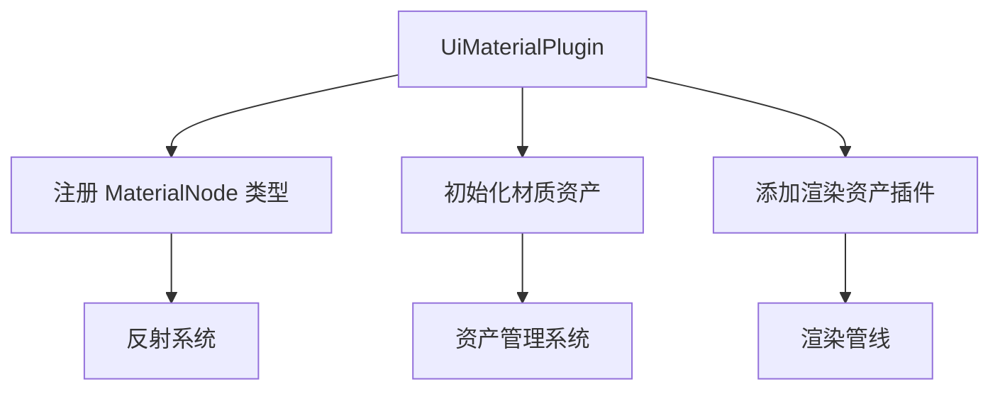

+++
title = "#20893 Add `register_type` for `MaterialNode"
date = "2025-09-05T00:00:00"
draft = false
template = "pull_request_page.html"
in_search_index = false

[extra]
current_language = "zh-cn"
available_languages = {"en" = { name = "English", url = "/pull_request/bevy/2025-09/pr-20893-en-20250905" }, "zh-cn" = { name = "中文", url = "/pull_request/bevy/2025-09/pr-20893-zh-cn-20250905" }}
+++

# Add `register_type` for `MaterialNode`

## 基本信息
- **标题**: Add `register_type` for `MaterialNode`
- **PR链接**: https://github.com/bevyengine/bevy/pull/20893
- **作者**: ickshonpe
- **状态**: 已合并
- **标签**: D-Trivial, A-UI, S-Ready-For-Final-Review
- **创建时间**: 2025-09-05T20:56:19Z
- **合并时间**: 2025-09-05T22:50:32Z
- **合并者**: alice-i-cecile

## 描述翻译
### Objective
为 `UiMaterialPlugin` 中的 `MaterialNode` 添加 `register_type`。在将所有内容迁移到 `bevy_ui_render` crate 时暂时移除了它，但忘记将其添加回来。

## 本次 Pull Request 的故事

这个 PR 的故事始于一次代码重构。在将 UI 材质相关的代码迁移到新的 `bevy_ui_render` crate 的过程中，开发者暂时注释掉了一行重要的代码：`register_type::<MaterialNode<M>>()`。这是一个典型的重构过程中出现的疏忽 - 临时修改被遗忘而没有恢复。

`register_type` 是 Bevy 引擎反射系统的核心功能。它允许类型在引擎的编辑器和工具链中被识别和操作。对于 `MaterialNode<M>` 这样的泛型组件，类型注册尤其重要，因为它确保了材质节点能够在场景序列化、编辑器可视化和运行时检查中正常工作。

问题的本质很简单：缺少类型注册会导致使用 `MaterialNode` 的功能出现潜在问题。虽然这可能不会立即导致运行时错误，但会影响开发体验和工具的完整性。

解决方案非常直接：恢复被注释掉的 `register_type` 调用，并清理不再需要的注释代码。这个修改展示了良好的代码维护实践 - 不仅修复了功能缺失，还同时进行了代码清理。

从技术实现来看，这个修改涉及两个关键变化：
1. 取消 `register_type` 调用的注释，恢复其功能
2. 移除已经被注释掉的 `ExtractComponentPlugin` 相关代码，保持代码整洁

这种修改模式很常见：在重构过程中，开发者可能会注释掉某些功能进行测试，但最终需要决定是恢复功能还是完全移除。在这个案例中，显然 `register_type` 是必须的功能，而 `ExtractComponentPlugin` 的相关代码则不再需要。

这个修改虽然简单，但体现了重要的工程原则：保持代码的完整性和一致性。即使是一个小小的类型注册，也对整个系统的可维护性和开发者体验有实际影响。

## 可视化表示



## 关键文件变更

### `crates/bevy_ui_render/src/ui_material_pipeline.rs` (+2/-5)

这个文件包含了主要的修改，恢复了 `MaterialNode` 的类型注册并清理了不必要的注释代码。

**修改前:**
```rust
app.init_asset::<M>()
    //.register_type::<MaterialNode<M>>()
    .add_plugins((
        //ExtractComponentPlugin::<MaterialNode<M>>::extract_visible(),
        RenderAssetPlugin::<PreparedUiMaterial<M>>::default(),
    ));
```

**修改后:**
```rust
app.init_asset::<M>()
    .register_type::<MaterialNode<M>>()
    .add_plugins(RenderAssetPlugin::<PreparedUiMaterial<M>>::default());
```

这个修改恢复了 `MaterialNode<M>` 的类型注册功能，同时移除了已经注释掉的 `ExtractComponentPlugin` 相关代码，使代码更加清晰和简洁。

## 延伸阅读

对于想要深入了解相关概念的开发者，建议查阅以下资源：

1. [Bevy 反射系统文档](https://bevyengine.org/learn/books/introduction/reflection) - 了解类型注册和反射的工作原理
2. [Bevy 资产系统](https://bevyengine.org/learn/books/introduction/assets) - 理解材质资产的管理方式
3. [Bevy UI 渲染架构](https://bevyengine.org/learn/books/introduction/ui-rendering) - 掌握 UI 材质系统的整体设计

# 完整代码差异

```diff
diff --git a/crates/bevy_ui_render/src/ui_material_pipeline.rs b/crates/bevy_ui_render/src/ui_material_pipeline.rs
index 60c0b9e302701..da047b8129349 100644
--- a/crates/bevy_ui_render/src/ui_material_pipeline.rs
+++ b/crates/bevy_ui_render/src/ui_material_pipeline.rs
@@ -49,11 +49,8 @@ where
         embedded_asset!(app, "ui_material.wgsl");
 
         app.init_asset::<M>()
-            //.register_type::<MaterialNode<M>>()
-            .add_plugins((
-                //ExtractComponentPlugin::<MaterialNode<M>>::extract_visible(),
-                RenderAssetPlugin::<PreparedUiMaterial<M>>::default(),
-            ));
+            .register_type::<MaterialNode<M>>()
+            .add_plugins(RenderAssetPlugin::<PreparedUiMaterial<M>>::default());
 
         if let Some(render_app) = app.get_sub_app_mut(RenderApp) {
             render_app
```