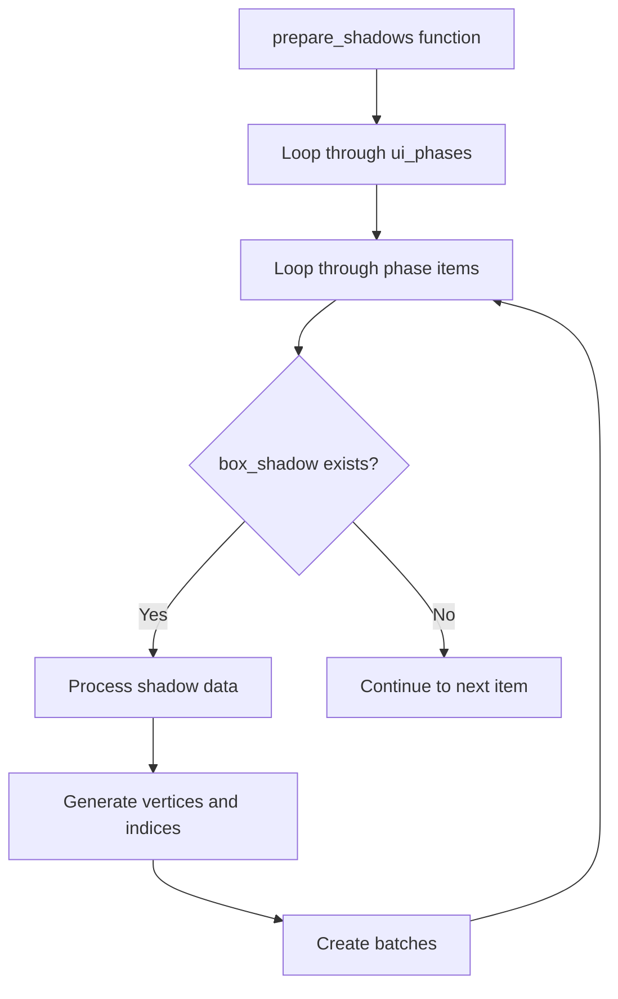

+++
title = "#20894 Reduce nesting in `prepare_shadows`"
date = "2025-09-06T00:00:00"
draft = false
template = "pull_request_page.html"
in_search_index = true

[taxonomies]
list_display = ["show"]

[extra]
current_language = "en"
available_languages = {"en" = { name = "English", url = "/pull_request/bevy/2025-09/pr-20894-en-20250906" }, "zh-cn" = { name = "中文", url = "/pull_request/bevy/2025-09/pr-20894-zh-cn-20250906" }}
labels = ["D-Trivial", "A-Rendering", "C-Code-Quality"]
+++

# Reduce nesting in `prepare_shadows`

## Basic Information
- **Title**: Reduce nesting in `prepare_shadows`
- **PR Link**: https://github.com/bevyengine/bevy/pull/20894
- **Author**: ickshonpe
- **Status**: MERGED
- **Labels**: D-Trivial, A-Rendering, C-Code-Quality, S-Ready-For-Final-Review
- **Created**: 2025-09-05T23:06:08Z
- **Merged**: 2025-09-06T00:00:01Z
- **Merged By**: alice-i-cecile

## Description Translation
# Objective

Reduce nesting in `prepare_shadows` by replacing the inner if block with let-else-continue.

## The Story of This Pull Request

The `prepare_shadows` function in Bevy's UI rendering system was handling box shadow preparation with multiple levels of nested control flow. This PR addresses a common code quality issue where deep nesting can reduce readability and maintainability.

The original implementation used an `if let` statement to extract `box_shadow` data from extracted shadows, wrapping the entire processing logic within the conditional block. This created a significant indentation level that made the code harder to scan and understand at a glance.

The solution replaces the nested `if let` pattern with Rust's `let-else` syntax combined with `continue`. This approach flattens the control flow by handling the negative case (when no box shadow is found) early and continuing to the next iteration, while the positive case proceeds with minimal indentation.

This change demonstrates a clear application of the "early return" (or in this case, "early continue") pattern, which is widely recognized as improving code readability. The transformation doesn't alter the functional behavior but significantly improves the code structure by reducing cognitive load when reading the function.

The implementation maintains all existing functionality while making the code more approachable for future maintenance. The change is purely structural - no algorithmic modifications or performance optimizations were made, though the flattened structure may slightly improve compiler optimization opportunities by reducing branch prediction complexity.

## Visual Representation



## Key Files Changed

### `crates/bevy_ui_render/src/box_shadow.rs`

**What changed**: The PR replaced a nested `if let` statement with `let-else` syntax to reduce indentation levels in the shadow preparation loop.

**Before:**
```rust
if let Some(box_shadow) = extracted_shadows
    .box_shadows
    .get(item.index)
    .filter(|n| item.entity() == n.render_entity)
{
    // 98 lines of processing code
    // at deep indentation level
}
```

**After:**
```rust
let Some(box_shadow) = extracted_shadows
    .box_shadows
    .get(item.index)
    .filter(|n| item.entity() == n.render_entity)
else {
    continue;
};
// 98 lines of processing code
// at reduced indentation level
```

**Why it matters**: This change improves code readability by reducing nesting depth, making the function easier to understand and maintain. The `let-else` pattern clearly communicates the early continuation when the required data isn't available.

## Further Reading

- [Rust let-else syntax](https://doc.rust-lang.org/rust-by-example/flow_control/let_else.html)
- [Flat is better than nested: Zen of Python](https://peps.python.org/pep-0020/)
- [Early return pattern](https://refactoring.guru/replace-nested-conditional-with-guard-clauses)