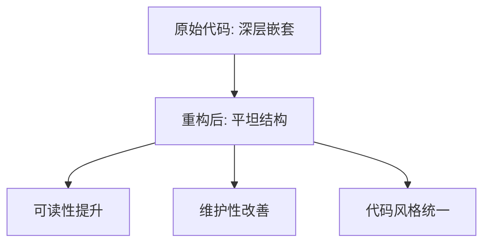

+++
title = "#20894 Reduce nesting in `prepare_shadows"
date = "2025-09-06T00:00:00"
draft = false
template = "pull_request_page.html"
in_search_index = false

[extra]
current_language = "zh-cn"
available_languages = {"en" = { name = "English", url = "/pull_request/bevy/2025-09/pr-20894-en-20250906" }, "zh-cn" = { name = "中文", url = "/pull_request/bevy/2025-09/pr-20894-zh-cn-20250906" }}
+++

# Reduce nesting in `prepare_shadows`

## 基本信息
- **标题**: Reduce nesting in `prepare_shadows`
- **PR 链接**: https://github.com/bevyengine/bevy/pull/20894
- **作者**: ickshonpe
- **状态**: 已合并
- **标签**: D-Trivial, A-Rendering, C-Code-Quality, S-Ready-For-Final-Review
- **创建时间**: 2025-09-05T23:06:08Z
- **合并时间**: 2025-09-06T00:00:01Z
- **合并人**: alice-i-cecile

## 描述翻译
### Objective

通过使用 let-else-continue 替换内部 if 块来减少 `prepare_shadows` 中的嵌套层级。

## 本次 Pull Request 的故事

这个 PR 解决了一个典型的代码可读性问题：过深的嵌套层级。在 `prepare_shadows` 函数中，原始代码使用了多层嵌套的 if 语句，这降低了代码的可读性和维护性。

问题的核心在于如何处理可选值的检查和后续处理。原始代码使用了 `if let Some(box_shadow) = ...` 的模式，然后在 if 块内执行大量逻辑。这种模式在处理复杂逻辑时会导致代码向右缩进过多，增加了理解代码的认知负担。

开发者选择了 Rust 的 let-else 语句作为解决方案，这是一个在 Rust 1.65 中引入的特性。let-else 允许在模式匹配失败时执行早期返回或继续循环，从而减少嵌套层级。具体来说，将：

```rust
if let Some(value) = optional_value {
    // 大量处理逻辑
}
```

重构为：

```rust
let Some(value) = optional_value else {
    continue; // 或 return
};
// 大量处理逻辑
```

这种重构带来了几个好处：
1. **减少嵌套层级**：主逻辑不再被包裹在额外的缩进层级中
2. **明确错误处理路径**：else 块清晰表达了模式匹配失败时的处理方式
3. **代码可读性提升**：主要业务逻辑现在处于更平坦的结构中，更容易阅读和理解

从技术实现角度看，这个改动是完全等价的语义转换，没有改变任何功能逻辑。它纯粹是代码风格的改进，属于重构(refactoring)范畴。

这种重构模式在 Rust 社区中越来越常见，特别是随着 let-else 语句的稳定和普及。它符合 Rust 的"显式优于隐式"哲学，让错误处理路径更加明确。

对于性能方面，这个改动不会产生任何影响，因为编译后的代码应该是相同的。这只是语法层面的改进，不影响运行时行为。

## 可视化表示



## 关键文件更改

### `crates/bevy_ui_render/src/box_shadow.rs` (+98/-97)

这个文件包含了主要的代码重构。改动将深层嵌套的 if-let 结构转换为更平坦的 let-else-continue 模式。

**重构前**:
```rust
if let Some(box_shadow) = extracted_shadows
    .box_shadows
    .get(item.index)
    .filter(|n| item.entity() == n.render_entity)
{
    // 大量处理逻辑（缩进层级+1）
}
```

**重构后**:
```rust
let Some(box_shadow) = extracted_shadows
    .box_shadows
    .get(item.index)
    .filter(|n| item.entity() == n.render_entity)
else {
    continue;
};
// 大量处理逻辑（保持当前缩进层级）
```

这个改动使得后续的大量处理逻辑不再需要额外的缩进层级，提高了代码的可读性。所有后续的逻辑处理都保持在相同的缩进层级，使得代码结构更加清晰。

## 延伸阅读

- [Rust let-else 语句官方文档](https://doc.rust-lang.org/rust-by-example/flow_control/let_else.html)
- [Rust 1.65 发布公告（包含 let-else 特性）](https://blog.rust-lang.org/2022/11/03/Rust-1.65.0.html#let-else-statements)
- [代码重构：减少嵌套层级的方法](https://refactoring.com/catalog/replaceNestedConditionalWithGuardClauses.html)
- [Bevy 引擎代码风格指南](https://github.com/bevyengine/bevy/blob/main/CODE_STYLE.md)

## 完整代码差异

```diff
diff --git a/crates/bevy_ui_render/src/box_shadow.rs b/crates/bevy_ui_render/src/box_shadow.rs
index 0c81a29068744..963e44575140e 100644
--- a/crates/bevy_ui_render/src/box_shadow.rs
+++ b/crates/bevy_ui_render/src/box_shadow.rs
@@ -385,118 +385,119 @@ pub fn prepare_shadows(
         for ui_phase in phases.values_mut() {
             for item_index in 0..ui_phase.items.len() {
                 let item = &mut ui_phase.items[item_index];
-                if let Some(box_shadow) = extracted_shadows
+                let Some(box_shadow) = extracted_shadows
                     .box_shadows
                     .get(item.index)
                     .filter(|n| item.entity() == n.render_entity)
-                {
-                    let rect_size = box_shadow.bounds;
-
-                    // Specify the corners of the node
-                    let positions = QUAD_VERTEX_POSITIONS.map(|pos| {
-                        box_shadow
-                            .transform
-                            .transform_point2(pos * rect_size)
-                            .extend(0.)
-                    });
-
-                    // Calculate the effect of clipping
-                    // Note: this won't work with rotation/scaling, but that's much more complex (may need more that 2 quads)
-                    let positions_diff = if let Some(clip) = box_shadow.clip {
-                        [
-                            Vec2::new(
-                                f32::max(clip.min.x - positions[0].x, 0.),
-                                f32::max(clip.min.y - positions[0].y, 0.),
-                            ),
-                            Vec2::new(
-                                f32::min(clip.max.x - positions[1].x, 0.),
-                                f32::max(clip.min.y - positions[1].y, 0.),
-                            ),
-                            Vec2::new(
-                                f32::min(clip.max.x - positions[2].x, 0.),
-                                f32::min(clip.max.y - positions[2].y, 0.),
-                            ),
-                            Vec2::new(
-                                f32::max(clip.min.x - positions[3].x, 0.),
-                                f32::min(clip.max.y - positions[3].y, 0.),
-                            ),
-                        ]
-                    } else {
-                        [Vec2::ZERO; 4]
-                    };
-
-                    let positions_clipped = [
-                        positions[0] + positions_diff[0].extend(0.),
-                        positions[1] + positions_diff[1].extend(0.),
-                        positions[2] + positions_diff[2].extend(0.),
-                        positions[3] + positions_diff[3].extend(0.),
-                    ];
-
-                    let transformed_rect_size = box_shadow.transform.transform_vector2(rect_size);
-
-                    // Don't try to cull nodes that have a rotation
-                    // In a rotation around the Z-axis, this value is 0.0 for an angle of 0.0 or π
-                    // In those two cases, the culling check can proceed normally as corners will be on
-                    // horizontal / vertical lines
-                    // For all other angles, bypass the culling check
-                    // This does not properly handles all rotations on all axis
-                    if box_shadow.transform.x_axis[1] == 0.0 {
-                        // Cull nodes that are completely clipped
-                        if positions_diff[0].x - positions_diff[1].x >= transformed_rect_size.x
-                            || positions_diff[1].y - positions_diff[2].y >= transformed_rect_size.y
-                        {
-                            continue;
-                        }
-                    }
-
-                    let uvs = [
-                        Vec2::new(positions_diff[0].x, positions_diff[0].y),
+                else {
+                    continue;
+                };
+                let rect_size = box_shadow.bounds;
+
+                // Specify the corners of the node
+                let positions = QUAD_VERTEX_POSITIONS.map(|pos| {
+                    box_shadow
+                        .transform
+                        .transform_point2(pos * rect_size)
+                        .extend(0.)
+                });
+
+                // Calculate the effect of clipping
+                // Note: this won't work with rotation/scaling, but that's much more complex (may need more that 2 quads)
+                let positions_diff = if let Some(clip) = box_shadow.clip {
+                    [
                         Vec2::new(
-                            box_shadow.bounds.x + positions_diff[1].x,
-                            positions_diff[1].y,
+                            f32::max(clip.min.x - positions[0].x, 0.),
+                            f32::max(clip.min.y - positions[0].y, 0.),
                         ),
                         Vec2::new(
-                            box_shadow.bounds.x + positions_diff[2].x,
-                            box_shadow.bounds.y + positions_diff[2].y,
+                            f32::min(clip.max.x - positions[1].x, 0.),
+                            f32::max(clip.min.y - positions[1].y, 0.),
                         ),
                         Vec2::new(
-                            positions_diff[3].x,
-                            box_shadow.bounds.y + positions_diff[3].y,
+                            f32::min(clip.max.x - positions[2].x, 0.),
+                            f32::min(clip.max.y - positions[2].y, 0.),
+                        ),
+                        Vec2::new(
+                            f32::max(clip.min.x - positions[3].x, 0.),
+                            f32::min(clip.max.y - positions[3].y, 0.),
                         ),
                     ]
-                    .map(|pos| pos / box_shadow.bounds);
-
-                    for i in 0..4 {
-                        ui_meta.vertices.push(BoxShadowVertex {
-                            position: positions_clipped[i].into(),
-                            uvs: uvs[i].into(),
-                            vertex_color: box_shadow.color.to_f32_array(),
-                            size: box_shadow.size.into(),
-                            radius: box_shadow.radius.into(),
-                            blur: box_shadow.blur_radius,
-                            bounds: rect_size.into(),
-                        });
+                } else {
+                    [Vec2::ZERO; 4]
+                };
+
+                let positions_clipped = [
+                    positions[0] + positions_diff[0].extend(0.),
+                    positions[1] + positions_diff[1].extend(0.),
+                    positions[2] + positions_diff[2].extend(0.),
+                    positions[3] + positions_diff[3].extend(0.),
+                ];
+
+                let transformed_rect_size = box_shadow.transform.transform_vector2(rect_size);
+
+                // Don't try to cull nodes that have a rotation
+                // In a rotation around the Z-axis, this value is 0.0 for an angle of 0.0 or π
+                // In those two cases, the culling check can proceed normally as corners will be on
+                // horizontal / vertical lines
+                // For all other angles, bypass the culling check
+                // This does not properly handles all rotations on all axis
+                if box_shadow.transform.x_axis[1] == 0.0 {
+                    // Cull nodes that are completely clipped
+                    if positions_diff[0].x - positions_diff[1].x >= transformed_rect_size.x
+                        || positions_diff[1].y - positions_diff[2].y >= transformed_rect_size.y
+                    {
+                        continue;
                     }
+                }
 
-                    for &i in &QUAD_INDICES {
-                        ui_meta.indices.push(indices_index + i as u32);
-                    }
+                let uvs = [
+                    Vec2::new(positions_diff[0].x, positions_diff[0].y),
+                    Vec2::new(
+                        box_shadow.bounds.x + positions_diff[1].x,
+                        positions_diff[1].y,
+                    ),
+                    Vec2::new(
+                        box_shadow.bounds.x + positions_diff[2].x,
+                        box_shadow.bounds.y + positions_diff[2].y,
+                    ),
+                    Vec2::new(
+                        positions_diff[3].x,
+                        box_shadow.bounds.y + positions_diff[3].y,
+                    ),
+                ]
+                .map(|pos| pos / box_shadow.bounds);
+
+                for i in 0..4 {
+                    ui_meta.vertices.push(BoxShadowVertex {
+                        position: positions_clipped[i].into(),
+                        uvs: uvs[i].into(),
+                        vertex_color: box_shadow.color.to_f32_array(),
+                        size: box_shadow.size.into(),
+                        radius: box_shadow.radius.into(),
+                        blur: box_shadow.blur_radius,
+                        bounds: rect_size.into(),
+                    });
+                }
 
-                    batches.push((
-                        item.entity(),
-                        UiShadowsBatch {
-                            range: vertices_index..vertices_index + 6,
-                            camera: box_shadow.extracted_camera_entity,
-                        },
-                    ));
+                for &i in &QUAD_INDICES {
+                    ui_meta.indices.push(indices_index + i as u32);
+                }
 
-                    vertices_index += 6;
-                    indices_index += 4;
+                batches.push((
+                    item.entity(),
+                    UiShadowsBatch {
+                        range: vertices_index..vertices_index + 6,
+                        camera: box_shadow.extracted_camera_entity,
+                    },
+                ));
 
-                    // shadows are sent to the gpu non-batched
-                    *ui_phase.items[item_index].batch_range_mut() =
-                        item_index as u32..item_index as u32 + 1;
-                }
+                vertices_index += 6;
+                indices_index += 4;
+
+                // shadows are sent to the gpu non-batched
+                *ui_phase.items[item_index].batch_range_mut() =
+                    item_index as u32..item_index as u32 + 1;
             }
         }
         ui_meta.vertices.write_buffer(&render_device, &render_queue);
```