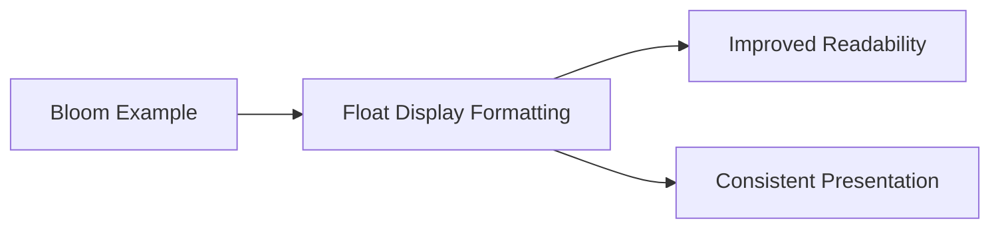

+++
title = "#20896 Format the float output in the bloom2d example to display two decimal"
date = "2025-09-06T00:00:00"
draft = false
template = "pull_request_page.html"
in_search_index = true

[taxonomies]
list_display = ["show"]

[extra]
current_language = "en"
available_languages = {"en" = { name = "English", url = "/pull_request/bevy/2025-09/pr-20896-en-20250906" }, "zh-cn" = { name = "中文", url = "/pull_request/bevy/2025-09/pr-20896-zh-cn-20250906" }}
labels = ["A-Rendering", "C-Examples", "C-Usability", "S-Waiting-on-Author"]
+++

# Format the float output in the bloom2d example to display two decimal

## Basic Information
- **Title**: Format the float output in the bloom2d example to display two decimal
- **PR Link**: https://github.com/bevyengine/bevy/pull/20896
- **Author**: Breakdown-Dog
- **Status**: MERGED
- **Labels**: A-Rendering, C-Examples, C-Usability, S-Waiting-on-Author
- **Created**: 2025-09-06T02:38:20Z
- **Merged**: 2025-09-06T03:43:26Z
- **Merged By**: james7132

## Description Translation
# Objective

Improve the readability of the float output in the bloom2d example by formatting it to two decimal places.
This makes the output cleaner and more consistent.

## Solution

Used Rust's formatting syntax (e.g., {:.2}) to ensure floats are displayed with exactly two decimal places.
Applied this to all relevant print or debug output lines in the bloom2d example.

---

## The Story of This Pull Request

This PR addresses a minor but important usability issue in Bevy's bloom2d example. The example displays various bloom configuration parameters as floating-point values, but they were shown with full precision, making the output cluttered and difficult to read during real-time adjustments.

The problem was straightforward: when users interact with the bloom example using keyboard controls, they see real-time updates of parameter values. However, the default float formatting could display many decimal places, creating visual noise that made it harder to focus on the actual values being adjusted.

The solution implemented a consistent formatting approach using Rust's built-in float formatting capabilities. By applying `{:.2}` format specifiers to all relevant float values, the output now displays exactly two decimal places for all bloom parameters. This creates a cleaner, more professional appearance and makes it easier for users to read and compare values while adjusting the bloom effect.

The implementation was surgical in nature, targeting only the display formatting without changing any underlying functionality. All changes were confined to the text generation logic in the `update_bloom_settings` function, where format strings were updated to include the precision specification.

This change demonstrates good attention to detail in user-facing examples. While the functional behavior remains identical, the improved readability enhances the developer experience when experimenting with bloom parameters. The consistency across all float displays also creates a more polished appearance for this example.

## Visual Representation



## Key Files Changed

- `examples/2d/bloom_2d.rs` (+10/-7)

The changes were focused on the text display formatting in the bloom example:

```rust
// Before:
text.push_str(&format!("(Q/A) Intensity: {}\n", bloom.intensity));
text.push_str(&format!("(W/S) Low-frequency boost: {}\n", bloom.low_frequency_boost));

// After:
text.push_str(&format!("(Q/A) Intensity: {:.2}\n", bloom.intensity));
text.push_str(&format!("(W/S) Low-frequency boost: {:.2}\n", bloom.low_frequency_boost));
```

Similar changes were applied to all float value displays in the example, including:
- Intensity
- Low-frequency boost
- Low-frequency boost curvature
- High-pass frequency
- Threshold
- Threshold softness
- Horizontal scale

These changes ensure consistent two-decimal-place formatting for all floating-point parameters displayed in the example's UI text.

## Further Reading

- [Rust Formatting Syntax](https://doc.rust-lang.org/std/fmt/index.html)
- [Bevy Bloom Documentation](https://docs.rs/bevy/latest/bevy/core_pipeline/bloom/index.html)
- [Floating-Point Precision Formatting](https://doc.rust-lang.org/std/fmt/#precision)

# Full Code Diff
```diff
diff --git a/examples/2d/bloom_2d.rs b/examples/2d/bloom_2d.rs
index 11377ac43675d..fd1bc0154765a 100644
--- a/examples/2d/bloom_2d.rs
+++ b/examples/2d/bloom_2d.rs
@@ -81,17 +81,17 @@ fn update_bloom_settings(
     match bloom {
         Some(mut bloom) => {
             text.0 = "Bloom (Toggle: Space)\n".to_string();
-            text.push_str(&format!("(Q/A) Intensity: {}\n", bloom.intensity));
+            text.push_str(&format!("(Q/A) Intensity: {:.2}\n", bloom.intensity));
             text.push_str(&format!(
-                "(W/S) Low-frequency boost: {}\n",
+                "(W/S) Low-frequency boost: {:.2}\n",
                 bloom.low_frequency_boost
             ));
             text.push_str(&format!(
-                "(E/D) Low-frequency boost curvature: {}\n",
+                "(E/D) Low-frequency boost curvature: {:.2}\n",
                 bloom.low_frequency_boost_curvature
             ));
             text.push_str(&format!(
-                "(R/F) High-pass frequency: {}\n",
+                "(R/F) High-pass frequency: {:.2}\n",
                 bloom.high_pass_frequency
             ));
             text.push_str(&format!(
@@ -101,12 +101,15 @@ fn update_bloom_settings(
                     BloomCompositeMode::Additive => "Additive",
                 }
             ));
-            text.push_str(&format!("(Y/H) Threshold: {}\n", bloom.prefilter.threshold));
             text.push_str(&format!(
-                "(U/J) Threshold softness: {}\n",
+                "(Y/H) Threshold: {:.2}\n",
+                bloom.prefilter.threshold
+            ));
+            text.push_str(&format!(
+                "(U/J) Threshold softness: {:.2}\n",
                 bloom.prefilter.threshold_softness
             ));
-            text.push_str(&format!("(I/K) Horizontal Scale: {}\n", bloom.scale.x));
+            text.push_str(&format!("(I/K) Horizontal Scale: {:.2}\n", bloom.scale.x));
 
             if keycode.just_pressed(KeyCode::Space) {
                 commands.entity(camera_entity).remove::<Bloom>();
```