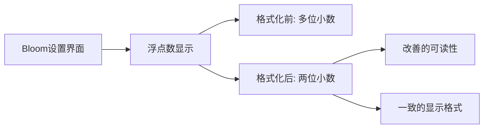

+++
title = "#20896 Format the float output in the bloom2d example to display two decimal"
date = "2025-09-06T00:00:00"
draft = false
template = "pull_request_page.html"
in_search_index = false

[extra]
current_language = "zh-cn"
available_languages = {"en" = { name = "English", url = "/pull_request/bevy/2025-09/pr-20896-en-20250906" }, "zh-cn" = { name = "中文", url = "/pull_request/bevy/2025-09/pr-20896-zh-cn-20250906" }}
+++

# 格式化bloom2d示例中的浮点数输出以显示两位小数

## 基本信息
- **标题**: Format the float output in the bloom2d example to display two decimal
- **PR链接**: https://github.com/bevyengine/bevy/pull/20896
- **作者**: Breakdown-Dog
- **状态**: 已合并
- **标签**: A-Rendering, C-Examples, C-Usability, S-Waiting-on-Author
- **创建时间**: 2025-09-06T02:38:20Z
- **合并时间**: 2025-09-06T03:43:26Z
- **合并者**: james7132

## 描述翻译
# Objective

通过将浮点数输出格式化为两位小数来提高bloom2d示例中浮点数输出的可读性。
这使输出更清晰、更一致。

## Solution

使用Rust的格式化语法（例如，{:.2}）确保浮点数精确显示两位小数。
将此应用于bloom2d示例中所有相关的打印或调试输出行。

---

## 本次Pull Request的故事

这个PR涉及一个简单但重要的用户体验改进。在Bevy引擎的bloom2d示例中，开发者注意到浮点数输出显示不够整洁，影响了示例代码的可读性和专业性。

**问题背景**
bloom2d示例展示了Bevy的bloom（泛光）效果实现，包含多个可调节的参数如intensity（强度）、threshold（阈值）等。这些参数通过文本界面显示当前数值，但原始实现使用默认的浮点数格式化，导致显示的小数位数不一致且有时过长。

```rust
// 修改前的代码示例
text.push_str(&format!("(Q/A) Intensity: {}\n", bloom.intensity));
```

这种显示方式可能导致用户看到类似"Intensity: 0.345600008"这样的输出，既不美观也不易读。

**解决方案**
开发者采用了Rust的标准格式化语法来解决这个问题。通过在格式字符串中使用`{:.2}`，所有浮点数都被统一格式化为两位小数：

```rust
// 修改后的代码示例
text.push_str(&format!("(Q/A) Intensity: {:.2}\n", bloom.intensity));
```

这个改动虽然简单，但体现了对细节的关注。修改涵盖了所有相关的浮点数值显示：
- Bloom强度 (intensity)
- 低频增强 (low-frequency boost)
- 低频增强曲率 (low-frequency boost curvature)
- 高通频率 (high-pass frequency)
- 阈值 (threshold)
- 阈值柔化 (threshold softness)
- 水平缩放 (horizontal scale)

**技术实现细节**
Rust的格式化语法`{:.2}`指定了精度为2位小数，这意味着：
1. 数值会自动四舍五入到两位小数
2. 即使整数也会显示为"x.00"格式
3. 保持所有数值显示的一致性

**影响和价值**
这个看似小的改进实际上提升了示例代码的质量：
1. **更好的用户体验**：用户现在可以看到整洁、一致的数值显示
2. **教学价值**：展示了Rust格式化功能的最佳实践
3. **代码一致性**：所有浮点显示遵循相同的格式标准
4. **专业性**：使示例看起来更加精致和完善

这种改进虽然不涉及核心渲染逻辑，但对于示例代码的质量和用户体验有实际提升，体现了对细节的关注。

## 视觉表示



## 关键文件更改

- `examples/2d/bloom_2d.rs` (+10/-7)

这个文件包含了bloom2d示例的主要实现，修改集中在`update_bloom_settings`函数中的文本生成部分。

**具体修改：**
```rust
// 文件: examples/2d/bloom_2d.rs
// 修改前:
text.push_str(&format!("(Q/A) Intensity: {}\n", bloom.intensity));
text.push_str(&format!("(W/S) Low-frequency boost: {}\n", bloom.low_frequency_boost));
text.push_str(&format!("(E/D) Low-frequency boost curvature: {}\n", bloom.low_frequency_boost_curvature));
text.push_str(&format!("(R/F) High-pass frequency: {}\n", bloom.high_pass_frequency));
text.push_str(&format!("(Y/H) Threshold: {}\n", bloom.prefilter.threshold));
text.push_str(&format!("(U/J) Threshold softness: {}\n", bloom.prefilter.threshold_softness));
text.push_str(&format!("(I/K) Horizontal Scale: {}\n", bloom.scale.x));

// 修改后:
text.push_str(&format!("(Q/A) Intensity: {:.2}\n", bloom.intensity));
text.push_str(&format!("(W/S) Low-frequency boost: {:.2}\n", bloom.low_frequency_boost));
text.push_str(&format!("(E/D) Low-frequency boost curvature: {:.2}\n", bloom.low_frequency_boost_curvature));
text.push_str(&format!("(R/F) High-pass frequency: {:.2}\n", bloom.high_pass_frequency));
text.push_str(&format!("(Y/H) Threshold: {:.2}\n", bloom.prefilter.threshold));
text.push_str(&format!("(U/J) Threshold softness: {:.2}\n", bloom.prefilter.threshold_softness));
text.push_str(&format!("(I/K) Horizontal Scale: {:.2}\n", bloom.scale.x));
```

这些修改确保了所有浮点数值都以两位小数的统一格式显示，提高了输出的可读性和一致性。

## 延伸阅读

对于想深入了解相关技术的读者，建议参考以下资源：

1. [Rust格式化语法文档](https://doc.rust-lang.org/std/fmt/) - Rust官方关于格式化输出的详细指南
2. [Bevy Bloom效果文档](https://bevyengine.org/learn/books/introduction-graphics/effects/bloom/) - Bevy引擎中bloom效果的实现原理和使用方法
3. [Rust的Display trait](https://doc.rust-lang.org/std/fmt/trait.Display.html) - 如何为自定义类型实现格式化输出

# 完整代码差异
```
diff --git a/examples/2d/bloom_2d.rs b/examples/2d/bloom_2d.rs
index 11377ac43675d..fd1bc0154765a 100644
--- a/examples/2d/bloom_2d.rs
+++ b/examples/2d/bloom_2d.rs
@@ -81,17 +81,17 @@ fn update_bloom_settings(
     match bloom {
         Some(mut bloom) => {
             text.0 = "Bloom (Toggle: Space)\n".to_string();
-            text.push_str(&format!("(Q/A) Intensity: {}\n", bloom.intensity));
+            text.push_str(&format!("(Q/A) Intensity: {:.2}\n", bloom.intensity));
             text.push_str(&format!(
-                "(W/S) Low-frequency boost: {}\n",
+                "(W/S) Low-frequency boost: {:.2}\n",
                 bloom.low_frequency_boost
             ));
             text.push_str(&format!(
-                "(E/D) Low-frequency boost curvature: {}\n",
+                "(E/D) Low-frequency boost curvature: {:.2}\n",
                 bloom.low_frequency_boost_curvature
             ));
             text.push_str(&format!(
-                "(R/F) High-pass frequency: {}\n",
+                "(R/F) High-pass frequency: {:.2}\n",
                 bloom.high_pass_frequency
             ));
             text.push_str(&format!(
@@ -101,12 +101,15 @@ fn update_bloom_settings(
                     BloomCompositeMode::Additive => "Additive",
                 }
             ));
-            text.push_str(&format!("(Y/H) Threshold: {}\n", bloom.prefilter.threshold));
             text.push_str(&format!(
-                "(U/J) Threshold softness: {}\n",
+                "(Y/H) Threshold: {:.2}\n",
+                bloom.prefilter.threshold
+            ));
+            text.push_str(&format!(
+                "(U/J) Threshold softness: {:.2}\n",
                 bloom.prefilter.threshold_softness
             ));
-            text.push_str(&format!("(I/K) Horizontal Scale: {}\n", bloom.scale.x));
+            text.push_str(&format!("(I/K) Horizontal Scale: {:.2}\n", bloom.scale.x));
 
             if keycode.just_pressed(KeyCode::Space) {
                 commands.entity(camera_entity).remove::<Bloom>();
```