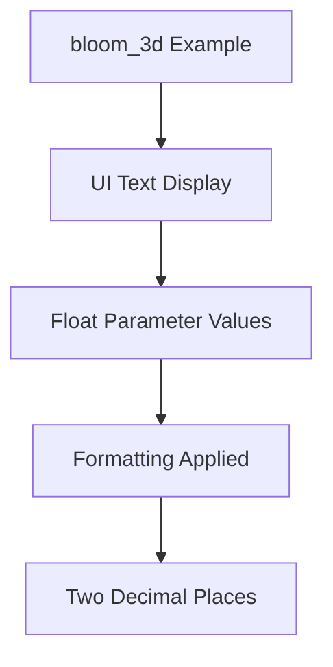

+++
title = "#20897 Limit bloom_3d float output to two decimal places."
date = "2025-09-06T00:00:00"
draft = false
template = "pull_request_page.html"
in_search_index = true

[taxonomies]
list_display = ["show"]

[extra]
current_language = "en"
available_languages = {"en" = { name = "English", url = "/pull_request/bevy/2025-09/pr-20897-en-20250906" }, "zh-cn" = { name = "中文", url = "/pull_request/bevy/2025-09/pr-20897-zh-cn-20250906" }}
labels = ["D-Trivial", "A-Rendering", "C-Examples", "M-Deliberate-Rendering-Change"]
+++

# Limit bloom_3d float output to two decimal places

## Basic Information
- **Title**: Limit bloom_3d float output to two decimal places.
- **PR Link**: https://github.com/bevyengine/bevy/pull/20897
- **Author**: Breakdown-Dog
- **Status**: MERGED
- **Labels**: D-Trivial, A-Rendering, C-Examples, S-Ready-For-Final-Review, M-Deliberate-Rendering-Change
- **Created**: 2025-09-06T04:22:23Z
- **Merged**: 2025-09-06T05:00:48Z
- **Merged By**: alice-i-cecile

## Description Translation
Objective
Improve the readability of the float output in the bloom_3d example by formatting it to two decimal places.
This makes the output cleaner and more consistent.

Solution
Used Rust's formatting syntax (e.g., {:.2}) to ensure floats are displayed with exactly two decimal places.
Applied this to all relevant print or debug output lines in the bloom_3d example.

## The Story of This Pull Request

The bloom_3d example in Bevy's 3D rendering examples demonstrates various bloom effect parameters that users can adjust in real-time. As developers interact with this example, they see numeric values for intensity, frequency, threshold, and other bloom parameters displayed on screen. The original implementation showed these floating-point values with full precision, which created visual clutter and made it difficult to quickly parse the current values.

The problem was straightforward: excessive decimal precision in the UI display reduced readability without providing meaningful additional information. For a real-time settings display where users need to quickly understand current values while adjusting parameters, two decimal places provide sufficient precision while maintaining clean visual presentation.

The solution implemented Rust's built-in float formatting capabilities using the `{:.2}` syntax. This approach required minimal code changes while delivering immediate readability improvements. The developer applied consistent formatting across all seven bloom parameter displays, ensuring uniform presentation:

- Bloom intensity
- Low-frequency boost
- Low-frequency boost curvature
- High-pass frequency
- Threshold
- Threshold softness
- Horizontal scale

The changes maintain full precision in the actual bloom calculations while only affecting the display formatting. This ensures no functional impact on the bloom rendering itself while significantly improving the user experience of the example.

From an engineering perspective, this change demonstrates good practice in UI formatting for technical displays. When presenting numeric values to users, especially in real-time debugging or configuration contexts, limiting precision to what's actually meaningful improves usability without sacrificing functionality.

## Visual Representation



## Key Files Changed

**File: examples/3d/bloom_3d.rs**

Changes: Modified the text formatting for bloom parameter displays to show two decimal places instead of full precision.

**Code Changes:**
```rust
// Before:
text.push_str(&format!("(Q/A) Intensity: {}\n", bloom.intensity));
text.push_str(&format!("(W/S) Low-frequency boost: {}\n", bloom.low_frequency_boost));
text.push_str(&format!("(E/D) Low-frequency boost curvature: {}\n", bloom.low_frequency_boost_curvature));
text.push_str(&format!("(R/F) High-pass frequency: {}\n", bloom.high_pass_frequency));
text.push_str(&format!("(Y/H) Threshold: {}\n", bloom.prefilter.threshold));
text.push_str(&format!("(U/J) Threshold softness: {}\n", bloom.prefilter.threshold_softness));
text.push_str(&format!("(I/K) Horizontal Scale: {}\n", bloom.scale.x));

// After:
text.push_str(&format!("(Q/A) Intensity: {:.2}\n", bloom.intensity));
text.push_str(&format!("(W/S) Low-frequency boost: {:.2}\n", bloom.low_frequency_boost));
text.push_str(&format!("(E/D) Low-frequency boost curvature: {:.2}\n", bloom.low_frequency_boost_curvature));
text.push_str(&format!("(R/F) High-pass frequency: {:.2}\n", bloom.high_pass_frequency));
text.push_str(&format!("(Y/H) Threshold: {:.2}\n", bloom.prefilter.threshold));
text.push_str(&format!("(U/J) Threshold softness: {:.2}\n", bloom.prefilter.threshold_softness));
text.push_str(&format!("(I/K) Horizontal Scale: {:.2}\n", bloom.scale.x));
```

The changes apply consistent two-decimal-place formatting to all floating-point parameter displays in the bloom example's UI text.

## Further Reading

- [Rust Formatting Syntax Documentation](https://doc.rust-lang.org/std/fmt/)
- [Bevy Bloom Example](https://github.com/bevyengine/bevy/blob/main/examples/3d/bloom_3d.rs)
- [Floating-Point Precision in UI Design](https://www.nngroup.com/articles/numbers-and-values/)