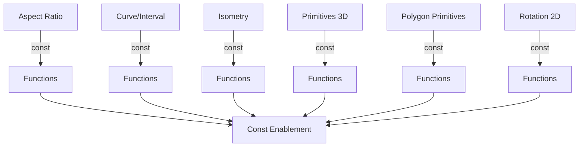

+++
title = "#20902 Constify math"
date = "2025-09-06T00:00:00"
draft = false
template = "pull_request_page.html"
in_search_index = true

[taxonomies]
list_display = ["show"]

[extra]
current_language = "en"
available_languages = {"en" = { name = "English", url = "/pull_request/bevy/2025-09/pr-20902-en-20250906" }, "zh-cn" = { name = "中文", url = "/pull_request/bevy/2025-09/pr-20902-zh-cn-20250906" }}
labels = ["C-Usability", "A-Math", "D-Straightforward"]
+++

# Constify math

## Basic Information
- **Title**: Constify math
- **PR Link**: https://github.com/bevyengine/bevy/pull/20902
- **Author**: exoego
- **Status**: MERGED
- **Labels**: C-Usability, S-Ready-For-Final-Review, A-Math, D-Straightforward
- **Created**: 2025-09-06T10:07:29Z
- **Merged**: 2025-09-06T21:53:38Z
- **Merged By**: james7132

## Description Translation
The original description is in English, so it's included as-is:

# Objective

Part of https://github.com/bevyengine/bevy/issues/16124

## Solution

Constify where seems legit and easy to maintain

## The Story of This Pull Request

This PR addresses a straightforward but important need in the Bevy math library: making functions const where possible. The work is part of a larger initiative (issue #16124) to increase const usage throughout the Bevy codebase.

The core problem was that many math functions that could be evaluated at compile-time were instead only available as runtime functions. This limited their usability in const contexts and missed optimization opportunities. The developer approached this systematically by identifying functions that met two criteria: they were "legit" candidates for constification (meaning they performed operations that are const-safe) and were "easy to maintain" (meaning the changes wouldn't introduce complexity or maintenance burden).

The implementation involved adding the `const` keyword to numerous functions across the math module. Most changes were straightforward additions of the `const` modifier, but one case required special attention. In `Cuboid::from_size`, the original implementation used vector division (`size / 2.0`), but since the vector division operator isn't const, the implementation had to be rewritten using component-wise operations:

```rust
// Before:
pub fn from_size(size: Vec3) -> Self {
    Self {
        half_size: size / 2.0,
    }
}

// After:
pub const fn from_size(size: Vec3) -> Self {
    Self {
        half_size: Vec3::new(size.x / 2.0, size.y / 2.0, size.z / 2.0),
    }
}
```

This change demonstrates an important technical insight: when making functions const, sometimes we need to rewrite operations using const-safe alternatives, even if they're mathematically equivalent.

The impact of these changes is significant for compile-time evaluation. Developers can now use these math functions in const contexts, enabling more compile-time computations and potentially better performance through constant propagation. The changes maintain full backward compatibility while extending functionality.

## Visual Representation



## Key Files Changed

### `crates/bevy_math/src/aspect_ratio.rs`
Added `const` to aspect ratio construction functions:
```rust
// Before:
pub fn try_new(width: f32, height: f32) -> Result<Self, AspectRatioError>
pub fn try_from_pixels(x: u32, y: u32) -> Result<Self, AspectRatioError>

// After:
pub const fn try_new(width: f32, height: f32) -> Result<Self, AspectRatioError>
pub const fn try_from_pixels(x: u32, y: u32) -> Result<Self, AspectRatioError>
```

### `crates/bevy_math/src/curve/interval.rs`
Made interval operations const:
```rust
// Before:
pub fn new(start: f32, end: f32) -> Result<Self, InvalidIntervalError>
pub fn length(self) -> f32
// ... and several others

// After:
pub const fn new(start: f32, end: f32) -> Result<Self, InvalidIntervalError>
pub const fn length(self) -> f32
// ... with const added to all applicable functions
```

### `crates/bevy_math/src/isometry.rs`
Added const to isometry constructors:
```rust
// Before:
pub fn new(translation: Vec2, rotation: Rot2) -> Self
pub fn from_rotation(rotation: Rot2) -> Self
// ... and several others

// After:
pub const fn new(translation: Vec2, rotation: Rot2) -> Self
pub const fn from_rotation(rotation: Rot2) -> Self
// ... with const added to all applicable functions
```

### `crates/bevy_math/src/primitives/dim3.rs`
Made 3D primitive methods const, including the notable change to `Cuboid::from_size`:
```rust
// Before:
pub fn from_size(size: Vec3) -> Self {
    Self {
        half_size: size / 2.0,
    }
}

// After:
pub const fn from_size(size: Vec3) -> Self {
    Self {
        half_size: Vec3::new(size.x / 2.0, size.y / 2.0, size.z / 2.0),
    }
}
```

### `crates/bevy_math/src/primitives/polygon.rs`
Made polygon utility functions const:
```rust
// Before:
fn point_side(p1: Vec2, p2: Vec2, q: Vec2) -> f32

// After:
const fn point_side(p1: Vec2, p2: Vec2, q: Vec2) -> f32
```

### `crates/bevy_math/src/rotation2d.rs`
Added const to rotation validation methods:
```rust
// Before:
pub fn is_finite(self) -> bool
pub fn is_nan(self) -> bool

// After:
pub const fn is_finite(self) -> bool
pub const fn is_nan(self) -> bool
```

## Further Reading

- [Rust Reference: Const Functions](https://doc.rust-lang.org/reference/const_eval.html#const-functions)
- [Rust Blog: Const Generics](https://blog.rust-lang.org/2021/02/26/const-generics-mvp-beta.html)
- [Bevy Issue #16124: More const fn](https://github.com/bevyengine/bevy/issues/16124)

## Full Code Diff
The complete code diff is provided in the original query.