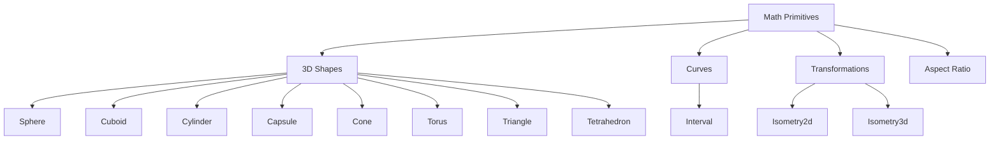

+++
title = "#20902 Constify math"
date = "2025-09-06T00:00:00"
draft = false
template = "pull_request_page.html"
in_search_index = false

[extra]
current_language = "zh-cn"
available_languages = {"en" = { name = "English", url = "/pull_request/bevy/2025-09/pr-20902-en-20250906" }, "zh-cn" = { name = "中文", url = "/pull_request/bevy/2025-09/pr-20902-zh-cn-20250906" }}
+++

# Constify math

## 基本信息
- **标题**: Constify math
- **PR链接**: https://github.com/bevyengine/bevy/pull/20902
- **作者**: exoego
- **状态**: 已合并
- **标签**: C-Usability, S-Ready-For-Final-Review, A-Math, D-Straightforward
- **创建时间**: 2025-09-06T10:07:29Z
- **合并时间**: 2025-09-06T21:53:38Z
- **合并人**: james7132

## 描述翻译
# Objective

Part of https://github.com/bevyengine/bevy/issues/16124

## Solution

Constify where seems legit and easy to maintain

## 本次PR的故事

这个PR是Bevy引擎数学库常量化计划的一部分。问题的核心在于让尽可能多的数学函数能够在编译时求值，从而提升性能和开发体验。

在Rust中，`const fn`允许函数在编译时执行，这意味着一些计算可以从运行时转移到编译时，减少运行时的计算开销。对于数学库来说，这尤其有价值，因为很多几何图元的创建和简单计算都是确定性的，适合在编译时完成。

开发者采取了务实的方法：只对那些看起来合理且易于维护的函数进行常量化。这意味着：
1. 不改变现有函数的逻辑行为
2. 只对确实可以在编译时求值的函数添加`const`关键字
3. 确保实现不会因为常量化而变得复杂难懂

从实现来看，这个PR主要涉及几个数学模块的改造：

在`aspect_ratio.rs`中，长宽比相关的构造函数现在可以在编译时验证输入参数：
```rust
// Before:
pub fn try_new(width: f32, height: f32) -> Result<Self, AspectRatioError>

// After:  
pub const fn try_new(width: f32, height: f32) -> Result<Self, AspectRatioError>
```

在`curve/interval.rs`中，区间相关的数学操作现在都是常量函数：
```rust
// 区间长度计算现在可以在编译时完成
pub const fn length(self) -> f32 {
    self.end - self.start
}
```

在`isometry.rs`中，等距变换的构造函数现在都是const函数，这使得创建恒等变换或简单变换可以在编译时完成：
```rust
// 从旋转创建等距变换
pub const fn from_rotation(rotation: Quat) -> Self {
    Isometry3d {
        rotation,
        translation: Vec3A::ZERO,
    }
}
```

在3D图元相关的`primitives/dim3.rs`中，各种几何体的构造函数和简单计算方法都被常量化了。这里有一个需要注意的技术细节：为了满足const fn的要求，有些实现需要调整：

```rust
// Before:
pub fn from_size(size: Vec3) -> Self {
    Self {
        half_size: size / 2.0,
    }
}

// After:
pub const fn from_size(size: Vec3) -> Self {
    Self {
        half_size: Vec3::new(size.x / 2.0, size.y / 2.0, size.z / 2.0),
    }
}
```

原来的`size / 2.0`在const context中不被允许，所以需要展开为各个分量的分别计算。

这个PR的影响是显著的：现在开发者可以在const context中使用这些数学函数，比如定义编译时常量：
```rust
const UNIT_CUBE: Cuboid = Cuboid::new(1.0, 1.0, 1.0);
const UNIT_SPHERE: Sphere = Sphere { radius: 1.0 };
```

这种改变对于需要高性能计算的游戏引擎特别有价值，因为它减少了运行时的计算开销，同时保持了代码的可读性和可维护性。

从工程角度看，这个PR展示了如何系统地推进代码库的现代化改造。它不是一次性重写所有内容，而是采取渐进式的方法，逐个模块地进行合理的优化。这种模式值得在其他类似的重构项目中借鉴。

## 可视化表示



## 关键文件变更

### `crates/bevy_math/src/primitives/dim3.rs` (+19/-19)
这个文件包含了各种3D几何图元的定义。变更主要是将构造函数和简单访问方法标记为const。

**关键变更示例：**
```rust
// Sphere直径计算
// Before:
pub fn diameter(&self) -> f32 {
    2.0 * self.radius
}

// After:
pub const fn diameter(&self) -> f32 {
    2.0 * self.radius
}

// Cuboid构造函数
// Before:
pub fn from_size(size: Vec3) -> Self {
    Self {
        half_size: size / 2.0,
    }
}

// After:
pub const fn from_size(size: Vec3) -> Self {
    Self {
        half_size: Vec3::new(size.x / 2.0, size.y / 2.0, size.z / 2.0),
    }
}
```

### `crates/bevy_math/src/curve/interval.rs` (+8/-8)
区间数学相关的函数常量化，包括区间创建、长度计算、边界检查等。

```rust
// 区间长度计算
// Before:
pub fn length(self) -> f32 {
    self.end - self.start
}

// After:
pub const fn length(self) -> f32 {
    self.end - self.start
}
```

### `crates/bevy_math/src/isometry.rs` (+6/-6)
等距变换的构造函数常量化，使得变换创建可以在编译时完成。

```rust
// 2D等距变换从坐标创建
// Before:
pub fn from_xy(x: f32, y: f32) -> Self

// After:
pub const fn from_xy(x: f32, y: f32) -> Self
```

### `crates/bevy_math/src/aspect_ratio.rs` (+2/-2)
长宽比计算的构造函数常量化。

```rust
// 从像素创建长宽比
// Before:
pub fn try_from_pixels(x: u32, y: u32) -> Result<Self, AspectRatioError>

// After:
pub const fn try_from_pixels(x: u32, y: u32) -> Result<Self, AspectRatioError>
```

### `crates/bevy_math/src/primitives/polygon.rs` (+2/-2)
多边形处理相关的辅助函数常量化。

```rust
// 点边关系计算
// Before:
fn point_side(p1: Vec2, p2: Vec2, q: Vec2) -> f32

// After:
const fn point_side(p1: Vec2, p2: Vec2, q: Vec2) -> f32
```

## 延伸阅读

- [Rust Reference: Constant functions](https://doc.rust-lang.org/reference/const_eval/const_fn.html)
- [Bevy Math Module Documentation](https://docs.rs/bevy_math/latest/bevy_math/)
- [Rust Const Generics RFC](https://github.com/rust-lang/rfcs/blob/master/text/2000-const-generics.md)

# 完整代码差异
<details>
<summary>展开查看完整diff</summary>
<div>

```diff
diff --git a/crates/bevy_math/src/aspect_ratio.rs b/crates/bevy_math/src/aspect_ratio.rs
index 7b7ae6d3bad04..39cfa9f95c973 100644
--- a/crates/bevy_math/src/aspect_ratio.rs
+++ b/crates/bevy_math/src/aspect_ratio.rs
@@ -33,7 +33,7 @@ impl AspectRatio {
     /// - Either width or height is infinite (`AspectRatioError::Infinite`)
     /// - Either width or height is NaN (`AspectRatioError::NaN`)
     #[inline]
-    pub fn try_new(width: f32, height: f32) -> Result<Self, AspectRatioError> {
+    pub const fn try_new(width: f32, height: f32) -> Result<Self, AspectRatioError> {
         match (width, height) {
             (w, h) if w == 0.0 || h == 0.0 => Err(AspectRatioError::Zero),
             (w, h) if w.is_infinite() || h.is_infinite() => Err(AspectRatioError::Infinite),
@@ -44,7 +44,7 @@ impl AspectRatio {
 
     /// Attempts to create a new [`AspectRatio`] from a given amount of x pixels and y pixels.
     #[inline]
-    pub fn try_from_pixels(x: u32, y: u32) -> Result<Self, AspectRatioError> {
+    pub const fn try_from_pixels(x: u32, y: u32) -> Result<Self, AspectRatioError> {
         Self::try_new(x as f32, y as f32)
     }
 
diff --git a/crates/bevy_math/src/curve/interval.rs b/crates/bevy_math/src/curve/interval.rs
index 03ffc0c486462..aeea24ca46054 100644
--- a/crates/bevy_math/src/curve/interval.rs
+++ b/crates/bevy_math/src/curve/interval.rs
@@ -61,7 +61,7 @@ impl Interval {
     /// but cannot be empty (so `start` must be less than `end`) and neither endpoint can be NaN; invalid
     /// parameters will result in an error.
     #[inline]
-    pub fn new(start: f32, end: f32) -> Result<Self, InvalidIntervalError> {
+    pub const fn new(start: f32, end: f32) -> Result<Self, InvalidIntervalError> {
         if start >= end || start.is_nan() || end.is_nan() {
             Err(InvalidIntervalError)
         } else {
@@ -103,7 +103,7 @@ impl Interval {
 
     /// Get the length of this interval. Note that the result may be infinite (`f32::INFINITY`).
     #[inline]
-    pub fn length(self) -> f32 {
+    pub const fn length(self) -> f32 {
         self.end - self.start
     }
 
@@ -111,19 +111,19 @@ impl Interval {
     ///
     /// Equivalently, an interval is bounded if its length is finite.
     #[inline]
-    pub fn is_bounded(self) -> bool {
+    pub const fn is_bounded(self) -> bool {
         self.length().is_finite()
     }
 
     /// Returns `true` if this interval has a finite start.
     #[inline]
-    pub fn has_finite_start(self) -> bool {
+    pub const fn has_finite_start(self) -> bool {
         self.start.is_finite()
     }
 
     /// Returns `true` if this interval has a finite end.
     #[inline]
-    pub fn has_finite_end(self) -> bool {
+    pub const fn has_finite_end(self) -> bool {
         self.end.is_finite()
     }
 
@@ -137,13 +137,13 @@ impl Interval {
     ///
     /// This is non-strict: each interval will contain itself.
     #[inline]
-    pub fn contains_interval(self, other: Self) -> bool {
+    pub const fn contains_interval(self, other: Self) -> bool {
         self.start <= other.start && self.end >= other.end
     }
 
     /// Clamp the given `value` to lie within this interval.
     #[inline]
-    pub fn clamp(self, value: f32) -> f32 {
+    pub const fn clamp(self, value: f32) -> f32 {
         value.clamp(self.start, self.end)
     }
 
@@ -196,7 +196,7 @@ impl TryFrom<RangeInclusive<f32>> for Interval {
 
 /// Create an [`Interval`] with a given `start` and `end`. Alias of [`Interval::new`].
 #[inline]
-pub fn interval(start: f32, end: f32) -> Result<Interval, InvalidIntervalError> {
+pub const fn interval(start: f32, end: f32) -> Result<Interval, InvalidIntervalError> {
     Interval::new(start, end)
 }
 
diff --git a/crates/bevy_math/src/isometry.rs b/crates/bevy_math/src/isometry.rs
index a221615b0a5bb..47de2363a17cd 100644
--- a/crates/bevy_math/src/isometry.rs
+++ b/crates/bevy_math/src/isometry.rs
@@ -110,7 +110,7 @@ impl Isometry2d {
 
     /// Create a two-dimensional isometry from a rotation and a translation.
     #[inline]
-    pub fn new(translation: Vec2, rotation: Rot2) -> Self {
+    pub const fn new(translation: Vec2, rotation: Rot2) -> Self {
         Isometry2d {
             rotation,
             translation,
@@ -119,7 +119,7 @@ impl Isometry2d {
 
     /// Create a two-dimensional isometry from a rotation.
     #[inline]
-    pub fn from_rotation(rotation: Rot2) -> Self {
+    pub const fn from_rotation(rotation: Rot2) -> Self {
         Isometry2d {
             rotation,
             translation: Vec2::ZERO,
@@ -128,7 +128,7 @@ impl Isometry2d {
 
     /// Create a two-dimensional isometry from a translation.
     #[inline]
-    pub fn from_translation(translation: Vec2) -> Self {
+    pub const fn from_translation(translation: Vec2) -> Self {
         Isometry2d {
             rotation: Rot2::IDENTITY,
             translation,
@@ -137,7 +137,7 @@ impl Isometry2d {
 
     /// Create a two-dimensional isometry from a translation with the given `x` and `y` components.
     #[inline]
-    pub fn from_xy(x: f32, y: f32) -> Self {
+    pub const fn from_xy(x: f32, y: f32) -> Self {
         Isometry2d {
             rotation: Rot2::IDENTITY,
             translation: Vec2::new(x, y),
@@ -397,7 +397,7 @@ impl Isometry3d {
 
     /// Create a three-dimensional isometry from a rotation.
     #[inline]
-    pub fn from_rotation(rotation: Quat) -> Self {
+    pub const fn from_rotation(rotation: Quat) -> Self {
         Isometry3d {
             rotation,
             translation: Vec3A::ZERO,
@@ -415,7 +415,7 @@ impl Isometry3d {
 
     /// Create a three-dimensional isometry from a translation with the given `x`, `y`, and `z` components.
     #[inline]
-    pub fn from_xyz(x: f32, y: f32, z: f32) -> Self {
+    pub const fn from_xyz(x: f32, y: f32, z: f32) -> Self {
         Isometry3d {
             rotation: Quat::IDENTITY,
             translation: Vec3A::new(x, y, z),
diff --git a/crates/bevy_math/src/primitives/dim3.rs b/crates/bevy_math/src/primitives/dim3.rs
index e40e0e2f1fe5a..97ff85bcd6511 100644
--- a/crates/bevy_math/src/primitives/dim3.rs
+++ b/crates/bevy_math/src/primitives/dim3.rs
@@ -50,7 +50,7 @@ impl Sphere {
 
     /// Get the diameter of the sphere
     #[inline(always)]
-    pub fn diameter(&self) -> f32 {
+    pub const fn diameter(&self) -> f32 {
         2.0 * self.radius
     }
 
@@ -430,13 +430,13 @@ impl Segment3d {
 
     /// Get the position of the first endpoint of the line segment.
     #[inline(always)]
-    pub fn point1(&self) -> Vec3 {
+    pub const fn point1(&self) -> Vec3 {
         self.vertices[0]
     }
 
     /// Get the position of the second endpoint of the line segment.
     #[inline(always)]
-    pub fn point2(&self) -> Vec3 {
+    pub const fn point2(&self) -> Vec3 {
         self.vertices[1]
     }
 
@@ -696,15 +696,15 @@ impl Default for Cuboid {
 impl Cuboid {
     /// Create a new `Cuboid` from a full x, y, and z length
     #[inline(always)]
-    pub fn new(x_length: f32, y_length: f32, z_length: f32) -> Self {
+    pub const fn new(x_length: f32, y_length: f32, z_length: f32) -> Self {
         Self::from_size(Vec3::new(x_length, y_length, z_length))
     }
 
     /// Create a new `Cuboid` from a given full size
     #[inline(always)]
-    pub fn from_size(size: Vec3) -> Self {
+    pub const fn from_size(size: Vec3) -> Self {
         Self {
-            half_size: size / 2.0,
+            half_size: Vec3::new(size.x / 2.0, size.y / 2.0, size.z / 2.0),
         }
     }
 
@@ -719,7 +719,7 @@ impl Cuboid {
     /// Create a `Cuboid` from a single length.
     /// The resulting `Cuboid` will be the same size in every direction.
     #[inline(always)]
-    pub fn from_length(length: f32) -> Self {
+    pub const fn from_length(length: f32) -> Self {
         Self {
             half_size: Vec3::splat(length / 2.0),
         }
@@ -792,7 +792,7 @@ impl Default for Cylinder {
 impl Cylinder {
     /// Create a new `Cylinder` from a radius and full height
     #[inline(always)]
-    pub fn new(radius: f32, height: f32) -> Self {
+    pub const fn new(radius: f32, height: f32) -> Self {
         Self {
             radius,
             half_height: height / 2.0,
@@ -801,7 +801,7 @@ impl Cylinder {
 
     /// Get the base of the cylinder as a [`Circle`]
     #[inline(always)]
-    pub fn base(&self) -> Circle {
+    pub const fn base(&self) -> Circle {
         Circle {
             radius: self.radius,
         }
@@ -811,7 +811,7 @@ impl Cylinder {
     /// also known as the lateral area
     #[inline(always)]
     #[doc(alias = "side_area")]
-    pub fn lateral_area(&self) -> f32 {
+    pub const fn lateral_area(&self) -> f32 {
         4.0 * PI * self.radius * self.half_height
     }
 
@@ -871,7 +871,7 @@ impl Default for Capsule3d {
 
 impl Capsule3d {
     /// Create a new `Capsule3d` from a radius and length
-    pub fn new(radius: f32, length: f32) -> Self {
+    pub const fn new(radius: f32, length: f32) -> Self {
         Self {
             radius,
             half_length: length / 2.0,
@@ -881,7 +881,7 @@ impl Capsule3d {
     /// Get the part connecting the hemispherical ends
     /// of the capsule as a [`Cylinder`]
     #[inline(always)]
-    pub fn to_cylinder(&self) -> Cylinder {
+    pub const fn to_cylinder(&self) -> Cylinder {
         Cylinder {
             radius: self.radius,
             half_height: self.half_length,
@@ -941,12 +941,12 @@ impl Default for Cone {
 
 impl Cone {
     /// Create a new [`Cone`] from a radius and height.
-    pub fn new(radius: f32, height: f32) -> Self {
+    pub const fn new(radius: f32, height: f32) -> Self {
         Self { radius, height }
     }
     /// Get the base of the cone as a [`Circle`]
     #[inline(always)]
-    pub fn base(&self) -> Circle {
+    pub const fn base(&self) -> Circle {
         Circle {
             radius: self.radius,
         }
@@ -1087,7 +1087,7 @@ impl Torus {
     /// The inner radius is the radius of the hole, and the outer radius
     /// is the radius of the entire object
     #[inline(always)]
-    pub fn new(inner_radius: f32, outer_radius: f32) -> Self {
+    pub const fn new(inner_radius: f32, outer_radius: f32) -> Self {
         let minor_radius = (outer_radius - inner_radius) / 2.0;
         let major_radius = outer_radius - minor_radius;
 
@@ -1101,7 +1101,7 @@ impl Torus {
     /// For a ring torus, this corresponds to the radius of the hole,
     /// or `major_radius - minor_radius`
     #[inline(always)]
-    pub fn inner_radius(&self) -> f32 {
+    pub const fn inner_radius(&self) -> f32 {
         self.major_radius - self.minor_radius
     }
 
@@ -1109,7 +1109,7 @@ impl Torus {
     /// This corresponds to the overall radius of the entire object,
     /// or `major_radius + minor_radius`
     #[inline(always)]
-    pub fn outer_radius(&self) -> f32 {
+    pub const fn outer_radius(&self) -> f32 {
         self.major_radius + self.minor_radius
     }
 
@@ -1191,7 +1191,7 @@ impl Default for Triangle3d {
 impl Triangle3d {
     /// Create a new [`Triangle3d`] from points `a`, `b`, and `c`.
     #[inline(always)]
-    pub fn new(a: Vec3, b: Vec3, c: Vec3) -> Self {
+    pub const fn new(a: Vec3, b: Vec3, c: Vec3) -> Self {
         Self {
             vertices: [a, b, c],
         }
@@ -1388,7 +1388,7 @@ impl Default for Tetrahedron {
 impl Tetrahedron {
     /// Create a new [`Tetrahedron`] from points `a`, `b`, `c` and `d`.
     #[inline(always)]
-    pub fn new(a: Vec3, b: Vec3, c: Vec3, d: Vec3) -> Self {
+    pub const fn new(a: Vec3, b: Vec3, c: Vec3, d: Vec3) -> Self {
         Self {
             vertices: [a, b, c, d],
         }
diff --git a/crates/bevy_math/src/primitives/polygon.rs b/crates/bevy_math/src/primitives/polygon.rs
index 096a19ecfb9aa..a95461d11aa45 100644
--- a/crates/bevy_math/src/primitives/polygon.rs
+++ b/crates/bevy_math/src/primitives/polygon.rs
@@ -174,7 +174,7 @@ struct SweepLine<'a> {
 }
 #[cfg(feature = "alloc")]
 impl<'a> SweepLine<'a> {
-    fn new(vertices: &'a [Vec2]) -> Self {
+    const fn new(vertices: &'a [Vec2]) -> Self {
         Self {
             vertices,
             tree: BTreeMap::new(),
@@ -271,7 +271,7 @@ impl<'a> SweepLine<'a> {
     )
 )]
 #[inline(always)]
-fn point_side(p1: Vec2, p2: Vec2, q: Vec2) -> f32 {
+const fn point_side(p1: Vec2, p2: Vec2, q: Vec2) -> f32 {
     (p2.x - p1.x) * (q.y - p1.y) - (q.x - p1.x) * (p2.y - p1.y)
 }
 
diff --git a/crates/bevy_math/src/rotation2d.rs b/crates/bevy_math/src/rotation2d.rs
index bcaf7f63b0dec..21839af6b6f01 100644
--- a/crates/bevy_math/src/rotation2d.rs
+++ b/crates/bevy_math/src/rotation2d.rs
@@ -336,13 +336,13 @@ impl Rot2 {
 
     /// Returns `true` if the rotation is neither infinite nor NaN.
     #[inline]
-    pub fn is_finite(self) -> bool {
+    pub const fn is_finite(self) -> bool {
         self.sin.is_finite() && self.cos.is_finite()
     }
 
     /// Returns `true` if the rotation is NaN.
     #[inline]
-    pub fn is_nan(self) -> bool {
+    pub const fn is_nan(self) -> bool {
         self.sin.is_nan() || self.cos.is_nan()
     }
 
```

</div>
</details>