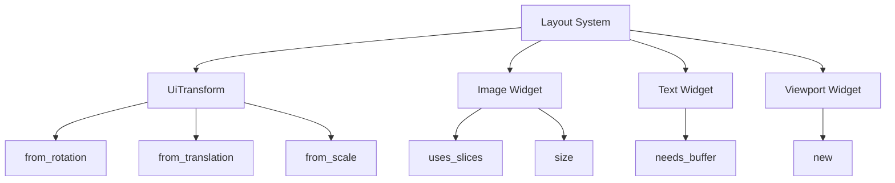

+++
title = "#20903 Constify ui"
date = "2025-09-06T00:00:00"
draft = false
template = "pull_request_page.html"
in_search_index = true

[taxonomies]
list_display = ["show"]

[extra]
current_language = "en"
available_languages = {"en" = { name = "English", url = "/pull_request/bevy/2025-09/pr-20903-en-20250906" }, "zh-cn" = { name = "中文", url = "/pull_request/bevy/2025-09/pr-20903-zh-cn-20250906" }}
labels = ["A-UI", "C-Usability", "D-Straightforward"]
+++

# Constify ui

## Basic Information
- **Title**: Constify ui
- **PR Link**: https://github.com/bevyengine/bevy/pull/20903
- **Author**: exoego
- **Status**: MERGED
- **Labels**: A-UI, C-Usability, S-Ready-For-Final-Review, D-Straightforward
- **Created**: 2025-09-06T10:28:06Z
- **Merged**: 2025-09-06T21:57:33Z
- **Merged By**: james7132

## Description Translation
# Objective

Part of https://github.com/bevyengine/bevy/issues/16124

## Solution

- Constify where seems legit and easy to maintain

## The Story of This Pull Request

This PR addresses a straightforward but meaningful optimization in Bevy's UI system by converting several functions to `const` where appropriate. The changes are part of a larger initiative (#16124) to identify and convert suitable functions to const throughout the Bevy codebase.

The core problem being solved is that certain utility functions in the UI system were not marked as `const`, which meant they couldn't be evaluated at compile time. This missed opportunity for compile-time optimization could lead to minor runtime performance overhead in scenarios where these functions are called frequently.

The solution approach was systematic and conservative: identify functions that meet the criteria for being `const` (no side effects, only operate on primitive types or const parameters) and convert them. The developer focused on functions that were "legit and easy to maintain" - meaning the changes were low-risk and wouldn't introduce complexity.

The implementation involved adding the `const` keyword to several functions across multiple UI components. In some cases, the `#[inline]` attribute was also added to suggest inlining to the compiler, though the compiler ultimately makes the final decision about inlining.

These changes are technically simple but provide concrete benefits:
1. **Compile-time evaluation**: Const functions can be computed during compilation rather than at runtime
2. **Potential performance improvements**: Eliminates function call overhead in some cases
3. **Better expressiveness**: Allows these functions to be used in const contexts
4. **Code consistency**: Aligns with Bevy's ongoing effort to constify appropriate functions

The changes affect core UI components including layout calculations, transform operations, image handling, text measurement, and viewport management. Each modified function was carefully selected to ensure the conversion was safe and appropriate.

## Visual Representation



## Key Files Changed

### `crates/bevy_ui/src/layout/mod.rs` (+3/-3)
**Purpose**: Make LayoutContext constructor const for compile-time initialization
```rust
// Before:
fn new(scale_factor: f32, physical_size: Vec2) -> Self

// After:
#[inline]
const fn new(scale_factor: f32, physical_size: Vec2) -> Self
```

### `crates/bevy_ui/src/ui_transform.rs` (+3/-3)
**Purpose**: Constify transform creation methods for compile-time transform construction
```rust
// Before:
pub fn from_rotation(rotation: Rot2) -> Self
pub fn from_translation(translation: Val2) -> Self  
pub fn from_scale(scale: Vec2) -> Self

// After:
pub const fn from_rotation(rotation: Rot2) -> Self
pub const fn from_translation(translation: Val2) -> Self
pub const fn from_scale(scale: Vec2) -> Self
```

### `crates/bevy_ui/src/widget/image.rs` (+3/-2)
**Purpose**: Constify image utility methods for better performance in image handling
```rust
// Before:
pub fn uses_slices(&self) -> bool
pub fn size(&self) -> UVec2

// After:
pub const fn uses_slices(&self) -> bool
#[inline]
pub const fn size(&self) -> UVec2
```

### `crates/bevy_ui/src/widget/text.rs` (+2/-1)
**Purpose**: Constify text measurement utility for compile-time text layout decisions
```rust
// Before:
pub fn needs_buffer(height: Option<f32>, available_width: AvailableSpace) -> bool

// After:
#[inline]
pub const fn needs_buffer(height: Option<f32>, available_width: AvailableSpace) -> bool
```

### `crates/bevy_ui/src/widget/viewport.rs` (+2/-1)
**Purpose**: Constify viewport constructor for compile-time viewport creation
```rust
// Before:
pub fn new(camera: Entity) -> Self

// After:
#[inline]
pub const fn new(camera: Entity) -> Self
```

## Further Reading

- [Rust Reference: Const Functions](https://doc.rust-lang.org/reference/const_eval.html#const-functions)
- [Bevy Engine Constification Initiative (#16124)](https://github.com/bevyengine/bevy/issues/16124)
- [Rust Performance Guide: Const Evaluation](https://nnethercote.github.io/perf-book/compile-times.html#const-evaluation)