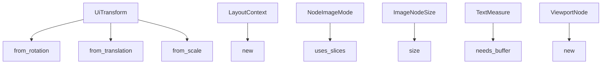

+++
title = "#20903 Constify ui"
date = "2025-09-06T00:00:00"
draft = false
template = "pull_request_page.html"
in_search_index = false

[extra]
current_language = "zh-cn"
available_languages = {"en" = { name = "English", url = "/pull_request/bevy/2025-09/pr-20903-en-20250906" }, "zh-cn" = { name = "中文", url = "/pull_request/bevy/2025-09/pr-20903-zh-cn-20250906" }}
+++

# Title
## Constify ui

## 基本信息
- **标题**: Constify ui  
- **PR链接**: https://github.com/bevyengine/bevy/pull/20903  
- **作者**: exoego  
- **状态**: 已合并  
- **标签**: A-UI, C-Usability, S-Ready-For-Final-Review, D-Straightforward  
- **创建时间**: 2025-09-06T10:28:06Z  
- **合并时间**: 2025-09-06T21:57:33Z  
- **合并者**: james7132  

## 描述翻译
# 目标

作为 https://github.com/bevyengine/bevy/issues/16124 的一部分

## 解决方案

- 在看起来合理且易于维护的地方进行常量化

## 这个Pull Request的故事

这个PR是Bevy引擎中UI模块常量化工作的一部分。常量化（constification）是指将函数标记为`const fn`，使其能够在编译时被求值，这是一种常见的Rust优化技术。

**问题与背景**  
在Rust中，`const fn`允许函数在编译时执行，这对于性能优化和代码表达力都有好处。Bevy团队正在系统性地将代码库中合适的函数标记为const，这是#16124 issue中计划的更大规模重构工作的一部分。UI模块作为引擎的核心组件，有很多简单的构造函数和工具方法适合进行这种优化。

**解决方案方法**  
开发者采用了直接而谨慎的方法：只对那些明显适合且不会影响代码维护性的函数进行常量化。这些函数通常具有以下特点：
- 纯函数性质，不依赖运行时状态
- 简单的数据转换或构造逻辑
- 不会引入额外的维护负担

**具体实现**  
PR修改了5个文件中的11个函数签名，主要是在函数前添加`const`关键字，并在某些情况下添加`#[inline]`属性。这些修改虽然看起来简单，但需要仔细选择哪些函数适合常量化。

以`UiTransform`的修改为例，这个结构体负责UI元素的变换操作：

```rust
// File: crates/bevy_ui/src/ui_transform.rs
// 修改前:
pub fn from_rotation(rotation: Rot2) -> Self {
    Self {
        rotation,
        ..Self::IDENTITY
    }
}

// 修改后:
pub const fn from_rotation(rotation: Rot2) -> Self {
    Self {
        rotation,
        ..Self::IDENTITY
    }
}
```

类似的修改也应用到了`from_translation`和`from_scale`方法上。这些构造函数现在可以在编译时被求值，对于创建常量UI变换特别有用。

在布局模块中，`LayoutContext::new`方法也进行了常量化：

```rust
// File: crates/bevy_ui/src/layout/mod.rs
// 修改前:
fn new(scale_factor: f32, physical_size: Vec2) -> Self {
    Self {
        scale_factor,
        physical_size,
    }
}

// 修改后:
#[inline]
const fn new(scale_factor: f32, physical_size: Vec2) -> Self {
    Self {
        scale_factor,
        physical_size,
    }
}
```

这里还添加了`#[inline]`提示，建议编译器内联这个小型函数。

**技术洞察**  
常量函数在Rust中有几个重要优势：
1. 编译时求值：允许在常量上下文中使用这些函数
2. 更好的优化机会：编译器可以对const函数进行更多优化
3. 表达力增强：开发者可以在const上下文中使用这些API

需要注意的是，不是所有函数都适合标记为const。只有那些不包含运行时操作（如动态分配、系统调用等）的函数才能安全地常量化。

**影响**  
这些修改虽然微小，但为UI系统带来了实质性的改进：
- 允许在编译时计算UI布局和变换
- 为未来更多的编译时优化奠定基础
- 保持代码的可维护性和清晰度

这种逐步的、谨慎的常量化策略是大型代码库演进的典型模式，避免了大规模重构的风险。

## 视觉表示



## 关键文件变更

**crates/bevy_ui/src/ui_transform.rs** (+3/-3)
- 将三个变换构造函数标记为const：`from_rotation`, `from_translation`, `from_scale`
- 这些函数现在可以在编译时使用

**crates/bevy_ui/src/widget/image.rs** (+3/-2)
- 将`NodeImageMode::uses_slices()`和`ImageNodeSize::size()`标记为const
- 添加了`#[inline]`提示以优化性能

```rust
// 修改后的 uses_slices 方法
pub const fn uses_slices(&self) -> bool {
    matches!(
        self,
        NodeImageMode::Sliced(..) | NodeImageMode::Tiled { .. }
    )
}
```

**crates/bevy_ui/src/layout/mod.rs** (+2/-1)
- 将`LayoutContext::new`标记为const并添加inline提示
- 这个函数用于创建布局上下文，现在可以在编译时使用

**crates/bevy_ui/src/widget/text.rs** (+2/-1)
- 将`TextMeasure::needs_buffer`标记为const并添加inline提示
- 这个工具函数用于文本测量优化

**crates/bevy_ui/src/widget/viewport.rs** (+2/-1)
- 将`ViewportNode::new`标记为const并添加inline提示
- 视口节点的构造函数现在可以在编译时使用

## 延伸阅读

- [Rust Reference: Const Functions](https://doc.rust-lang.org/reference/const_eval.html#const-functions)
- [Bevy Issue #16124: Constify everything that can be const](https://github.com/bevyengine/bevy/issues/16124)
- [Rust Blog: Const Generics](https://blog.rust-lang.org/2021/02/26/const-generics-mvp-beta.html)

## 完整代码差异

```diff
diff --git a/crates/bevy_ui/src/layout/mod.rs b/crates/bevy_ui/src/layout/mod.rs
index d16f464745fc8..3de05629ff294 100644
--- a/crates/bevy_ui/src/layout/mod.rs
+++ b/crates/bevy_ui/src/layout/mod.rs
@@ -38,7 +38,8 @@ impl LayoutContext {
         physical_size: Vec2::ZERO,
     };
     /// create new a [`LayoutContext`] from the window's physical size and scale factor
-    fn new(scale_factor: f32, physical_size: Vec2) -> Self {
+    #[inline]
+    const fn new(scale_factor: f32, physical_size: Vec2) -> Self {
         Self {
             scale_factor,
             physical_size,
diff --git a/crates/bevy_ui/src/ui_transform.rs b/crates/bevy_ui/src/ui_transform.rs
index 47f8484e54201..aa69c9cf3a3ec 100644
--- a/crates/bevy_ui/src/ui_transform.rs
+++ b/crates/bevy_ui/src/ui_transform.rs
@@ -103,7 +103,7 @@ impl UiTransform {
     };
 
     /// Creates a UI transform representing a rotation.
-    pub fn from_rotation(rotation: Rot2) -> Self {
+    pub const fn from_rotation(rotation: Rot2) -> Self {
         Self {
             rotation,
             ..Self::IDENTITY
@@ -111,7 +111,7 @@ impl UiTransform {
     }
 
     /// Creates a UI transform representing a responsive translation.
-    pub fn from_translation(translation: Val2) -> Self {
+    pub const fn from_translation(translation: Val2) -> Self {
         Self {
             translation,
             ..Self::IDENTITY
@@ -119,7 +119,7 @@ impl UiTransform {
     }
 
     /// Creates a UI transform representing a scaling.
-    pub fn from_scale(scale: Vec2) -> Self {
+    pub const fn from_scale(scale: Vec2) -> Self {
         Self {
             scale,
             ..Self::IDENTITY
diff --git a/crates/bevy_ui/src/widget/image.rs b/crates/bevy_ui/src/widget/image.rs
index eb450e6f61eb5..92e951a263f9d 100644
--- a/crates/bevy_ui/src/widget/image.rs
+++ b/crates/bevy_ui/src/widget/image.rs
@@ -170,7 +170,7 @@ pub enum NodeImageMode {
 impl NodeImageMode {
     /// Returns true if this mode uses slices internally ([`NodeImageMode::Sliced`] or [`NodeImageMode::Tiled`])
     #[inline]
-    pub fn uses_slices(&self) -> bool {
+    pub const fn uses_slices(&self) -> bool {
         matches!(
             self,
             NodeImageMode::Sliced(..) | NodeImageMode::Tiled { .. }
@@ -192,7 +192,8 @@ pub struct ImageNodeSize {
 
 impl ImageNodeSize {
     /// The size of the image's texture
-    pub fn size(&self) -> UVec2 {
+    #[inline]
+    pub const fn size(&self) -> UVec2 {
         self.size
     }
 }
diff --git a/crates/bevy_ui/src/widget/text.rs b/crates/bevy_ui/src/widget/text.rs
index b008923a83d12..2998041a500ca 100644
--- a/crates/bevy_ui/src/widget/text.rs
+++ b/crates/bevy_ui/src/widget/text.rs
@@ -163,7 +163,8 @@ pub struct TextMeasure {
 
 impl TextMeasure {
     /// Checks if the cosmic text buffer is needed for measuring the text.
-    pub fn needs_buffer(height: Option<f32>, available_width: AvailableSpace) -> bool {
+    #[inline]
+    pub const fn needs_buffer(height: Option<f32>, available_width: AvailableSpace) -> bool {
         height.is_none() && matches!(available_width, AvailableSpace::Definite(_))
     }
 }
diff --git a/crates/bevy_ui/src/widget/viewport.rs b/crates/bevy_ui/src/widget/viewport.rs
index 0851d4d8303a8..b917a1f78335f 100644
--- a/crates/bevy_ui/src/widget/viewport.rs
+++ b/crates/bevy_ui/src/widget/viewport.rs
@@ -55,7 +55,8 @@ pub struct ViewportNode {
 
 impl ViewportNode {
     /// Creates a new [`ViewportNode`] with a given `camera`.
-    pub fn new(camera: Entity) -> Self {
+    #[inline]
+    pub const fn new(camera: Entity) -> Self {
         Self { camera }
     }
 }
```